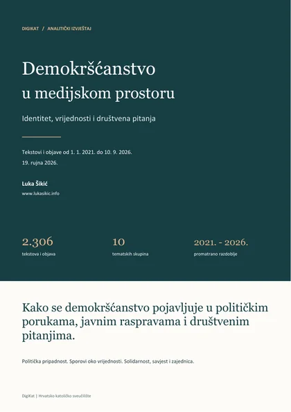

```{r}
#| label: barometar-multiplatform-setup
#| include: false
knitr::opts_chunk$set(echo=FALSE,message=FALSE,warning=FALSE,dev="svglite",fig.width=10,fig.height=6)
source("../../R/lib/barometar_multiplatform_page.R",encoding="UTF-8")
source("../../R/lib/digikat_hr.R",encoding="UTF-8")
source("../../R/theme_digikat.R",encoding="UTF-8")
base_dir <- "../../data/barometar/demokrscanstvo-multiplatform/v1"
release <- barometar_multiplatform_release(base_dir)
thematic <- barometar_thematic_release("../../data/barometar/demokrscanstvo-themes/v1",base_dir)
s <- release$summary
m <- release$tables$monthly
p <- release$tables$platforms
labels <- unlist(s$platform_labels)
integer <- function(x)formatC(as.integer(x),format="d",big.mark=".",decimal.mark=",")
number <- function(x,digits=1L)ifelse(is.na(x),"—",formatC(x,format="f",digits=digits,big.mark=".",decimal.mark=","))
escape <- function(x)htmltools::htmlEscape(as.character(x))
table_html <- function(x,caption)cat('<div class="table-responsive" tabindex="0" role="region" aria-label="',escape(caption),'">',
  as.character(knitr::kable(x,format="html",escape=TRUE,row.names=FALSE,caption=caption)),"</div>",sep="")
web_share <- 100*p$matching_records[p$platform=="web"]/s$matching_records
topic_count <- thematic$summary$method$n_components
topic_rows <- thematic$summary$topics
topic_rows <- topic_rows[order(vapply(topic_rows,`[[`,numeric(1),"records"),decreasing=TRUE)]
report_stem <- "../../assets/izvjestaji/demokrscanstvo-u-medijskom-prostoru"
report <- jsonlite::fromJSON(paste0(report_stem,".meta.json"))
stopifnot(identical(digest::digest(file=paste0(report_stem,".pdf"),algo="sha256",serialize=FALSE),report$pdf_sha256),
  report$records==s$matching_records,report$data_from==s$data_from,report$data_through==s$data_through)
identity_records <- sum(vapply(Filter(function(t)t$id %in% c("t01","t02","t03","t04"),topic_rows),`[[`,numeric(1),"records"))
values_topic <- Filter(function(t)t$id=="t09",topic_rows)[[1L]]
```

::: {.dkb}
<section class="dkb-hero dkb-on-dark"><div class="dkb-inner">
<p class="dkb-eyebrow">DigiKat · Hrvatsko katoličko sveučilište</p>
<h1>Medijski barometar demokršćanstva</h1>
<p class="dkb-lead">Gdje se govori o demokršćanskim idejama i kršćanskoj socijalnoj misli?</p>
<p class="dkb-muted">Od stranačkog identiteta i europske politike do obitelji, solidarnosti i općeg dobra: barometar pokazuje kako demokršćanske ideje ulaze u javnu raspravu, koje ih teme prate i gdje dobivaju medijsku pozornost.</p>
<div class="freshness-strip">`r s$platform_count` platformi · `r digikat_hr_date(s$data_from)` – `r digikat_hr_date(s$data_through)`</div>
<p class="dkb-hero-links"><a href="#teme">Tematska karta rasprave <span aria-hidden="true">↗</span></a><a href="#kretanja">Kretanja kroz vrijeme <span aria-hidden="true">↗</span></a><a href="../../assets/izvjestaji/demokrscanstvo-u-medijskom-prostoru.pdf" download>Preuzmi izvještaj (PDF) <span aria-hidden="true">↓</span></a></p>
</div></section>

<nav class="dkb-subnav" aria-label="Sadržaj barometra"><div class="dkb-inner"><a href="#pregled">Pregled</a><a href="#izvjestaj">Izvještaj</a><a href="#teme">Tematska karta</a><a href="#kretanja">Kretanja</a><a href="#platforme">Platforme</a><a href="#javna-pitanja">Javna pitanja</a><a href="#metoda">O barometru</a></div></nav>

<section id="pregled" class="dkb-inner">
<p class="dkb-kicker">Demokršćanstvo u javnom prostoru</p>
<h2>Ideje, politički identitet i društvene vrijednosti</h2>
<p>Demokršćanstvo se u medijima pojavljuje kao politička tradicija, stranačko opredjeljenje i polazište za raspravu o društvu. Barometar povezuje te načine govora s platformama na kojima se pojavljuju. Obuhvaća zagovaranje, kritiku i raspravu o demokršćanskim idejama.</p>
<div class="dkb-cards dkb-overview-cards">
<article class="dkb-card dkb-on-dark"><h3>Objave o demokršćanstvu</h3><p class="dkb-value dkb-mono">`r integer(s$matching_records)`</p><p>demokršćanske ideje i kršćanska socijalna misao u javnoj raspravi</p></article>
<article class="dkb-card dkb-on-dark"><h3>Udio mrežnih medija</h3><p class="dkb-value dkb-mono">`r number(web_share)` <span>%</span></p><p>obrađenih objava dolazi s weba</p></article>
<article class="dkb-card dkb-on-dark"><h3>Teme rasprave</h3><p class="dkb-value dkb-mono">`r topic_count`</p><p>tematskih skupina izdvojenih iz jezika objava</p></article>
<article class="dkb-card dkb-on-dark"><h3>Izričito demokršćanstvo</h3><p class="dkb-value dkb-mono">`r integer(s$narrow_records)`</p><p>objava izravno imenuje demokršćansku ideju ili tradiciju</p></article>
</div>
<p class="dkb-reading">Izričito imenovanje demokršćanstva prisutno je u `r number(100*s$narrow_records/s$matching_records)` % uključenih objava. Tematska karta otkriva što se uz taj naziv veže: politička pripadnost, domoljublje, obitelj, europski korijeni i svjetonazorski prijepori.</p>
</section>

<section id="izvjestaj" class="dkb-inner dkb-section-rule" aria-labelledby="izvjestaj-title">
<div class="dkb-report">

<div class="dkb-report-copy">
<p class="dkb-kicker">Izvještaj za čitanje i preuzimanje</p>
<h2 id="izvjestaj-title">Demokršćanstvo u medijskom prostoru</h2>
<p>Kako se demokršćanstvo pojavljuje u političkim porukama, javnim raspravama i društvenim pitanjima? Izvještaj povezuje tematski pregled s konkretnim izjavama, sporovima i primjerima solidarnosti, savjesti i općeg dobra. Tri mjesečna portreta približavaju rasprave iza vrhunaca medijske pozornosti.</p>
<p class="dkb-report-meta">`r integer(report$pages)` stranica · PDF · `r number(report$bytes/1e6)` MB · `r digikat_hr_date(report$published)`</p>
<a class="dkb-report-download" href="../../assets/izvjestaji/demokrscanstvo-u-medijskom-prostoru.pdf" download>Preuzmi izvještaj <span aria-hidden="true">↓</span><span class="visually-hidden"> (PDF, `r integer(report$pages)` stranica)</span></a>
</div>
</div>
<h3 class="dkb-findings-title">Tri nalaza iz izvještaja</h3>
<p class="dkb-report-period">Analiza obuhvaća `r integer(report$records)` tekstova i objava od `r digikat_hr_date(report$data_from)` do `r digikat_hr_date(report$data_through)`</p>
<div class="dkb-report-findings">
<article><h4>Politička pripadnost u središtu</h4><p>Teme političke pripadnosti, domoljublja, HDZ-ova identiteta i desnog centra zajedno obuhvaćaju <strong>`r number(100*identity_records/report$records)` %</strong> analiziranih tekstova. Demokršćansko ime služi predstavljanju vlastitog položaja, ali i osporavanju političke vjerodostojnosti.</p></article>
<article><h4>Zajedničke vrijednosti, različiti zaključci</h4><p>Vrijednosti i svjetonazorski prijepori okupljaju <strong>`r integer(values_topic$records)` tekstova i objava</strong>. Obitelj, nacionalni identitet i savjest pojavljuju se u afirmaciji načela i u kritikama stranačke dosljednosti.</p></article>
<article><h4>Od načela do javnog zahtjeva</h4><p>Solidarnost se povezuje s položajem radnika i europskom suradnjom, opće dobro sa zapošljavanjem prema sposobnosti, a supsidijarnost s razinama vlasti. Ti primjeri otvaraju društveni sadržaj demokršćanske tradicije.</p></article>
</div>
</section>

<section id="teme" class="dkb-inner dkb-section-rule">
<p class="dkb-kicker">O čemu se govori</p>
<h2>Tematska karta rasprave</h2>
<p>Računalna obrada teksta izdvaja `r topic_count` skupina objava sa sličnim rječnikom u odlomcima o demokršćanstvu. Najveća je <strong>„`r escape(topic_rows[[1]]$label)`”</strong>, s `r integer(topic_rows[[1]]$records)` objava. Svaka je objava pridružena jednoj glavnoj temi, pa udjeli pokazuju sastav odabrane rasprave.</p>
<div id="mt-controls" class="dkb-controls" hidden>
<label>Platforma <select id="mt-platform" aria-controls="mt-topics mt-detail"><option value="all">Sve platforme</option></select></label>
<label>Razdoblje <select id="mt-year" aria-controls="mt-topics mt-detail"><option value="all">Cijelo razdoblje</option></select></label>
<button id="mt-reset" class="dkb-reset" type="button">Poništi odabir</button>
</div>
<p id="mt-status" class="dkb-status" role="status" aria-live="polite">Teme u svim uključenim objavama.</p>
<div id="mt-interactive" class="dkb-topic-explorer" hidden>
<div><h3 class="dkb-small-heading">Teme prema broju objava</h3><p class="dkb-status">Odabir teme otvara njezin opis i raspodjelu po platformama.</p><div id="mt-topics"></div></div>
<article id="mt-detail" class="dkb-topic-detail" aria-label="Opis odabrane teme"></article>
</div>
<div id="mt-static">

```{r}
#| output: asis
table_html(do.call(rbind,lapply(topic_rows,function(t)data.frame(Tema=t$label,Objave=integer(t$records),
  `Udio (%)`=number(t$share),Opis=t$editorial_note,check.names=FALSE))),"Teme i njihov udio u objavama")
```

</div>
<div class="dkb-editorial-note"><h3>Kako čitati tematsku kartu</h3><p>Politička tradicija ovdje ima više javnih lica. Stranački govori povezuju je s identitetom i vrijednostima, europske rasprave s kršćanskim nasljeđem, a knjige i skupovi s poviješću ideja. Odabir platforme ili godine pokazuje kako se mijenja odnos tih tema unutar obrađenih objava.</p></div>
</section>

<section id="kretanja" class="dkb-inner dkb-section-rule">
<p class="dkb-kicker">Kada se govori</p>
<h2>Medijska prisutnost kroz vrijeme</h2>
<p>Mjesečni prikaz otkriva razdoblja pojačane pozornosti. Broj objava pokazuje opseg rasprave, a pokazatelj na 10.000 objava njezinu zastupljenost u ukupno prikupljenom sadržaju odabrane platforme.</p>
<div id="mp-controls" class="dkb-controls" hidden>
<label>Platforma <select id="mp-platform" aria-controls="mp-chart mp-monthly"></select></label>
<label>Obuhvat <select id="mp-scope"><option value="broad">Sve uključene objave</option><option value="narrow">Izričito demokršćanstvo</option></select></label>
<label>Pokazatelj <select id="mp-measure"><option value="rate">Na 10.000 objava</option><option value="count">Broj objava</option></select></label>
<label>Tekst <select id="mp-text"><option value="all">Svi dostupni tekstovi</option><option value="full">Objave s punim tekstom</option></select></label>
</div>
<p id="mp-status" class="dkb-status" role="status" aria-live="polite">Mjesečni podaci za sve platforme dostupni su u datoteci za preuzimanje.</p>
<div id="mp-interactive" hidden>
<div class="figure-card"><h3 id="mp-chart-title">Mjesečna zastupljenost</h3><div id="mp-chart" role="img" aria-label="Mjesečna zastupljenost odabrane platforme"></div><p class="dkb-status">Izvor: DigiKat / Determ. Prazni kružići označavaju djelomično obuhvaćene mjesece. Prekid crte označava promjenu prikupljanja u travnju 2024. ili mjesec bez podataka.</p></div>
<details><summary>Mjesečni podaci</summary><div id="mp-monthly" class="table-responsive" tabindex="0" role="region" aria-label="Mjesečni podaci odabrane platforme"></div></details>
</div>
<div id="mp-static" class="figure-card">
<h3>Mjesečna zastupljenost u mrežnim medijima</h3>
<p>Prikaz pokazuje broj objava o demokršćanstvu na 10.000 prikupljenih mrežnih objava.</p>

```{r}
#| label: multiplatform-static
#| fig-height: 3.5
#| fig-alt: "Mjesečna zastupljenost demokršćanskih ideja u mrežnim objavama, s označenom promjenom prikupljanja u travnju 2024."
#| fig-cap: "Izvor: DigiKat / Determ. Prazni kružići označavaju djelomično obuhvaćene mjesece."
web <- m[m$platform=="web",]
web$date <- as.Date(paste0(web$month,"-01"))
web$segment <- interaction(cumsum(c(TRUE,head(web$eligible_records==0,-1))),web$month>="2024-04")
days_in_month <- vapply(web$date,function(d)as.integer(format(seq(as.Date(d,origin="1970-01-01"),by="month",length.out=2L)[2L]-1L,"%d")),0L)
web$partial <- web$observed_days<days_in_month
ggplot(web,aes(date,per_10000,group=segment))+geom_line(color=dk_col$accent,na.rm=TRUE)+
  geom_point(aes(shape=partial),color=dk_col$accent,na.rm=TRUE,size=1.6)+scale_shape_manual(values=c(`FALSE`=16,`TRUE`=1),guide="none")+
  geom_vline(xintercept=as.Date(s$collection_break),linetype="dashed",color=dk_col$muted)+
  scale_x_date(date_breaks="1 year",date_labels="%Y.")+scale_y_continuous(labels=function(x)number(x,0L))+
  labs(x=NULL,y="Na 10.000 objava")+theme_digikat()
```

</div>
</section>

<section id="platforme" class="dkb-inner dkb-section-rule">
<p class="dkb-kicker">Gdje se govori</p>
<h2>Mrežni mediji nose najveći dio objava</h2>
<p>Web čini `r number(web_share)` % uključenih objava. Slijede Twitter / X i Facebook, a demokršćanske ideje pojavljuju se i u tisku, radijskim i televizijskim sadržajima te na forumima i u komentarima. Grafikon prikazuje raspodjelu objava u obrađenoj građi.</p>

```{r}
#| label: multiplatform-composition
#| fig-alt: "Broj objava o demokršćanskim idejama po platformama. Najveći broj dolazi s weba."
#| fig-cap: "Izvor: DigiKat / Determ. Broj objava u razdoblju dostupnom za svaku platformu."
p$label <- factor(labels[p$platform],levels=rev(labels[p$platform]))
ggplot(p,aes(matching_records,label))+geom_col(fill=dk_col$accent,width=.7)+
  geom_text(aes(label=integer(matching_records)),hjust=-.15,size=3.5,color=dk_col$ink)+
  scale_x_continuous(labels=function(x)number(x,0L),expand=expansion(mult=c(0,.13)))+
  labs(x="Objave",y=NULL)+theme_digikat()
```

<details><summary>Brojevi i razdoblja po platformama</summary>
<p>Uz broj uključenih objava prikazani su ukupna količina prikupljenog teksta, njegova vremenska pokrivenost i zastupljenost demokršćanskih ideja.</p>

```{r}
#| output: asis
table_html(data.frame(Platforma=labels[p$platform],Prikupljene=integer(p$eligible_records),Uključene=integer(p$matching_records),
  `Na 10.000`=number(p$per_10000),`Od`=p$first_day,`Do`=p$last_day,
  `Obuhvaćeni dani`=integer(p$observed_days),check.names=FALSE),"Objave i vremenski obuhvat po platformama")
```

</details>
</section>

<section id="javna-pitanja" class="dkb-inner dkb-section-rule">
<p class="dkb-kicker">Ideje u društvenom kontekstu</p>
<h2>S kojim se javnim pitanjima povezuju?</h2>
<p>Tematska karta opisuje jezik rasprave. Ovaj prikaz izdvaja konkretna javna pitanja spomenuta uz demokršćanski ili kršćansko-socijalni argument: od politike i europskih odnosa do obitelji, rada i socijalne skrbi. Jedna objava može povezivati više pitanja.</p>

```{r}
#| label: multiplatform-themes
#| fig-height: 4
#| fig-alt: "Javna pitanja spomenuta u kontekstu demokršćanskih i kršćansko-socijalnih argumenata."
#| fig-cap: "Izvor: DigiKat / Determ. Objave se mogu pojaviti u više kategorija."
themes <- aggregate(matching_records~theme,data=release$tables$themes,FUN=sum)
unclassified <- sum(themes$matching_records[themes$theme=="unclassified"])
themes <- themes[themes$theme!="unclassified",]
theme_labels <- unlist(jsonlite::fromJSON(file.path(base_dir,"definitions.json"))$theme_labels)
themes <- themes[order(themes$matching_records),]
themes$label <- factor(theme_labels[themes$theme],levels=theme_labels[themes$theme])
ggplot(themes,aes(matching_records,label))+geom_col(fill=dk_col$accent,width=.7)+
  geom_text(aes(label=integer(matching_records)),hjust=-.15,size=3.5,color=dk_col$ink)+
  scale_x_continuous(labels=function(x)number(x,0L),expand=expansion(mult=c(0,.13)))+
  labs(x="Objave koje povezuju ideju s javnim pitanjem",y=NULL)+theme_digikat()
```

<p class="dkb-reading">Konkretno javno pitanje prepoznato je u `r integer(s$matching_records-unclassified)` objava. U preostalih `r integer(unclassified)` objava demokršćanstvo se pojavljuje bez jedne od ovih oznaka u analiziranom odlomku. Tako barometar razlikuje prisutnost naziva od njegova povezivanja s konkretnim društvenim pitanjima.</p>
</section>

<section id="metoda" class="dkb-inner dkb-section-rule">
<p class="dkb-kicker">Izvori i objašnjenja</p>
<h2>O barometru</h2>
<p>Barometar je istraživački resurs projekta DigiKat pri Hrvatskom katoličkom sveučilištu. Analizira tekstove medijskih objava i javnih rasprava prikupljene putem sustava Determ. Autor: Luka Šikić.</p>
<details><summary>Što barometar mjeri?</summary>
<p>Mjeri prisutnost demokršćanskih ideja i kršćanske socijalne misli u prikupljenom tekstu. Uključuje njihovo zagovaranje, opisivanje i kritiku. Brojevi se odnose na objave; ne izražavaju potporu strankama ili stavove stanovništva. U izračunu se pretražuje `r integer(s$eligible_records)` objava na `r s$platform_count` platformi.</p>
<p>Uži obuhvat prepoznaje izričito imenovanje demokršćanstva kao ideje ili tradicije. Širi obuhvat dodaje primjenu socijalnog nauka Crkve i kršćanski utemeljene argumente o javnim pitanjima. Naziv stranke ili riječ poput solidarnosti sama za sebe nije dovoljna za uključivanje. Prepoznavanje slijedi računalna pravila za hrvatske izraze i njihov neposredni kontekst.</p>
</details>
<details><summary>Kako nastaje tematska karta?</summary>
<p>Obrada uspoređuje riječi u odlomcima zbog kojih je objava uključena u barometar. Slični odlomci grupiraju se u teme, a njihovi nazivi i opisi sažimaju zajednički sadržaj. Model je izrađen na `r integer(thematic$summary$distinct_contexts)` različitih tekstnih konteksta. Svaka objava ulazi u zbroj samo jednom, prema svojoj najizraženijoj temi.</p>
<p>Filtri mijenjaju izbor platforme i godine, dok definicije tema ostaju jednake. Udio teme računa se među uključenim objavama odabranog razdoblja i platforme. Prikaz javnih pitanja koristi zasebne oznake koje se mogu preklapati. <a href="../../data/barometar/demokrscanstvo-themes/v1/README.md">Postupak tematske analize</a>.</p>
</details>
<details><summary>Kako se računaju brojevi i vremenska kretanja?</summary>
<p>Pokazatelj na 10.000 objava jednak je broju uključenih objava podijeljenom s ukupnim brojem pretraživih objava iste platforme i mjeseca, pomnoženom s 10.000. Ponovljena preuzimanja istog zapisa uklanjaju se; objavljivanje istog sadržaja na različitim mjestima ostaje dio medijske prisutnosti.</p>
<p>Datumi se odnose na prikupljanje. Dostupnost platformi i teksta razlikuje se kroz vrijeme. Grafikon označava promjenu prikupljanja u travnju 2024., mjesece bez podataka i djelomično obuhvaćene mjesece; promjene preko tih granica uključuju i promjenu obuhvata. Za radio, televiziju i video analizira se raspoloživi tekst. Posljednja godina obuhvaćena je do `r digikat_hr_date(s$data_through)` <a href="../../data/barometar/demokrscanstvo-multiplatform/v1/README.md">Podatkovna i računalna metoda</a>.</p>
</details>
<h3>Podaci za preuzimanje</h3>
<p>Cjelovit pregled nalaza dostupan je u <a href="../../assets/izvjestaji/demokrscanstvo-u-medijskom-prostoru.pdf" download>izvještaju Demokršćanstvo u medijskom prostoru (PDF)</a>. Zbirne tablice omogućuju daljnju analizu i izradu vlastitih prikaza.</p>
<div class="download-group">
<a href="../../data/barometar/demokrscanstvo-themes/v1/topics.csv" download>Teme rasprave</a>
<a href="../../data/barometar/demokrscanstvo-themes/v1/topic_monthly.csv" download>Teme po mjesecima i platformama</a>
<a href="../../data/barometar/demokrscanstvo-multiplatform/v1/monthly.csv" download>Mjesečni pokazatelji</a>
<a href="../../data/barometar/demokrscanstvo-multiplatform/v1/platforms.csv" download>Sažetak platformi</a>
<a href="../../data/barometar/demokrscanstvo-multiplatform/v1/themes.csv" download>Javna pitanja</a>
<a href="../../data/barometar/demokrscanstvo-multiplatform/v1/definitions.json" download>Rječnik pojmova</a>
</div>
<p class="dkb-status">DigiKat · Luka Šikić · Stabilno izdanje · Podaci do `r digikat_hr_date(s$data_through)`</p>
</section>
:::

```{r}
#| output: asis
payload <- jsonlite::toJSON(list(summary=s[c("platform_labels","data_through","collection_break")],monthly=m),
  dataframe="rows",auto_unbox=TRUE,na="null",digits=10)
cat('<script id="mp-data" type="application/json">',gsub("<","\\u003c",payload,fixed=TRUE),'</script>',sep="")
topic_payload <- jsonlite::toJSON(list(topics=thematic$summary$topics,monthly=thematic$monthly,
  platform_labels=s$platform_labels,data_through=s$data_through),dataframe="rows",auto_unbox=TRUE,na="null",digits=10)
cat('<script id="mt-data" type="application/json">',gsub("<","\\u003c",topic_payload,fixed=TRUE),'</script>',sep="")
```

<script src="../../assets/js/barometar-multiplatform.js" defer></script>
<script src="../../assets/js/barometar-themes.js" defer></script>
