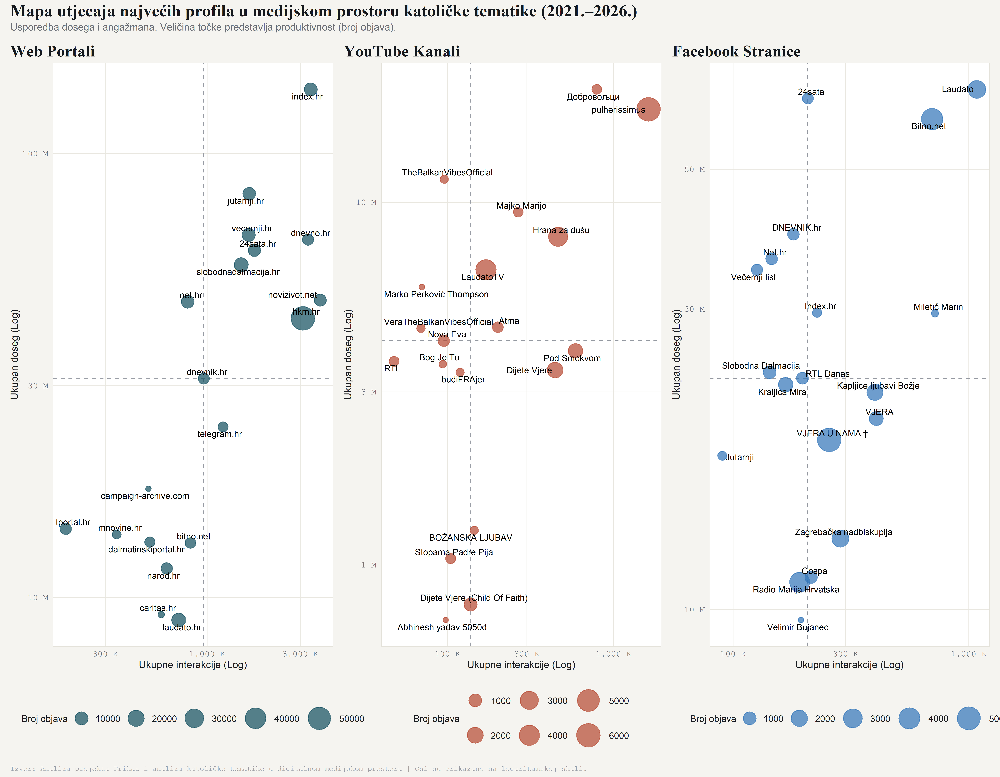
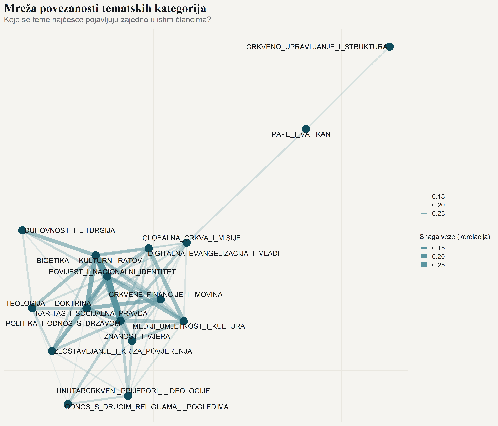

```{r}
#| label: setup
#| include: false

knitr::opts_chunk$set(
  echo = FALSE, message = FALSE, warning = FALSE,
  fig.width = 12, fig.height = 5, dpi = 200
)
library(dplyr)
library(tidyr)
library(ggplot2)
source("../../R/theme_digikat.R")
```

```{r}
#| label: load-data
#| include: false

# Ovaj pregled čita ISKLJUČIVO male praćene agregate iz data/processed/ —
# ne matični skup i ne data/nlp/. Renderiranje je jeftino i bez nuspojava na data/.
platform_summary <- readRDS("../../data/processed/platform_summary.rds")
source_summary   <- readRDS("../../data/processed/source_summary.rds")

fmt_int <- function(x) formatC(x, format = "d", big.mark = ".")
fmt_pct <- function(x, d = 1) paste0(formatC(x, format = "f", digits = d, decimal.mark = ","), " %")
fmt_mil <- function(x, d = 1) paste0(formatC(x / 1e6, format = "f", digits = d, decimal.mark = ","), " mil.")

corpus_total <- sum(platform_summary$total_posts)
n_platforms  <- n_distinct(platform_summary$SOURCE_TYPE)
total_inter  <- sum(platform_summary$total_interactions)
total_reach  <- sum(platform_summary$total_reach)
first_year   <- min(platform_summary$year)
last_year    <- max(platform_summary$year)

# Skupni (pooled) udjeli platformi kroz cijelo razdoblje
pooled <- platform_summary |>
  group_by(SOURCE_TYPE) |>
  summarise(posts = sum(total_posts),
            inter = sum(total_interactions),
            reach = sum(total_reach), .groups = "drop") |>
  mutate(post_sh  = 100 * posts / sum(posts),
         int_sh   = 100 * inter / sum(inter),
         reach_sh = 100 * reach / sum(reach))

sh <- function(p, col) pooled[[col]][pooled$SOURCE_TYPE == p]
web_post_sh  <- sh("web", "post_sh")
web_int_sh   <- sh("web", "int_sh")
web_reach_sh <- sh("web", "reach_sh")
fb_post_sh   <- sh("facebook", "post_sh")
fb_int_sh    <- sh("facebook", "int_sh")
fb_reach_sh  <- sh("facebook", "reach_sh")
yt_post_sh   <- sh("youtube", "post_sh")
yt_int_sh    <- sh("youtube", "int_sh")

# Koncentracija utjecaja: udio deset najvećih aktera u interakcijama po godini
# (zrcali izračun iz evolucija.qmd; skupni/anonimizirani identifikatori izuzeti).
non_actor_from <- c(".", "anonymous_user")
conc <- source_summary |>
  filter(!FROM %in% non_actor_from) |>
  group_by(year) |>
  arrange(desc(total_interactions), .by_group = TRUE) |>
  summarise(top10 = sum(head(total_interactions, 10)),
            tot   = sum(total_interactions), .groups = "drop") |>
  mutate(share = 100 * top10 / tot)
conc_first <- conc$share[conc$year == first_year]
conc_lfy   <- conc$share[conc$year == last_year - 1]  # posljednja POTPUNA godina

# Najproduktivniji pojedinačni izvor (iz punog godišnjeg popisa izvora)
hkm_posts <- sum(source_summary$productivity[source_summary$FROM == "hkm.hr"])

# Broj javnih agregata u data/processed/
n_aggregates <- length(list.files("../../data/processed", pattern = "\\.rds$"))

# Datum izrade (hrvatski genitiv mjeseca, malo slovo)
mjeseci_gen <- c("siječnja", "veljače", "ožujka", "travnja", "svibnja", "lipnja",
                 "srpnja", "kolovoza", "rujna", "listopada", "studenoga", "prosinca")
danas <- Sys.Date()
datum_izrade <- paste0(as.integer(format(danas, "%d")), ". ",
                       mjeseci_gen[as.integer(format(danas, "%m"))], " ",
                       format(danas, "%Y"), ".")

# Zaštita od tihe promjene podataka: pregled je pisan uz ovo stanje agregata
# (i uz slike renderirane iz njega). Nakon namjernog osvježenja podataka
# ažurirati ovu konstantu I ponovno renderirati mapa/mapa_stats stranice.
stopifnot(
  corpus_total == 710307,
  n_platforms == 9,
  abs(sum(pooled$post_sh) - 100) < 0.01,
  abs(sum(pooled$int_sh) - 100) < 0.01,
  abs(sum(pooled$reach_sh) - 100) < 0.01,
  length(conc_first) == 1, length(conc_lfy) == 1,
  conc_first > conc_lfy,
  hkm_posts > 0
)
```

```{=html}
<style>
.pregled-prose { max-width: 44rem; line-height: 1.7; }
.koncept-broj {
  display: inline-block; font-family: "IBM Plex Mono", monospace;
  font-size: .72rem; letter-spacing: .08em; color: #0F4C5C;
  background: #EAF0F2; border-radius: 4px; padding: 3px 9px; margin-bottom: .6rem;
}
.pull-stat {
  font-family: "IBM Plex Mono", monospace; font-weight: 600; font-size: 1.9rem;
  color: #0F4C5C; letter-spacing: -0.02em; margin: 1.2rem 0 .2rem;
}
.pull-stat-label { font-size: .85rem; color: #6B6F76; margin-bottom: 1rem; }
.letter-signature {
  margin-top: 3rem; padding-top: 1.2rem; border-top: 1px solid #E4E2DA;
  font-family: "Source Serif 4", serif; font-size: 1.05rem; color: #14181D;
}
.letter-signature .role {
  display: block; font-family: "IBM Plex Mono", monospace;
  font-size: .75rem; letter-spacing: .06em; color: #6B6F76; margin-top: .3rem;
}
.izvor-caption {
  font-family: "IBM Plex Mono", monospace; font-size: .74rem; color: #9A9EA6;
  margin: .4rem 0 1.6rem;
}
@media print {
  .navbar, .nav-footer, #quarto-header, #quarto-margin-sidebar { display: none !important; }
  .info-card, .metric-card, .featured-box, .timeline-item { break-inside: avoid; }
}
</style>
```

<!-- GOVORNIČKE BILJEŠKE · 0:00–1:30 — pročitati pozdrav i jednu misijsku rečenicu;
     pokazati prvu karticu brojki (broj objava). Poruka: empirijski, otvoreni zahvat. -->

::: {.pregled-prose}
Poštovani,

pred vama je sažeti pregled projekta **DigiKat — Prikaz i analiza katoličke tematike u digitalnom medijskom prostoru**, koji se provodi na Hrvatskom katoličkom sveučilištu. Projekt računalnim metodama društvenih znanosti mapira kako se o katoličkoj tematici piše i raspravlja na hrvatskom internetu — na portalima, društvenim mrežama i forumima. Riječ je o empirijskom istraživanju provedenom prema načelima otvorene znanosti.

Ovaj dokument donosi ono što bismo izložili u petnaest minuta: pet povezanih koncepata, tri nalaza i jednu metodološku ogradu. Svaki koncept vodi na stranicu projekta koja ga razrađuje.
:::

<div class="metric-grid">
<div class="metric-card">
<div class="metric-value">`r fmt_int(corpus_total)`</div>
<div class="metric-label">Medijskih objava</div>
</div>
<div class="metric-card">
<div class="metric-value">`r n_platforms`</div>
<div class="metric-label">Platformi</div>
</div>
<div class="metric-card">
<div class="metric-value">`r fmt_mil(total_inter)`</div>
<div class="metric-label">Interakcija</div>
</div>
<div class="metric-card">
<div class="metric-value">`r first_year`.–`r last_year`.</div>
<div class="metric-label">Razdoblje analize (2026. nepotpuna)</div>
</div>
</div>

<!-- GOVORNIČKE BILJEŠKE · 1:30–2:30 — tri metrike u deset sekundi; naglasiti da je
     doseg POTENCIJALNI. Najaviti strukturu: pet koncepata, tri nalaza, jedna ograda. -->

::: {.callout-note}
## Tri metrike, prije nastavka

Pod **volumenom** podrazumijevamo ukupan broj objava, što reflektira produktivnost aktera. **Angažman** označava ukupne interakcije, odnosno zbroj lajkova, komentara, dijeljenja i sličnih reakcija publike. **Doseg** (*reach*) predstavlja ukupan broj korisnika koji su **potencijalno** vidjeli sadržaj — riječ je o procjeni, a ne o stvarnim pregledima.

Jedna napomena unaprijed: zbog promjene metode prikupljanja oko 2024. godišnji volumeni nisu izravno usporedivi. Puna ograda nalazi se uz peti koncept.
:::

<!-- GOVORNIČKE BILJEŠKE · 2:30–3:30 — kartica 01: razina „tko objavljuje";
     četiri arhetipa najaviti, razraditi ih tek kod Nalaza 2. -->

## Prvi koncept — Mapa ekosustava

<div class="info-card">
<span class="koncept-broj">Koncept 01 · 4 arhetipa aktera</span>
<h3>Tko objavljuje i s kojim učinkom</h3>
<p>Prva analitička razina mjeri volumen, doseg i angažman po platformama i izvorima. Na logaritamskoj karti dosega i angažmana, s rezovima na medijanima platforme, akteri se razvrstavaju u četiri arhetipa — <strong>Divove, Graditelje zajednica, Megafone i Specijalizirane aktere</strong> (Giants, Community Builders, Megaphones, Specialists). Položaji su izračunati iz podataka, a ne procijenjeni.</p>
<p><a href="https://lusiki.github.io/DigiKat/pages/mapa/mapa.html">Mapa ekosustava — cijela analiza</a></p>
</div>

<!-- GOVORNIČKE BILJEŠKE · 3:30–6:00 — NALAZ 1: tri trake slijeva nadesno (objave →
     interakcije → doseg); poanta: Facebook s osminom objava gotovo sustiže web u dosegu. -->

::: {.featured-box}
### Nalaz 1 — platforme se funkcionalno specijaliziraju

Web portali proizvode `r fmt_pct(web_post_sh)` svih objava, ali drže `r fmt_pct(web_int_sh)` interakcija i `r fmt_pct(web_reach_sh)` potencijalnog dosega. Konfesionalni hkm.hr je pritom najproduktivniji pojedinačni izvor u korpusu, s `r fmt_int(hkm_posts)` objava. Facebook s `r fmt_pct(fb_post_sh)` objava ostvaruje `r fmt_pct(fb_reach_sh)` ukupnog potencijalnog dosega — gotovo koliko i web, uz `r round(web_post_sh / fb_post_sh)` puta manje objava. YouTube s `r fmt_pct(yt_post_sh)` objava preuzima `r fmt_pct(yt_int_sh)` interakcija.

Dominacija web-sadržaja nije, dakle, samo brojčana: ona odražava ulogu tradicionalnih medija kao čuvara vijesti u hrvatskom društvu, dok društvene i video platforme uspješnije potiču izravan angažman publike.

<div class="pull-stat">`r fmt_pct(fb_post_sh)` objava → `r fmt_pct(fb_reach_sh)` dosega</div>
<div class="pull-stat-label">Facebook: udio u proizvodnji naspram udjela u potencijalnom dosegu, 2021.–2026.</div>
:::

```{r}
#| label: plot-udjeli
#| fig-alt: !expr 'paste0("Vodoravni složeni stupci: udjeli platformi u objavama, interakcijama i potencijalnom dosegu. Web pada s ", fmt_pct(web_post_sh), " objava na ", fmt_pct(web_reach_sh), " dosega, a Facebook raste s ", fmt_pct(fb_post_sh), " objava na ", fmt_pct(fb_reach_sh), " dosega.")'

plot_df <- pooled |>
  mutate(grupa = ifelse(SOURCE_TYPE %in% c("web", "facebook", "youtube"),
                        SOURCE_TYPE, "ostalo")) |>
  group_by(grupa) |>
  summarise(posts = sum(posts), inter = sum(inter), reach = sum(reach),
            .groups = "drop") |>
  transmute(grupa,
            `Udio objava`               = 100 * posts / sum(posts),
            `Udio interakcija`          = 100 * inter / sum(inter),
            `Udio potencijalnog dosega` = 100 * reach / sum(reach)) |>
  pivot_longer(-grupa, names_to = "metrika", values_to = "udio") |>
  mutate(grupa = factor(grupa, levels = c("web", "facebook", "youtube", "ostalo")),
         metrika = factor(metrika, levels = rev(c("Udio objava", "Udio interakcija",
                                                  "Udio potencijalnog dosega"))),
         oznaka = ifelse(udio >= 8,
                         paste0(formatC(udio, format = "f", digits = 1,
                                        decimal.mark = ","), " %"), ""))

boje <- c(dk_platform_colors[c("web", "facebook", "youtube")], "ostalo" = "#C9C6BC")

ggplot(plot_df, aes(x = udio, y = metrika, fill = grupa)) +
  geom_col(width = 0.62, position = position_stack(reverse = TRUE)) +
  geom_text(aes(label = oznaka), position = position_stack(vjust = 0.5, reverse = TRUE),
            family = dk_mono, colour = "white", size = 4.4, fontface = "bold") +
  scale_fill_manual(values = boje, name = NULL,
                    labels = c(web = "Web portali", facebook = "Facebook",
                               youtube = "YouTube", ostalo = "Ostale platforme")) +
  scale_x_continuous(expand = expansion(mult = c(0, 0.02)),
                     labels = function(x) paste0(x, " %")) +
  labs(title = "Tri četvrtine proizvodnje, manje od polovice dosega",
       subtitle = "Udjeli platformi u objavama, interakcijama i potencijalnom dosegu, 2021.–2026.",
       x = NULL, y = NULL,
       caption = "Izvor: DigiKat, javni agregati (data/processed), 2021.–2026. Doseg je vendorska procjena potencijalnog dosega.") +
  theme_digikat(base_size = 14) +
  theme(legend.position = "top", panel.grid.major.y = element_blank())
```

<!-- GOVORNIČKE BILJEŠKE · 6:00–8:00 — NALAZ 2: objasniti osi u jednoj rečenici, potom
     po jedan arhetip po kvadrantu; završiti na župnim stranicama („utjecaj bez veličine"). -->

::: {.featured-box}
### Nalaz 2 — četiri puta do utjecaja

Na karti dosega i angažmana **Divovi** su apsolutni lideri ekosustava, s visokim dosegom i visokim angažmanom. **Megafoni** dopiru daleko, ali ne potiču raspravu. **Specijalizirani akteri** djeluju u tematskim i geografskim nišama, s manjom publikom. Najzanimljiviji su **Graditelji zajednica**: akteri manjeg dosega, ali iznimno visokog angažmana (poput župnih Facebook stranica). Oni pokazuju „alternativni put do utjecaja koji ne ovisi o veličini publike, već o kvaliteti odnosa”.

Među istaknutim primjerima izvora su konfesionalni hkm.hr, index.hr i bitno.net. Ne postoji jedinstvena formula uspjeha: do utjecaja se dolazi i masovnom produkcijom i fokusiranom izgradnjom zajednice.
:::

{fig-alt="Trodijelna točkasta karta aktera po dosegu i angažmanu za web, YouTube i Facebook, s medijanskim linijama koje dijele četiri kvadranta arhetipova."}

<div class="izvor-caption">Izvor: Mapa ekosustava (render 2. srpnja 2026.) — <a href="https://lusiki.github.io/DigiKat/pages/mapa/mapa.html">lusiki.github.io/DigiKat/pages/mapa/mapa.html</a></div>

<!-- GOVORNIČKE BILJEŠKE · 8:00–9:00 — kartice 02 i 03 u dvije rečenice: razina
     „o čemu" i razina „kako". -->

## Drugi i treći koncept — o čemu i kako se govori

<div class="card-grid">
<div class="info-card">
<span class="koncept-broj">Koncept 02 · 16 tematskih kategorija</span>
<h3>Tematske struje</h3>
<p>Druga razina odgovara na pitanje o čemu se govori: lematizacija (udpipe, hrvatski model 2.5) i rječnik od 16 tematskih kategorija na stratificiranom uzorku od 5 % korpusa. Okosnicu diskursa čine Duhovnost i liturgija te Crkveno upravljanje i struktura, uz snažnu prisutnost politike i bioetike.</p>
<p><a href="https://lusiki.github.io/DigiKat/pages/mapa/mapa_stats.html">Tematske struje — cijela analiza</a></p>
</div>
<div class="info-card">
<span class="koncept-broj">Koncept 03 · 8 emocija · RIK</span>
<h3>Atmosfera diskursa</h3>
<p>Treća razina mjeri kako se govori: tonalitet (CroSentilex i CroSentilex Gold), osam emocija (lilaHR) i Relativni indeks konflikta (RIK) na uzorku od 2 %. Intenzitet konfliktnog jezika, a ne tonalitet, pokazuje se glavnim razlikovnim obilježjem narativnih okvira.</p>
<p><a href="https://lusiki.github.io/DigiKat/pages/mapa/diskurs.html">Atmosfera diskursa — cijela analiza</a></p>
</div>
</div>

<!-- GOVORNIČKE BILJEŠKE · 9:00–11:00 — NALAZ 3: dva klastera na mreži; konflikt pokreće
     angažman. Reći izrijekom: „kvalitativan obrazac, ne postotak". Konvergencija dviju metoda. -->

::: {.featured-box}
### Nalaz 3 — dva tematska svijeta

Diskurs se dosljedno dijeli na dva svijeta. Pastoralni svijet (Duhovnost i liturgija, Karitas i socijalna pravda, Digitalna evangelizacija) prati pretežno pozitivan prijem. Društveno-politički svijet (Politika i odnos s državom, Povijest i nacionalni identitet, Bioetika i kulturni ratovi) nosi najviše angažmana, ali i najjaču polarizaciju: konflikt, kontroverza i krizni narativi djeluju kao glavni pokretači interakcija.

Riječ je o kvalitativnom obrascu, a ne o jednom postotku. Do istog rascjepa neovisno dolaze dvije metode: supojavljivanje tema s reakcijama publike (Tematske struje) i mjerenje konfliktnog rječnika (Atmosfera diskursa). Upravo je ta konvergencija glavni razlog povjerenja u nalaz.
:::

{fig-alt="Mrežni graf šesnaest tematskih kategorija u kojem se teme grupiraju u dva klastera: pastoralni i društveno-politički."}

<div class="izvor-caption">Izvor: Tematske struje (render 1. srpnja 2026.) — <a href="https://lusiki.github.io/DigiKat/pages/mapa/mapa_stats.html">lusiki.github.io/DigiKat/pages/mapa/mapa_stats.html</a></div>

<!-- GOVORNIČKE BILJEŠKE · 11:00–12:30 — kartice 04 i 05, pa ogradu pročitati NAGLAS:
     rast volumena 2025. nije dokaz rasta pažnje; metoda se promijenila. -->

## Četvrti i peti koncept — vrijeme i mijena

<div class="card-grid">
<div class="info-card">
<span class="koncept-broj">Koncept 04 · prag: 3 standardne devijacije</span>
<h3>Fokus na događaje</h3>
<p>Četvrta razina prati kada rasprava eruptira: „digitalni seizmograf” standardizira dnevni volumen i konfliktnost unutar svake godine i označava dane iznad tri standardne devijacije. Detektirani vrhunci sustavno koincidiraju s poznatim događajima — od smrti i pogreba pape Franje u travnju 2025. do Božića, Uskrsa i Velike Gospe. Zbog standardizacije unutar godine, detekcija je otporna na promjenu metode prikupljanja 2024.</p>
<p><a href="https://lusiki.github.io/DigiKat/pages/mapa/doga%C4%91aji.html">Fokus na događaje — cijela analiza</a></p>
</div>
<div class="info-card">
<span class="koncept-broj">Koncept 05 · `r fmt_pct(conc_first)` → `r fmt_pct(conc_lfy)`</span>
<h3>Evolucija ekosustava</h3>
<p>Peta razina daje vremenski presjek: udio deset najvećih aktera u ukupnim interakcijama pada s `r fmt_pct(conc_first)` (2021.) na `r fmt_pct(conc_lfy)` (2025.), a angažman se seli s weba prema videu i društvenim mrežama. Te brojke valja čitati kao okvirne naznake putanje, a ne kao precizne mjere stvarne promjene — dio pada odražava širi zahvat prikupljanja.</p>
<p><a href="https://lusiki.github.io/DigiKat/pages/mapa/evolucija.html">Evolucija ekosustava — cijela analiza</a></p>
</div>
</div>

::: {.callout-warning}
## Promjena metode prikupljanja (oko 2024.) — jedina, ali važna ograda

Korpus objedinjuje dva vremenski odvojena toka prikupljanja: kontinuirani medijski monitoring, koji pokriva pretežno razdoblje 2021.–2024., i naknadno religijsko filtriranje, koje pokriva 2024.–2026. Kako se metoda prikupljanja mijenja oko 2024., **apsolutni volumen i udjeli po godinama nisu izravno usporedivi kroz cijelo razdoblje** — izražen porast broja objava od 2024./2025. dobrim je dijelom posljedica šireg zahvata prikupljanja, a ne nužno porasta medijske pažnje. Instagram i TikTok u korpus ulaze tek od 2024., a 2026. je u korpusu nepotpuna godina. Zato ovaj pregled ne prikazuje nijedan graf rasta po godinama.
:::

<!-- GOVORNIČKE BILJEŠKE · 12:30–13:30 — proizvodni lanac: pet koraka u pet rečenica;
     zadržati se samo na koraku 02 (pravilo ≥2 pogotka od 95 pojmova DEFINIRA korpus). -->

## Kako nastaju podaci i analitičke razine

Svaka brojka u ovom pregledu ima isti rodoslov: od sirovih izvoza do javnih agregata podaci teku u jednom smjeru, a svaki korak proizvodi provjerljiv artefakt.

<div class="timeline">
<div class="timeline-item">
<strong>01 · Prikupljanje</strong> — vendorski monitoring-izvozi u <span class="tag">xlsx</span> formatu: portali, društvene platforme, forumi.
</div>
<div class="timeline-item">
<strong>02 · Filtriranje</strong> — objava ulazi u korpus samo uz <strong>najmanje dva različita podudaranja</strong> s popisom od 95 hrvatskih religijskih pojmova, uz deduplikaciju po URL-u. Korpus je zato tematski zahvat koji miješa konfesionalne i sekularne izvore, a nije probran popis katoličkih medija ni mjera religioznosti. <span class="tag">filtar ≥2 od 95</span>
</div>
<div class="timeline-item">
<strong>03 · Korpus</strong> — glavni skup podataka: `r fmt_int(corpus_total)` objava × 47 varijabli, sa sigurnosnom kopijom prije svakog prebrisavanja. Zbog zaštite sadržaja nije javan. <span class="tag">master</span>
</div>
<div class="timeline-item">
<strong>04 · Agregati</strong> — skripta <span class="tag">R/03_aggregate.R</span> proizvodi `r n_aggregates` javnih agregata bez osobnih podataka (CC BY 4.0), iz kojih su izračunate sve brojke ovog pregleda.
</div>
<div class="timeline-item">
<strong>05 · Analitičke razine</strong> — Mapa ekosustava i Evolucija ekosustava računaju se izravno iz punih javnih agregata. Jezične razine (Tematske struje, Atmosfera diskursa i Fokus na događaje) rade na stratificiranim uzorcima od 2 % do 5 % korpusa (sjeme 123), uz udpipe (hrvatski model 2.5) i leksikone CroSentilex, CroSentilex Gold i lilaHR. <span class="tag">uzorci 2–5 %</span>
</div>
</div>

Projekt slijedi načela otvorene znanosti: agregati su javni, a baza podataka distribuira se pod licencijom CC BY 4.0 — puni tekst objava dostupan je na zahtjev. Više o podacima: [Baza podataka](https://lusiki.github.io/DigiKat/pages/baza.html).

<!-- GOVORNIČKE BILJEŠKE · 13:30–14:15 — agentski sloj u tri rečenice: pravila, provjere,
     zaštite. Poanta: AI ubrzava, ali pravila iz repozitorija čuvaju kvalitetu. -->

## Agentski sloj — pravila po kojima projekt nastaje

Uz podatkovni i analitički sloj, projekt ima i treći, manje vidljiv sloj: agentski. Dio razvojnog posla (pisanje koda, provjere kvalitete, priprema stranica) obavlja se uz pomoć agenata umjetne inteligencije (AI), ali ne slobodnom rukom. Središnja projektna datoteka `CLAUDE.md` u javnom repozitoriju djeluje kao projektni ustav: svaki zahvat, ljudski ili strojni, podliježe istim pravilima.

<div class="card-grid">
<div class="info-card">
<h4>Pravila</h4>
<p>Automatski učitana pravila propisuju radni tok: plan prije svake netrivijalne izmjene, protokol podatkovnog cjevovoda, obvezna provjera renderiranja te očuvanje hrvatske dijakritike i kućnog stila u svakom objavljenom tekstu.</p>
</div>
<div class="info-card">
<h4>Provjere</h4>
<p>Specijalizirani agenti nezavisno provjeravaju rad: objavljene brojke ponovno se izvode iz javnih agregata, stranice se verificiraju nakon renderiranja, a analitički tekstovi prolaze domensku recenziju iz perspektive računalne lingvistike i sociologije religije i medija.</p>
</div>
<div class="info-card">
<h4>Zaštite</h4>
<p>Najrizičnije operacije imaju tvrde brane: glavni skup ne prebrisuje se bez sigurnosne kopije, agregati nastaju isključivo skriptom, pravilo uključivanja u korpus ne mijenja se prešutno, a izmjene koje bi oštetile objavljene stranice projekta blokiraju se prije objave.</p>
</div>
</div>

::: {.pregled-prose}
Agentski sloj ne proizvodi ni podatke ni nalaze — on čuva prijelaze između faza proizvodnog lanca: od sirovih izvoza do korpusa, od korpusa do agregata, od agregata do stranica. U praksi to znači da brojke u tekstu moraju biti izračunate iz podataka, a ne upisane rukom. I ovaj je pregled nastao u tom sloju, s planom pohranjenim u repozitoriju i brojkama koje se pri svakom renderiranju iznova računaju iz javnih agregata uz automatske kontrole. Pravila su javna: [CLAUDE.md u repozitoriju projekta](https://github.com/lusiki/DigiKat/blob/main/CLAUDE.md).
:::

<!-- GOVORNIČKE BILJEŠKE · 14:15–15:00 — završetak: poziv na živu stranicu i interaktivnu
     mrežu izvora; dokument je ujedno i materijal koji ostaje publici (e-mail). -->

## Gdje dalje

Cjelovite analize, interaktivna mreža izvora i otvorena baza podataka dostupni su na stranicama projekta. Mreža izvora prikazuje sve praćene izvore kao interaktivni graf — poveznice u njemu su strukturne (pripadnost platformi i zajednički brend), a ne izmjereni odnosi.

<div style="display: flex; flex-wrap: wrap; gap: 12px; margin: 1.5rem 0;">
<a class="dk-btn" href="https://lusiki.github.io/DigiKat/">Cijela stranica projekta</a>
<a class="dk-btn-outline" href="https://lusiki.github.io/DigiKat/pages/baza.html">Baza podataka</a>
<a class="dk-btn-outline" href="https://lusiki.github.io/DigiKat/pages/izvori/mreza.html">Mreža izvora</a>
<a class="dk-btn-outline" href="https://github.com/lusiki/DigiKat">GitHub</a>
</div>

<div class="letter-signature">
doc. dr. sc. Luka Šikić
<span class="role">voditelj projekta · Hrvatsko katoličko sveučilište · DigiKat</span>
</div>

<div class="izvor-caption" style="margin-top: 2rem;">
DigiKat · CC BY 4.0 · Pregled izrađen `r datum_izrade` — sve brojke izračunate su iz javnih agregata (data/processed) pri renderiranju.
</div>
