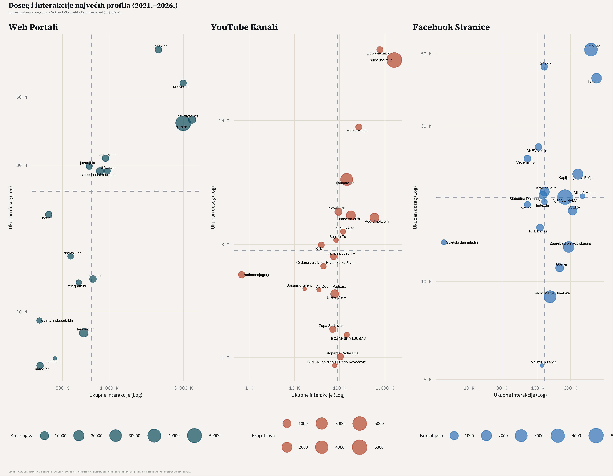
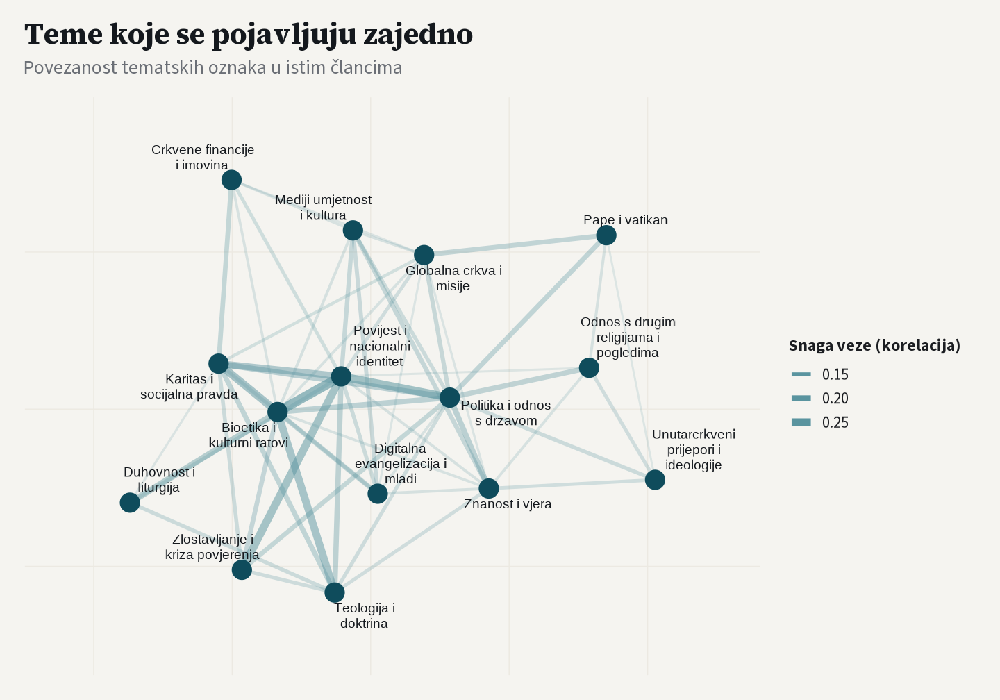

```{r}
#| label: setup
#| include: false

knitr::opts_chunk$set(
  echo = FALSE, message = FALSE, warning = FALSE,
  fig.width = 12, fig.height = 5, dpi = 200
)
library(dplyr)
library(tidyr)
library(ggplot2)
source("../../R/theme_digikat.R")
```

```{r}
#| label: load-data
#| include: false

# Ovaj pregled čita ISKLJUČIVO male praćene agregate iz data/processed/ —
# ne matični skup i ne data/nlp/. Renderiranje je jeftino i bez nuspojava na data/.
platform_summary <- readRDS("../../data/processed/platform_summary.rds")
source_summary   <- readRDS("../../data/processed/source_summary.rds")

fmt_int <- function(x) formatC(x, format = "d", big.mark = ".")
fmt_pct <- function(x, d = 1) paste0(formatC(x, format = "f", digits = d, decimal.mark = ","), " %")
# Engleska varijanta postotka (decimalna točka)
fmt_pct_en <- function(x, d = 1) paste0(formatC(x, format = "f", digits = d, decimal.mark = "."), " %")
fmt_mil <- function(x, d = 1) paste0(formatC(x / 1e6, format = "f", digits = d, decimal.mark = ","), " mil.")
fmt_mil_en <- function(x, d = 1) paste0(formatC(x / 1e6, format = "f", digits = d, decimal.mark = "."), "M")

corpus_total <- sum(platform_summary$total_posts)
n_platforms  <- n_distinct(platform_summary$SOURCE_TYPE)
total_inter  <- sum(platform_summary$total_interactions)
total_reach  <- sum(platform_summary$total_reach)
first_year   <- min(platform_summary$year)
last_year    <- max(platform_summary$year)

# Skupni (pooled) udjeli platformi kroz cijelo razdoblje.
# NB: SOURCE_TYPE je faktor — as.character() je nužan prije ifelse-grupiranja
# (inače ifelse vraća cjelobrojne kodove faktora, ne oznake).
pooled <- platform_summary |>
  mutate(SOURCE_TYPE = as.character(SOURCE_TYPE)) |>
  group_by(SOURCE_TYPE) |>
  summarise(posts = sum(total_posts),
            inter = sum(total_interactions),
            reach = sum(total_reach), .groups = "drop") |>
  mutate(post_sh  = 100 * posts / sum(posts),
         int_sh   = 100 * inter / sum(inter),
         reach_sh = 100 * reach / sum(reach))

sh <- function(p, col) pooled[[col]][pooled$SOURCE_TYPE == p]
web_post_sh  <- sh("web", "post_sh")
web_int_sh   <- sh("web", "int_sh")
web_reach_sh <- sh("web", "reach_sh")
fb_post_sh   <- sh("facebook", "post_sh")
fb_int_sh    <- sh("facebook", "int_sh")
fb_reach_sh  <- sh("facebook", "reach_sh")
yt_post_sh   <- sh("youtube", "post_sh")
yt_int_sh    <- sh("youtube", "int_sh")

# Koncentracija utjecaja: udio deset najvećih aktera u interakcijama po godini
# (zrcali izračun iz evolucija.qmd; skupni/anonimizirani identifikatori izuzeti).
non_actor_from <- c(".", "anonymous_user")
conc <- source_summary |>
  filter(!FROM %in% non_actor_from) |>
  group_by(year) |>
  arrange(desc(total_interactions), .by_group = TRUE) |>
  summarise(top10 = sum(head(total_interactions, 10)),
            tot   = sum(total_interactions), .groups = "drop") |>
  mutate(share = 100 * top10 / tot)
conc_first <- conc$share[conc$year == first_year]
conc_lfy   <- conc$share[conc$year == last_year - 1]  # posljednja POTPUNA godina

# Najproduktivniji pojedinačni izvor (iz punog godišnjeg popisa izvora)
hkm_posts <- sum(source_summary$productivity[source_summary$FROM == "hkm.hr"])

# Broj javnih agregata u data/processed/
n_aggregates <- length(list.files("../../data/processed", pattern = "\\.rds$"))

# Zaštita od tihe promjene podataka: pregled je pisan uz ovo stanje agregata
# (i uz slike renderirane iz njega). Nakon namjernog osvježenja podataka
# ažurirati ovu konstantu I ponovno renderirati mapa/mapa_stats stranice.
stopifnot(
  corpus_total == 710307,
  n_platforms == 9,
  abs(sum(pooled$post_sh) - 100) < 0.01,
  abs(sum(pooled$int_sh) - 100) < 0.01,
  abs(sum(pooled$reach_sh) - 100) < 0.01,
  length(conc_first) == 1, length(conc_lfy) == 1,
  conc_first > conc_lfy,
  hkm_posts > 0
)
```

```{=html}
<style>
.pregled-prose { max-width: 44rem; line-height: 1.7; }
.layer-broj {
  display: inline-block; font-family: "IBM Plex Mono", monospace;
  font-size: .72rem; letter-spacing: .08em; color: #0F4C5C;
  background: #EAF0F2; border-radius: 4px; padding: 3px 9px; margin-bottom: .6rem;
}
.pull-stat {
  font-family: "IBM Plex Mono", monospace; font-weight: 600; font-size: 1.9rem;
  color: #0F4C5C; letter-spacing: -0.02em; margin: 1.2rem 0 .2rem;
}
.pull-stat-label { font-size: .85rem; color: #6B6F76; margin-bottom: 1rem; }
.letter-signature {
  margin-top: 3rem; padding-top: 1.2rem; border-top: 1px solid #E4E2DA;
  font-family: "Source Serif 4", serif; font-size: 1.05rem; color: #14181D;
}
.letter-signature .role {
  display: block; font-family: "IBM Plex Mono", monospace;
  font-size: .75rem; letter-spacing: .06em; color: #6B6F76; margin-top: .3rem;
}
.izvor-caption {
  font-family: "IBM Plex Mono", monospace; font-size: .74rem; color: #9A9EA6;
  margin: .4rem 0 1.6rem;
}
/* Zbirni rječnik metrika kao sklopivi element */
details.metrike {
  background: #EAF0F2; border-left: 3px solid #0F4C5C; border-radius: 8px;
  padding: .5rem 1.2rem; margin: 1.75rem 0;
}
details.metrike > summary {
  cursor: pointer; font-weight: 600; color: #0A3543; padding: .5rem 0;
  list-style: none;
}
details.metrike > summary::-webkit-details-marker { display: none; }
details.metrike > summary::before { content: "▸ "; color: #0F4C5C; }
details.metrike[open] > summary::before { content: "▾ "; }

/* ---- Prebacivanje jezika (HR / EN) ---- */
.lang-switch {
  position: sticky; top: 0; z-index: 50;
  display: flex; justify-content: flex-end; gap: 4px;
  padding: 8px 0; margin-bottom: .5rem;
  background: rgba(245,244,240,.92); backdrop-filter: blur(4px);
}
.lang-switch button {
  font-family: "IBM Plex Mono", monospace; font-size: .78rem; letter-spacing: .06em;
  border: 1px solid #cfccc2; background: #fff; color: #4f535a;
  border-radius: 6px; padding: 5px 14px; cursor: pointer;
}
.lang-switch button.active { background: #0F4C5C; color: #fff; border-color: #0F4C5C; }
/* Zadano: prikazuje se hrvatski; .en klase skrivene dok se ne uključe */
body.show-en .lang-hr { display: none; }
body:not(.show-en) .lang-en { display: none; }
</style>

<div class="lang-switch">
  <button id="btn-hr" class="active" onclick="setLang('hr')">HR</button>
  <button id="btn-en" onclick="setLang('en')">EN</button>
</div>
<script>
function setLang(l){
  document.body.classList.toggle('show-en', l==='en');
  document.getElementById('btn-hr').classList.toggle('active', l==='hr');
  document.getElementById('btn-en').classList.toggle('active', l==='en');
  document.documentElement.lang = l;
}
</script>
```

<!-- ============================ UVOD / INTRO ============================ -->

::: {.pregled-prose}
::: {.lang-hr}
DigiKat je istraživanje Hrvatskoga katoličkog sveučilišta koje računalnim metodama društvenih znanosti mjeri kako se o katoličkoj tematici piše i raspravlja u hrvatskom digitalnom medijskom prostoru, na portalima, društvenim mrežama i forumima. Provedeno je prema načelima otvorene znanosti.

Ovaj pregled sažima cijeli projekt. Digitalni prostor čita se kroz pet analitičkih razina: prva pokazuje **tko** objavljuje i s kolikim učinkom, druga **o čemu** se govori, treća **kako** se govori, a četvrta i peta **kada** rasprava eruptira i **kako** se prostor mijenja kroz vrijeme. Zajedno one od raspršenoga korpusa objava grade jasnu kartu digitalnoga medijskog prostora katoličke tematike. Svaka razina ovdje je sažeta na najvažnije, a poveznica vodi na stranicu koja je razrađuje.
:::
::: {.lang-en}
DigiKat is a research project of the Catholic University of Croatia that uses computational social science to measure how Catholic topics are written about and discussed across Croatia's digital media space: on news portals, social networks and forums. It is conducted according to the principles of open science.

This overview summarises the whole project. The digital space is read through five analytical layers: the first shows **who** publishes and to what effect, the second **what** is being discussed, the third **how** it is discussed, and the fourth and fifth **when** debate erupts and **how** the space changes over time. Together they turn a scattered corpus of posts into a clear map of the digital media space around Catholic topics. Each layer is distilled here to its essentials, with a link to the page that develops it in full.
:::
:::

<!-- ============================ KPI ============================ -->

<div class="metric-grid">
<div class="metric-card">
<div class="metric-value">`r fmt_int(corpus_total)`</div>
<div class="metric-label"><span class="lang-hr">Medijskih objava</span><span class="lang-en">Media posts</span></div>
</div>
<div class="metric-card">
<div class="metric-value">`r n_platforms`</div>
<div class="metric-label"><span class="lang-hr">Platformi</span><span class="lang-en">Platforms</span></div>
</div>
<div class="metric-card">
<div class="metric-value"><span class="lang-hr">`r fmt_mil(total_inter)`</span><span class="lang-en">`r fmt_mil_en(total_inter)`</span></div>
<div class="metric-label"><span class="lang-hr">Interakcija</span><span class="lang-en">Interactions</span></div>
</div>
<div class="metric-card">
<div class="metric-value">`r first_year`.–`r last_year`.</div>
<div class="metric-label"><span class="lang-hr">Razdoblje analize</span><span class="lang-en">Analysis period</span></div>
</div>
</div>

<!-- ============================ RJEČNIK METRIKA (sklopivo) ============================ -->

```{=html}
<details class="metrike">
<summary><span class="lang-hr">Kako čitati brojke — tri osnovne metrike</span><span class="lang-en">How to read the numbers — three core metrics</span></summary>
<div class="lang-hr">
<p><strong>Volumen</strong> je ukupan broj objava i mjeri produktivnost aktera. <strong>Angažman</strong> su ukupne interakcije, odnosno zbroj lajkova, komentara, dijeljenja i sličnih reakcija publike. <strong>Doseg</strong> je procijenjeni broj korisnika koji su objavu mogli vidjeti. Doseg je procjena pružatelja podataka, a ne broj stvarnih pregleda.</p>
</div>
<div class="lang-en">
<p><strong>Volume</strong> is the total number of posts and measures how productive an actor is. <strong>Engagement</strong> is the sum of interactions: likes, comments, shares and similar audience reactions. <strong>Reach</strong> is the estimated number of users who could have seen a post. Reach is a data-provider estimate, not a count of actual views.</p>
</div>
</details>
```

<!-- ============================ RAZINA 1 — MAPA EKOSUSTAVA ============================ -->

## Mapa ekosustava

<div class="info-card">
<span class="layer-broj">01 · <span class="lang-hr">4 arhetipa aktera</span><span class="lang-en">4 actor archetypes</span></span>
<div class="lang-hr">
<h3>Tko objavljuje i s kojim učinkom</h3>
<p>Prva razina mjeri volumen, doseg i angažman po platformama i izvorima. Na logaritamskoj karti dosega i angažmana, s rezovima na medijanima platforme, akteri se razvrstavaju u četiri arhetipa: <strong>Divove, Graditelje zajednica, Megafone i Specijalizirane aktere</strong>. Njihovi su položaji izračunati iz podataka, a ne procijenjeni.</p>
<p><a href="https://lusiki.github.io/DigiKat/pages/mapa/mapa.html">Mapa ekosustava — cijela analiza</a></p>
</div>
<div class="lang-en">
<h3>Who publishes, and to what effect</h3>
<p>The first layer measures volume, reach and engagement by platform and source. On a log–log map of reach against engagement, split at each platform's medians, actors sort into four archetypes: <strong>Giants, Community Builders, Megaphones and Specialists</strong>. Their positions are computed from the data, not estimated.</p>
<p><a href="https://lusiki.github.io/DigiKat/pages/mapa/mapa.html">Ecosystem map — full analysis</a></p>
</div>
</div>

::: {.featured-box}
::: {.lang-hr}
### Nalaz 1 — platforme se funkcionalno specijaliziraju

Web-portali proizvode `r fmt_pct(web_post_sh)` svih objava, ali drže `r fmt_pct(web_int_sh)` interakcija i tek `r fmt_pct(web_reach_sh)` dosega. Facebook s `r fmt_pct(fb_post_sh)` objava ostvaruje `r fmt_pct(fb_reach_sh)` dosega, gotovo koliko i web, uz `r round(web_post_sh / fb_post_sh)` puta manje objava. YouTube s `r fmt_pct(yt_post_sh)` objava preuzima `r fmt_pct(yt_int_sh)` interakcija. Najproduktivniji je pojedinačni izvor konfesionalni hkm.hr, s `r fmt_int(hkm_posts)` objava.

Dominacija web-sadržaja nije samo brojčana. Ona odražava ulogu tradicionalnih medija kao čuvara vijesti u hrvatskom društvu, dok društvene i video platforme uspješnije potiču izravan angažman publike.
:::
::: {.lang-en}
### Finding 1 — platforms specialise by function

Web portals produce `r fmt_pct_en(web_post_sh)` of all posts, yet hold `r fmt_pct_en(web_int_sh)` of interactions and only `r fmt_pct_en(web_reach_sh)` of reach. Facebook, with `r fmt_pct_en(fb_post_sh)` of posts, achieves `r fmt_pct_en(fb_reach_sh)` of reach, almost as much as web, with `r round(web_post_sh / fb_post_sh)` times fewer posts. YouTube, with `r fmt_pct_en(yt_post_sh)` of posts, takes `r fmt_pct_en(yt_int_sh)` of interactions. The single most productive source is the confessional portal hkm.hr, with `r fmt_int(hkm_posts)` posts.

The dominance of web content is not merely numerical. It reflects the role of traditional media as gatekeepers of news in Croatian society, while social and video platforms are more effective at prompting direct audience engagement.
:::

<div class="pull-stat"><span class="lang-hr">`r fmt_pct(fb_post_sh)` objava → `r fmt_pct(fb_reach_sh)` dosega</span><span class="lang-en">`r fmt_pct_en(fb_post_sh)` of posts → `r fmt_pct_en(fb_reach_sh)` of reach</span></div>
<div class="pull-stat-label"><span class="lang-hr">Facebook: udio u proizvodnji naspram udjela u dosegu, 2021.–2026.</span><span class="lang-en">Facebook: share of production versus share of reach, 2021–2026.</span></div>
:::

```{r}
#| label: plot-udjeli
#| fig-alt: !expr 'paste0("Vodoravni složeni stupci: udjeli platformi u objavama, interakcijama i dosegu. Web-portali padaju s ", fmt_pct(web_post_sh), " objava na ", fmt_pct(web_reach_sh), " dosega, a Facebook raste s ", fmt_pct(fb_post_sh), " objava na ", fmt_pct(fb_reach_sh), " dosega.")'

big <- c("web", "facebook", "youtube")
plot_df <- platform_summary |>
  mutate(SOURCE_TYPE = as.character(SOURCE_TYPE),
         grupa = ifelse(SOURCE_TYPE %in% big, SOURCE_TYPE, "ostalo")) |>
  group_by(grupa) |>
  summarise(Objave = sum(total_posts),
            Interakcije = sum(total_interactions),
            Doseg = sum(total_reach), .groups = "drop") |>
  pivot_longer(-grupa, names_to = "metrika", values_to = "vr") |>
  group_by(metrika) |>
  mutate(udio = 100 * vr / sum(vr)) |>
  ungroup() |>
  mutate(
    grupa = factor(grupa, levels = c("ostalo", "youtube", "facebook", "web"),
                   labels = c("Ostale platforme", "YouTube", "Facebook", "Web-portali")),
    metrika = factor(metrika, levels = c("Objave", "Interakcije", "Doseg"),
                     labels = c("Udio u objavama", "Udio u interakcijama", "Udio u dosegu")),
    metrika = factor(metrika, levels = rev(levels(metrika))),
    oznaka = ifelse(udio >= 6,
                    paste0(formatC(udio, format = "f", digits = 1, decimal.mark = ","), " %"), ""))

boje <- c("Web-portali" = unname(dk_platform_colors["web"]),
          "Facebook"    = unname(dk_platform_colors["facebook"]),
          "YouTube"     = unname(dk_platform_colors["youtube"]),
          "Ostale platforme" = "#B7B3A8")

ggplot(plot_df, aes(x = udio, y = metrika, fill = grupa)) +
  geom_col(width = 0.62, position = position_stack(reverse = TRUE)) +
  geom_text(aes(label = oznaka), position = position_stack(vjust = 0.5, reverse = TRUE),
            family = dk_mono, colour = "white", size = 4.3, fontface = "bold") +
  scale_fill_manual(values = boje, name = NULL, guide = guide_legend(reverse = TRUE)) +
  scale_x_continuous(expand = expansion(mult = c(0, 0.02)),
                     labels = function(x) paste0(x, " %")) +
  labs(title = "Tri četvrtine proizvodnje, manje od polovice dosega",
       subtitle = "Kako se objave, interakcije i doseg dijele među platformama, 2021.–2026.",
       x = NULL, y = NULL,
       caption = paste0("Izvor: DigiKat, javni agregati. „Ostale platforme” = Twitter/X, Reddit, forumi,\n",
                        "Instagram, TikTok i komentari zajedno. Doseg je procjena pružatelja podataka.")) +
  theme_digikat(base_size = 14) +
  theme(legend.position = "top", panel.grid.major.y = element_blank())
```

::: {.lang-hr}
Graf pokazuje kako se svaka od tri metrike dijeli među platformama. Svaki stupac zbraja se na 100 %. „Ostale platforme” obuhvaćaju Twitter/X, Reddit, forume, Instagram, TikTok i komentare zajedno, a svaka od njih pojedinačno nosi manji udio.
:::
::: {.lang-en}
The chart shows how each of the three metrics is split among platforms. Each bar sums to 100 %. "Other platforms" groups Twitter/X, Reddit, forums, Instagram, TikTok and comments together, and each of these individually carries a smaller share.
:::

<!-- ============================ NALAZ 2 — ARHETIPI ============================ -->

::: {.featured-box}
::: {.lang-hr}
### Nalaz 2 — četiri puta do utjecaja

Na karti dosega i angažmana **Divovi** su apsolutni lideri ekosustava, s visokim dosegom i visokim angažmanom. **Megafoni** dopiru daleko, ali ne potiču raspravu. **Specijalizirani akteri** djeluju u tematskim i geografskim nišama, s manjom publikom. Najzanimljiviji su **Graditelji zajednica**: akteri manjeg dosega, ali iznimno visokog angažmana, poput župnih Facebook stranica. Oni pokazuju put do utjecaja koji ne ovisi o veličini publike, nego o kvaliteti odnosa.

Među istaknutim primjerima izvora su konfesionalni hkm.hr, index.hr i bitno.net. Ne postoji jedinstvena formula uspjeha: do utjecaja se dolazi i masovnom produkcijom i fokusiranom izgradnjom zajednice.
:::
::: {.lang-en}
### Finding 2 — four paths to influence

On the reach–engagement map, **Giants** are the outright leaders of the ecosystem, high on both reach and engagement. **Megaphones** travel far but do not spark debate. **Specialists** operate in thematic and geographic niches with smaller audiences. The most interesting are the **Community Builders**: actors with modest reach but exceptionally high engagement, such as parish Facebook pages. They show a path to influence that depends not on audience size but on the quality of the relationship.

Prominent examples of sources include the confessional hkm.hr, index.hr and bitno.net. There is no single formula for success: influence is reached both through mass production and through focused community-building.
:::
:::

{fig-alt="Trodijelna točkasta karta aktera po dosegu i angažmanu za web, YouTube i Facebook, s medijanskim linijama koje dijele četiri kvadranta arhetipova."}

<div class="izvor-caption"><span class="lang-hr">Karta utjecaja aktera: doseg (okomito) i angažman (vodoravno), po platformama; veličina točke je broj objava. Izvor:</span><span class="lang-en">Actor influence map: reach (vertical) and engagement (horizontal), by platform; point size is the number of posts. Source:</span> <a href="https://lusiki.github.io/DigiKat/pages/mapa/mapa.html">Mapa ekosustava</a></div>

<!-- ============================ RAZINE 2 i 3 ============================ -->

## Tematske struje i atmosfera diskursa

<div class="card-grid">
<div class="info-card">
<span class="layer-broj">02 · <span class="lang-hr">16 tematskih kategorija</span><span class="lang-en">16 thematic categories</span></span>
<div class="lang-hr">
<h3>Tematske struje</h3>
<p>Druga razina odgovara na pitanje o čemu se govori: lematizacija (udpipe) i rječnik od 16 tematskih kategorija primijenjeni na korpus. Okosnicu diskursa čine Duhovnost i liturgija te Crkveno upravljanje i struktura, uz snažnu prisutnost politike i bioetike.</p>
<p><a href="https://lusiki.github.io/DigiKat/pages/mapa/mapa_stats.html">Tematske struje — cijela analiza</a></p>
</div>
<div class="lang-en">
<h3>Thematic streams</h3>
<p>The second layer answers what is being discussed: lemmatisation (udpipe) and a dictionary of 16 thematic categories applied to the corpus. The backbone of the discourse is Spirituality and liturgy together with Church governance and structure, with a strong presence of politics and bioethics.</p>
<p><a href="https://lusiki.github.io/DigiKat/pages/mapa/mapa_stats.html">Thematic streams — full analysis</a></p>
</div>
</div>
<div class="info-card">
<span class="layer-broj">03 · <span class="lang-hr">8 emocija · RIK</span><span class="lang-en">8 emotions · RIK</span></span>
<div class="lang-hr">
<h3>Atmosfera diskursa</h3>
<p>Treća razina mjeri kako se govori: tonalitet (leksikoni CroSentilex i CroSentilex Gold), osam emocija (lilaHR) te Relativni indeks konflikta (RIK). Intenzitet konfliktnog jezika, a ne tonalitet, pokazuje se glavnim razlikovnim obilježjem narativnih okvira.</p>
<p><a href="https://lusiki.github.io/DigiKat/pages/mapa/diskurs.html">Atmosfera diskursa — cijela analiza</a></p>
</div>
<div class="lang-en">
<h3>Discourse atmosphere</h3>
<p>The third layer measures how things are said: tonality (the CroSentilex and CroSentilex Gold lexicons), eight emotions (lilaHR) and the Relative Conflict Index (RIK). The intensity of conflictual language, rather than tonality, turns out to be the main distinguishing feature of narrative frames.</p>
<p><a href="https://lusiki.github.io/DigiKat/pages/mapa/diskurs.html">Discourse atmosphere — full analysis</a></p>
</div>
</div>
</div>

::: {.featured-box}
::: {.lang-hr}
### Nalaz 3 — dva tematska svijeta

Diskurs se dosljedno dijeli na dva svijeta. Pastoralni svijet (Duhovnost i liturgija, Karitas i socijalna pravda, Digitalna evangelizacija) prati pretežno pozitivan prijem. Društveno-politički svijet (Politika i odnos s državom, Povijest i nacionalni identitet, Bioetika i kulturni ratovi) nosi najviše angažmana, ali i najjaču polarizaciju: konflikt, kontroverza i krizni narativi glavni su pokretači interakcija.

Riječ je o kvalitativnom obrascu, a ne o jednom postotku. Do istoga rascjepa neovisno dolaze dvije metode: supojavljivanje tema s reakcijama publike (Tematske struje) i mjerenje konfliktnog rječnika (Atmosfera diskursa). Upravo je ta konvergencija glavni razlog povjerenja u nalaz.
:::
::: {.lang-en}
### Finding 3 — two thematic worlds

The discourse splits consistently into two worlds. The pastoral world (Spirituality and liturgy, Charity and social justice, Digital evangelisation) meets a largely positive reception. The socio-political world (Politics and relations with the state, History and national identity, Bioethics and culture wars) draws the most engagement but also the sharpest polarisation: conflict, controversy and crisis narratives are the main drivers of interaction.

This is a qualitative pattern, not a single percentage. Two independent methods arrive at the same divide: the co-occurrence of themes with audience reactions (Thematic streams) and the measurement of conflictual vocabulary (Discourse atmosphere). That convergence is the main reason to trust the finding.
:::
:::

{fig-alt="Mrežni graf šesnaest tematskih kategorija u kojem se teme grupiraju u dva klastera: pastoralni i društveno-politički."}

<div class="izvor-caption"><span class="lang-hr">Mreža povezanosti tematskih kategorija: dvije jasno odvojene skupine tema, pastoralna i društveno-politička. Izvor:</span><span class="lang-en">Network of thematic-category links: two clearly separated groups of topics, pastoral and socio-political. Source:</span> <a href="https://lusiki.github.io/DigiKat/pages/mapa/mapa_stats.html">Tematske struje</a></div>

<!-- ============================ RAZINE 4 i 5 ============================ -->

## Fokus na događaje i evolucija ekosustava

<div class="card-grid">
<div class="info-card">
<span class="layer-broj">04 · <span class="lang-hr">prag: 3 standardne devijacije</span><span class="lang-en">threshold: 3 std. deviations</span></span>
<div class="lang-hr">
<h3>Fokus na događaje</h3>
<p>Četvrta razina prati kada rasprava eruptira: „digitalni seizmograf” označava dane u kojima dnevni volumen i konfliktnost premašuju tri standardne devijacije. Detektirani vrhunci sustavno koincidiraju s poznatim događajima, od smrti i pogreba pape Franje u travnju 2025. do Božića, Uskrsa i Velike Gospe.</p>
<p><a href="https://lusiki.github.io/DigiKat/pages/mapa/doga%C4%91aji.html">Fokus na događaje — cijela analiza</a></p>
</div>
<div class="lang-en">
<h3>Focus on events</h3>
<p>The fourth layer tracks when debate erupts: a "digital seismograph" flags the days on which daily volume and conflict exceed three standard deviations. The detected peaks systematically coincide with known events, from the death and funeral of Pope Francis in April 2025 to Christmas, Easter and the Feast of the Assumption.</p>
<p><a href="https://lusiki.github.io/DigiKat/pages/mapa/doga%C4%91aji.html">Focus on events — full analysis</a></p>
</div>
</div>
<div class="info-card">
<span class="layer-broj">05 · `r fmt_pct(conc_first)` → `r fmt_pct(conc_lfy)`</span>
<div class="lang-hr">
<h3>Evolucija ekosustava</h3>
<p>Peta razina daje vremenski presjek: udio deset najvećih aktera u ukupnim interakcijama pada s `r fmt_pct(conc_first)` (2021.) na `r fmt_pct(conc_lfy)` (2025.), a angažman se seli s weba prema videu i društvenim mrežama. Utjecaj se raspršuje, a krug aktera širi.</p>
<p><a href="https://lusiki.github.io/DigiKat/pages/mapa/evolucija.html">Evolucija ekosustava — cijela analiza</a></p>
</div>
<div class="lang-en">
<h3>Ecosystem evolution</h3>
<p>The fifth layer offers a temporal cross-section: the share of the ten largest actors in total interactions falls from `r fmt_pct_en(conc_first)` (2021) to `r fmt_pct_en(conc_lfy)` (2025), while engagement migrates from web towards video and social networks. Influence disperses and the circle of actors widens.</p>
<p><a href="https://lusiki.github.io/DigiKat/pages/mapa/evolucija.html">Ecosystem evolution — full analysis</a></p>
</div>
</div>
</div>

<!-- ============================ PROIZVODNI LANAC ============================ -->

## Kako nastaju podaci i analitičke razine

::: {.lang-hr}
Svaka brojka u ovom pregledu ima isti rodoslov: od sirovih izvoza do javnih agregata podaci teku u jednom smjeru, a svaki korak proizvodi provjerljiv artefakt.
:::
::: {.lang-en}
Every number in this overview shares the same lineage: from raw exports to public aggregates, the data flows in one direction, and each step produces a verifiable artefact.
:::

<div class="timeline">
<div class="timeline-item">
<div class="lang-hr"><strong>01 · Prikupljanje</strong> — vendorski monitoring-izvozi u <span class="tag">xlsx</span> formatu: portali, društvene platforme, forumi.</div>
<div class="lang-en"><strong>01 · Collection</strong> — vendor monitoring exports in <span class="tag">xlsx</span> format: portals, social platforms, forums.</div>
</div>
<div class="timeline-item">
<div class="lang-hr"><strong>02 · Filtriranje</strong> — objava ulazi u korpus samo uz <strong>najmanje dva različita podudaranja</strong> s popisom od 95 hrvatskih religijskih pojmova, uz deduplikaciju po URL-u. Korpus je zato tematski zahvat koji miješa konfesionalne i sekularne izvore, a nije probran popis katoličkih medija ni mjera religioznosti. <span class="tag">filtar ≥2 od 95</span></div>
<div class="lang-en"><strong>02 · Filtering</strong> — a post enters the corpus only with <strong>at least two distinct matches</strong> against a list of 95 Croatian religious terms, with deduplication by URL. The corpus is therefore a thematic sweep that mixes confessional and secular sources; it is not a curated list of Catholic media, nor a measure of religiosity. <span class="tag">filter ≥2 of 95</span></div>
</div>
<div class="timeline-item">
<div class="lang-hr"><strong>03 · Korpus</strong> — glavni skup podataka: `r fmt_int(corpus_total)` objava × 47 varijabli, sa sigurnosnom kopijom prije svakoga prebrisavanja. Zbog zaštite sadržaja nije javan. <span class="tag">master</span></div>
<div class="lang-en"><strong>03 · Corpus</strong> — the main dataset: `r fmt_int(corpus_total)` posts × 47 variables, backed up before every overwrite. It is not public, to protect the content. <span class="tag">master</span></div>
</div>
<div class="timeline-item">
<div class="lang-hr"><strong>04 · Agregati</strong> — skripta <span class="tag">R/03_aggregate.R</span> proizvodi `r n_aggregates` javnih agregata bez osobnih podataka (CC BY 4.0), iz kojih su izračunate sve brojke ovog pregleda.</div>
<div class="lang-en"><strong>04 · Aggregates</strong> — the script <span class="tag">R/03_aggregate.R</span> produces `r n_aggregates` public aggregates with no personal data (CC BY 4.0), from which every number in this overview is computed.</div>
</div>
<div class="timeline-item">
<div class="lang-hr"><strong>05 · Analitičke razine</strong> — pet razina čita agregate i jezično obrađen tekst (udpipe, leksikoni CroSentilex, CroSentilex Gold i lilaHR) i pretvara ih u pet pogleda na isti korpus.</div>
<div class="lang-en"><strong>05 · Analytical layers</strong> — five layers read the aggregates and the language-processed text (udpipe; the CroSentilex, CroSentilex Gold and lilaHR lexicons) and turn them into five views of the same corpus.</div>
</div>
</div>

::: {.lang-hr}
Projekt slijedi načela otvorene znanosti: agregati su javni, a baza podataka distribuira se pod licencijom CC BY 4.0. Puni tekst objava dostupan je na zahtjev. Više o podacima donosi stranica [Baza podataka](https://lusiki.github.io/DigiKat/pages/baza.html).
:::
::: {.lang-en}
The project follows the principles of open science: the aggregates are public, and the database is distributed under a CC BY 4.0 licence. The full text of posts is available on request. The [Database](https://lusiki.github.io/DigiKat/pages/baza.html) page has more on the data.
:::

<!-- ============================ AGENTSKI SLOJ ============================ -->

## Agentski sloj — pravila po kojima projekt nastaje

::: {.lang-hr}
Uz podatkovni i analitički sloj, projekt ima i treći, manje vidljiv sloj: agentski. Dio razvojnog posla (pisanje koda, provjere kvalitete, priprema stranica) obavlja se uz pomoć agenata umjetne inteligencije (AI), ali ne slobodnom rukom. Središnja datoteka `CLAUDE.md` u javnom repozitoriju djeluje kao projektni ustav: svaki zahvat, ljudski ili strojni, podliježe istim pravilima.
:::
::: {.lang-en}
Alongside the data layer and the analytical layer, the project has a third, less visible one: the agentic layer. Part of the development work (writing code, quality checks, preparing pages) is done with the help of artificial-intelligence (AI) agents, but not freehand. The central file `CLAUDE.md` in the public repository acts as the project's constitution: every action, human or machine, is subject to the same rules.
:::

<div class="card-grid">
<div class="info-card">
<div class="lang-hr">
<h4>Pravila</h4>
<p>Automatski učitana pravila propisuju radni tok: plan prije svake netrivijalne izmjene, protokol podatkovnog cjevovoda, obvezna provjera renderiranja te očuvanje hrvatske dijakritike i kućnog stila u svakom objavljenom tekstu.</p>
</div>
<div class="lang-en">
<h4>Rules</h4>
<p>Automatically loaded rules govern the workflow: a plan before every non-trivial change, a data-pipeline protocol, a mandatory render check, and preservation of Croatian diacritics and the house style in every published text.</p>
</div>
</div>
<div class="info-card">
<div class="lang-hr">
<h4>Provjere</h4>
<p>Specijalizirani agenti nezavisno provjeravaju rad: objavljene se brojke ponovno izvode iz javnih agregata, stranice se verificiraju nakon renderiranja, a analitički tekstovi prolaze domensku recenziju iz perspektive računalne lingvistike te sociologije religije i medija.</p>
</div>
<div class="lang-en">
<h4>Checks</h4>
<p>Specialised agents review the work independently: published numbers are re-derived from the public aggregates, pages are verified after rendering, and analytical texts undergo domain review from the perspective of computational linguistics and the sociology of religion and media.</p>
</div>
</div>
<div class="info-card">
<div class="lang-hr">
<h4>Zaštite</h4>
<p>Najrizičnije operacije imaju tvrde brane: glavni se skup ne prebrisuje bez sigurnosne kopije, agregati nastaju isključivo skriptom, pravilo uključivanja u korpus ne mijenja se prešutno, a izmjene koje bi oštetile objavljene stranice blokiraju se prije objave.</p>
</div>
<div class="lang-en">
<h4>Safeguards</h4>
<p>The riskiest operations have hard guardrails: the master dataset is never overwritten without a backup, aggregates are produced only by a script, the corpus-inclusion rule is never changed silently, and edits that would damage published pages are blocked before release.</p>
</div>
</div>
</div>

::: {.pregled-prose}
::: {.lang-hr}
Agentski sloj ne proizvodi ni podatke ni nalaze. On čuva prijelaze između faza proizvodnog lanca: od sirovih izvoza do korpusa, od korpusa do agregata, od agregata do stranica. U praksi to znači da brojke u tekstu moraju biti izračunate iz podataka, a ne upisane rukom. I ovaj je pregled nastao u tom sloju, uz plan pohranjen u repozitoriju i brojke koje se pri svakom renderiranju iznova računaju iz javnih agregata. Pravila su javna: [CLAUDE.md u repozitoriju projekta](https://github.com/lusiki/DigiKat/blob/main/CLAUDE.md).
:::
::: {.lang-en}
The agentic layer produces neither data nor findings. It guards the transitions between stages of the production chain: from raw exports to the corpus, from the corpus to the aggregates, from the aggregates to the pages. In practice this means numbers in the text must be computed from the data, not typed by hand. This overview, too, was produced in that layer, with a plan stored in the repository and numbers recomputed from the public aggregates on every render. The rules are public: [CLAUDE.md in the project repository](https://github.com/lusiki/DigiKat/blob/main/CLAUDE.md).
:::
:::

<!-- ============================ ZAVRŠETAK ============================ -->

## Gdje dalje

::: {.lang-hr}
Cjelovite analize, interaktivna mreža izvora i otvorena baza podataka dostupni su na stranicama projekta. Mreža izvora prikazuje sve praćene izvore kao interaktivni graf. Poveznice su u njemu strukturne (pripadnost platformi i zajednički brend), a ne izmjereni odnosi.
:::
::: {.lang-en}
The full analyses, the interactive source network and the open database are available on the project's pages. The source network shows every tracked source as an interactive graph. Its links are structural (platform membership and shared brand), not measured relationships.
:::

<div style="display: flex; flex-wrap: wrap; gap: 12px; margin: 1.5rem 0;">
<a class="dk-btn" href="https://lusiki.github.io/DigiKat/"><span class="lang-hr">Cijela stranica projekta</span><span class="lang-en">Full project site</span></a>
<a class="dk-btn-outline" href="https://lusiki.github.io/DigiKat/pages/baza.html"><span class="lang-hr">Baza podataka</span><span class="lang-en">Database</span></a>
<a class="dk-btn-outline" href="https://lusiki.github.io/DigiKat/pages/izvori/mreza.html"><span class="lang-hr">Mreža izvora</span><span class="lang-en">Source network</span></a>
<a class="dk-btn-outline" href="https://github.com/lusiki/DigiKat">GitHub</a>
</div>

<div class="letter-signature">
doc. dr. sc. Luka Šikić
<span class="role"><span class="lang-hr">voditelj projekta · Hrvatsko katoličko sveučilište · DigiKat</span><span class="lang-en">principal investigator · Catholic University of Croatia · DigiKat</span></span>
</div>

<div class="izvor-caption" style="margin-top: 2rem;">
<span class="lang-hr">DigiKat · CC BY 4.0 · sve su brojke izračunate iz javnih agregata pri renderiranju.</span><span class="lang-en">DigiKat · CC BY 4.0 · all numbers are computed from the public aggregates at render time.</span>
</div>
