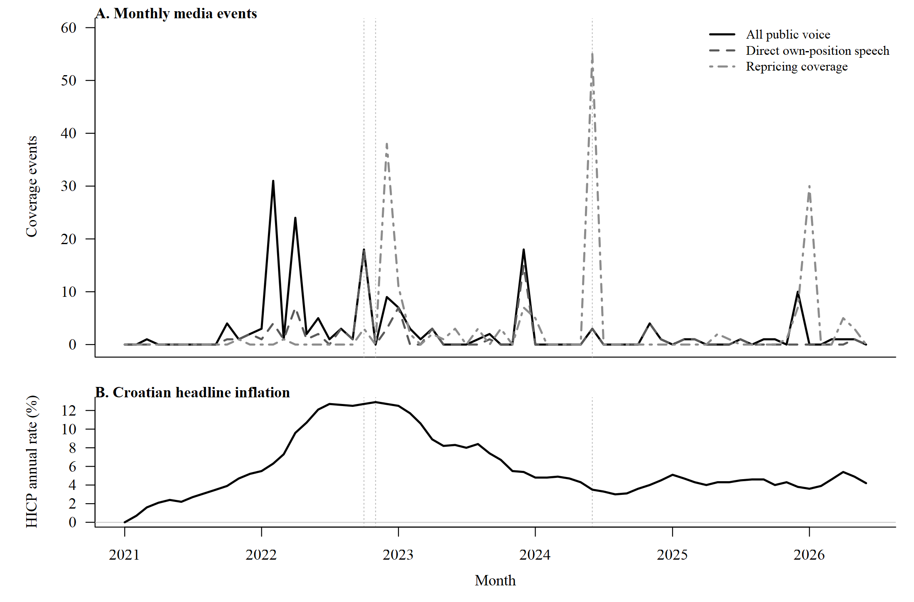
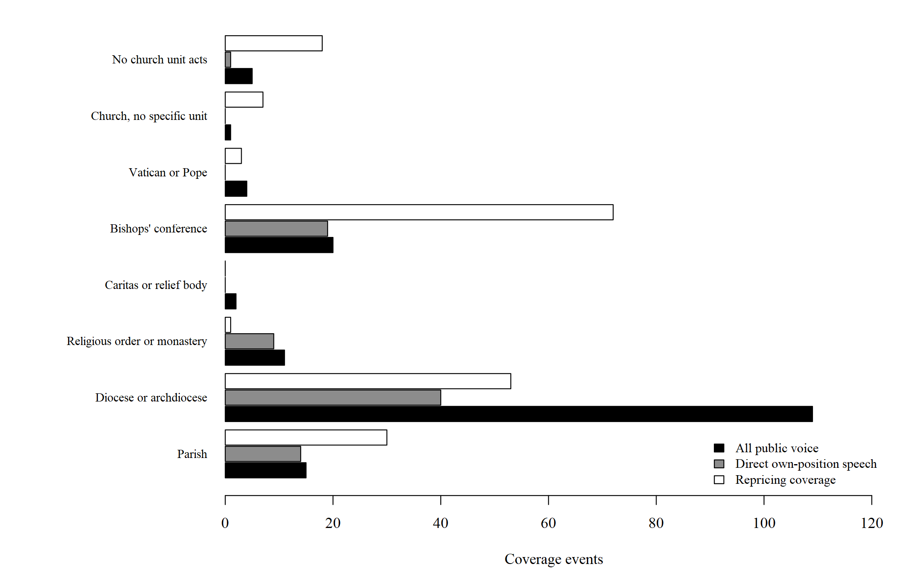

```{r}
#| echo: false
#| results: hide

rez <- data.table::fread(
  here::here("studies", "inflation-salience", "output", "derived_v2.csv"),
  encoding = "UTF-8",
  colClasses = "character"
)
v <- stats::setNames(rez$value, rez$name)
hr_broj <- function(x) gsub(" ", ".", v[[x]], fixed = TRUE)
hr_dec <- function(x) gsub(".", ",", v[[x]], fixed = TRUE)
```

Istraživanja rigidnosti cijena uglavnom promatraju same cijene. Mnogo je teže utvrditi je li određivač
cijene uočio inflacijski šok, ali je prilagodbu ipak odgodio. Ovaj rad koristi datirano medijsko
izvještavanje kako bi proučio upravo taj slijed u hrvatskom vjerskom sektoru, za koji ne postoji službena
cjenovna serija.

## Istraživačko pitanje

Rad razlikuje dva moguća objašnjenja nepromijenjene cijene. U prvom slučaju određivač cijene nije obradio
relevantne informacije. U drugom je slučaju upoznat s rastom vlastitih troškova, ali cijenu ne mijenja zbog
troška prilagodbe, sporog organizacijskog odlučivanja ili mogućeg otpora korisnika. Medijski zapisi ne
otkrivaju privatno razmišljanje, ali pokazuju kada su informacije o troškovima i prihodima postale javno
prisutne unutar sektora.

## Podaci i metode

Analiza polazi od službenoga korpusa s `r hr_broj("n_corpus")` religijski relevantnih objava od siječnja
2021. do lipnja 2026. Jedinstveno pravilo relevantnosti primijenjeno je na oba razdoblja prikupljanja.
Kodiranjem je izdvojeno `r hr_broj("n_core")` objava koje stvarno povezuju religiju s domaćom inflacijom.
Objave su zatim razvrstane prema predmetu ekonomskog sadržaja, vrsti govornika, institucijskoj jedinici i
vrsti odgovora. Odgovor može biti javni govor, promjena cijena, dobrotvorna pomoć ili normativno
tumačenje tereta inflacije.

Većina kandidata zadržava ranije odluke triju neovisnih kodiranja. Novi korpus izdvaja još
`r hr_broj("n_addendum_coded")` kandidata, koji su kodirani u zasebnom dodatku. Razlika u snazi anotacije
zadržana je u analitičkim izlazima i navedena među ograničenjima rada.

Medijski korpus koristi se kao registar događaja, a ne kao cjenovni indeks. Analiza zato mjeri datume,
vrhunce, sastav izvještavanja i vremenske odmake. Ne procjenjuje razinu pojedine naknade, koeficijent
prijenosa inflacije ni strukturnu stopu promjene cijena.

## Glavni nalazi

Izravan govor sektora o vlastitim troškovima ili prihodima pojavljuje se u
`r hr_broj("v2_direct_own_n")` objave i doseže vrhunac u
listopadu 2022. Izvještavanje o promjenama cijena doseže vrhunac u lipnju 2024., dvadeset mjeseci poslije.
Harmonizirana razina potrošačkih cijena tada je bila `r hr_dec("v2_price_gap")` % viša nego u lipnju 2021.

Četiri imenovana crkvena tijela pojavljuju se i u govoru o vlastitom ekonomskom položaju i u kasnijem
izvještavanju o promjeni cijena. U tri slučaja odmak je dulji od godine dana. Relevantne informacije bile
su, dakle, javno prisutne prije nego što se izvještavanje o prilagodbi cijena koncentriralo.

Novi korpus daje oprezniju procjenu veze medijske pažnje i inflacije. U razdoblju glavnog šoka korelacija
udjela objava o troškovima života i ukupnoga HICP-a iznosi `r hr_dec("r_monitoring_headline")`, dok mjesečne
promjene ne pokazuju stabilnu vezu. Glavni argument rada zato počiva na vremenskom slijedu i podudaranju
imenovanih tijela, a ne na snažnoj korelaciji pažnje i inflacije.

Nalaz nije dovoljan za razdvajanje ograničenja pravednosti od sporoga organizacijskog odlučivanja. Pokazuje
da nepažnja prema vlastitim troškovima nije potpuno objašnjenje opaženog slijeda, ali ne isključuje djelomičnu
nepažnju ni troškove prilagodbe.

## Vremenski slijed

{#fig-inflation-timeline fig-alt="Dvopanelni vremenski grafikon od 2021. do lipnja 2026. Gornji panel prikazuje mjesečne medijske događaje javnog govora, govora o vlastitim troškovima i promjena cijena, a donji hrvatsku godišnju stopu HICP-a."}

Slika @fig-inflation-timeline pokazuje da govor o vlastitim troškovima doseže vrhunac uz vrhunac inflacije,
dok je najveća koncentracija izvještavanja o promjenama cijena zabilježena poslije pada inflacije.

## Institucijska raspodjela

{#fig-inflation-units fig-alt="Vodoravni stupčasti grafikon javnog govora, izravnog govora o vlastitim troškovima i izvještavanja o promjenama cijena prema župama, biskupijama, redovničkim zajednicama, Caritasu, biskupskoj konferenciji, Vatikanu i drugim jedinicama."}

Slika @fig-inflation-units pokazuje organizacijsku podjelu događaja. Biskupije dominiraju javnim govorom,
dok je izvještavanje o promjenama cijena raspodijeljeno između biskupija, biskupske konferencije i župa.

## Cijeli rad

Potpuni rukopis dostupan je u tri formata.

::: {.study-paper-formats aria-label="Dostupni formati rada"}
<a class="study-paper-format study-paper-format--primary" href="../../assets/papers/inflation-information-delayed-repricing.html"><span class="study-paper-format__type">HTML</span><span class="study-paper-format__label">Čitanje u pregledniku</span></a>
<a class="study-paper-format" href="../../assets/papers/inflation-information-delayed-repricing.pdf"><span class="study-paper-format__type">PDF</span><span class="study-paper-format__label">Preuzimanje i ispis</span></a>
<a class="study-paper-format" href="../../assets/papers/inflation-information-delayed-repricing.docx"><span class="study-paper-format__type">Word</span><span class="study-paper-format__label">Uređivi dokument</span></a>
:::

Sve tablice, slike i brojčani navodi generirani su iz osvježenih izlaza studije. Opis korpusa i profil
izvora dostupni su na stranici [Baza podataka](../baza.qmd).

## Status

Radni rukopis [Luke Šikića](https://www.lukasikic.info/) i
[Petre Palić](https://www.unicath.hr/odjeli-i-fakultet/nastavnici/petra-palic), pripremljen u okviru
projekta DigiKat na Hrvatskom katoličkom sveučilištu. Dio je drugoga izlaznog toka projekta, čiji je
popis na stranici [Projektni raspored](../schedule.qmd).
