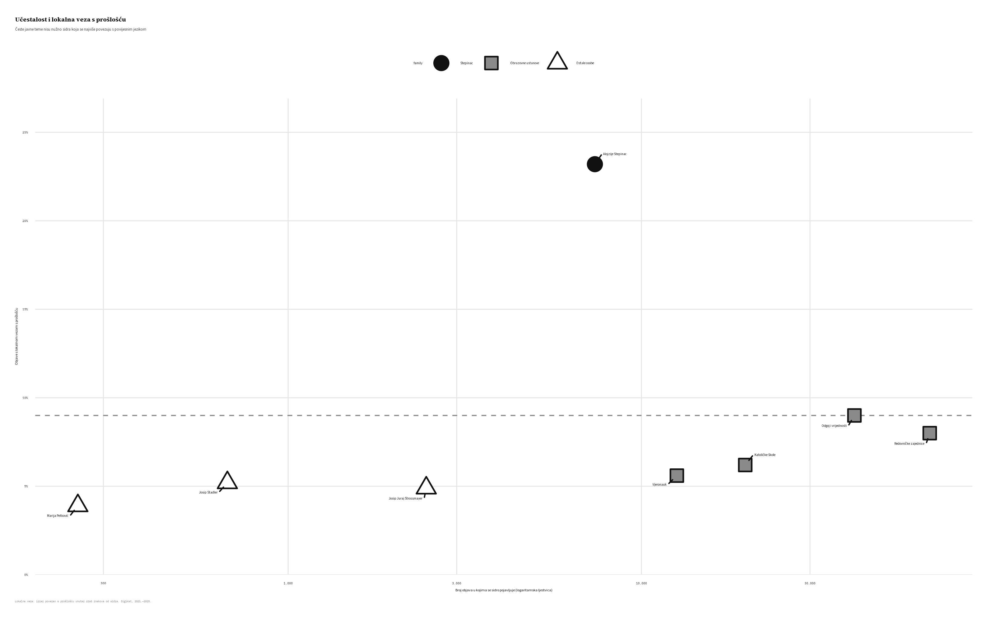
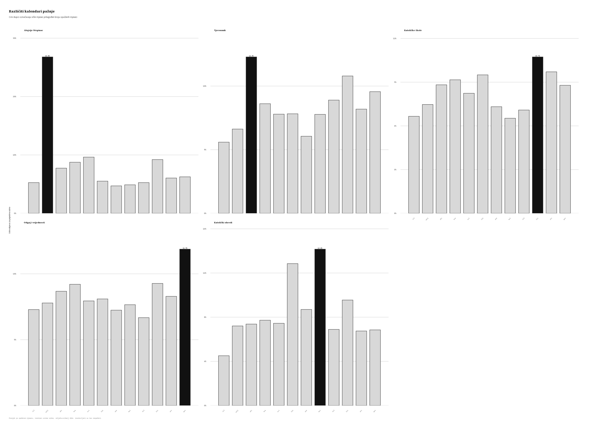
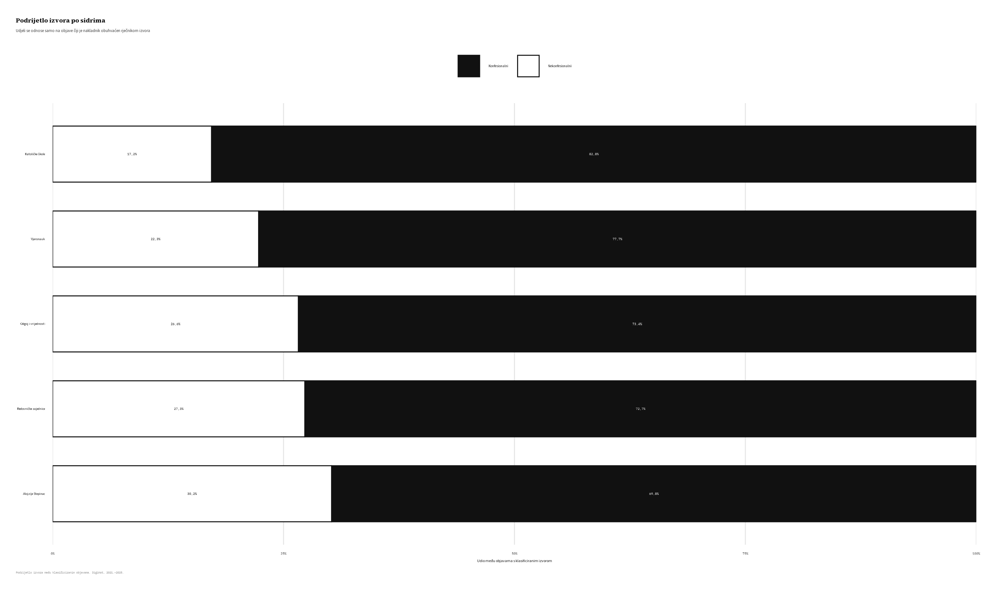

```{r}
#| label: setup
#| include: false

knitr::opts_chunk$set(echo = FALSE, message = FALSE, warning = FALSE)

metrics <- read.csv(
  here::here("studies", "catholic-education", "output", "tables", "paper_profile_metrics.csv"),
  fileEncoding = "UTF-8",
  stringsAsFactors = FALSE
)

metric <- function(name) metrics$value[metrics$metric == name][1]
fmt_n <- function(x) format(round(x), big.mark = ".", decimal.mark = ",", scientific = FALSE, trim = TRUE)
fmt_pct <- function(x) paste0(
  formatC(100 * x, format = "f", digits = 1, decimal.mark = ","),
  " %"
)
```

Kada hrvatski digitalni mediji govore o katoličkom obrazovanju, prenose li prošlost ili raspravljaju o
sadašnjosti? Nova analiza službenoga korpusa uspoređuje vjeronauk, katoličke škole, redovničke zajednice i
odgoj s osobama povezanima s katoličkom poviješću. Ustanove se ponajprije pojavljuju kao pitanja
sadašnjosti. Povijesni jezik i komemorativni ritam najviše se okupljaju oko Alojzija Stepinca.

## Istraživačko pitanje

Pitanje nije samo koliko se često pojedina tema pojavljuje. Važno je povezuje li ona sadašnji govor s
prošlošću. Rad zato ispituje koja katolička obrazovna sidra pokazuju trajnost, kalendarsko ponavljanje,
jezik emocija i lokalnu tekstualnu vezu s povijesnim izrazima. Uspoređuje se i tko ta sidra objavljuje te
prelaze li ona granicu između konfesionalnih i nekonfesionalnih izvora.

## Podaci i metode

Analiza obuhvaća `r fmt_n(metric("education_strand_n"))` objava od 2021. do 2025. godine. Prati se osam
glavnih sidara. Četiri obuhvaćaju ustanove i prakse, a četiri imenovane osobe. Učestalost se uspoređuje s
mjesečnim ritmom, jezikom emocija, podrijetlom izvora i lokalnom vezom s prošlošću. Posljednja mjera traži
da se povijesni izraz pojavi unutar 160 znakova od promatranog sidra. Ona je pokazatelj tekstualne blizine,
a ne potvrda značenja. Pojedinosti su dostupne u [Metodologiji](../metodologija.qmd).

::: {.metric-grid}
::: {.metric-card}
<div class="metric-value">`r fmt_n(metric("education_strand_n"))`</div>
<div class="metric-label">analiziranih objava</div>
:::

::: {.metric-card}
<div class="metric-value">`r fmt_pct(metric("stepinac_genuine_share"))`</div>
<div class="metric-label">Stepinčevih objava s lokalnom vezom s prošlošću</div>
:::

::: {.metric-card}
<div class="metric-value">`r fmt_n(metric("stepinac_february_peak_years"))` / `r fmt_n(metric("stepinac_february_eligible_years"))`</div>
<div class="metric-label">opaženih veljača s godišnjim vrhuncem</div>
:::

::: {.metric-card}
<div class="metric-value">`r fmt_pct(metric("overlap_removed_share"))`</div>
<div class="metric-label">uklonjenih prividnih veza</div>
:::
:::

## Glavni nalazi

Obrazovne teme pojavljuju se češće od Stepinca, ali su mnogo rjeđe lokalno povezane s prošlošću. Stepinac
se javlja u `r fmt_n(metric("stepinac_n"))` objava. Lokalna je veza zabilježena u
`r fmt_pct(metric("stepinac_genuine_share"))` tih objava. Njegova manja učestalost stoga ne znači i manju
ulogu u javnom sjećanju.

### Učestalost nije isto što i sjećanje

Obrazovne ustanove zauzimaju područje velike učestalosti i slabe veze s prošlošću. Stepinac se odvaja u
suprotnom smjeru. Pojavljuje se rjeđe, ali znatno češće otvara povijesni kontekst.

{#fig-education-anchor fig-alt="Crno-bijeli raspršeni grafikon pokazuje da je Stepinac mnogo snažnije povezan s prošlošću od češćih obrazovnih ustanova."}

### Veljača daje Stepincu kalendar

Stepinac doseže godišnji vrhunac u veljači u sve `r fmt_n(metric("stepinac_february_eligible_years"))`
godine za koje je veljača opažena. Podaci nedostaju od veljače do svibnja 2024. godine pa se ta godina ne
prikazuje kao nulta veljača. Ritam se podudara sa Stepinčevom, dok obrazovne teme prate šire školske i
medijske cikluse. Kolovoški vrhunac katoličkih obreda služi kao usporedni primjer drugog kalendara.

{#fig-education-seasonality fig-alt="Pet malih crno-bijelih stupčastih grafikona. Stepinac ima izražen vrhunac u veljači, katolički obredi u kolovozu, a obrazovne teme šire raspodjele."}

### Autorstvo prelazi institucijsku granicu

Rječnik podrijetla obuhvaća `r fmt_pct(metric("stepinac_source_classified_coverage"))` Stepinčevih objava.
Unutar toga dijela `r fmt_pct(metric("stepinac_confessional_share"))` objava dolazi iz konfesionalnih, a
`r fmt_pct(metric("stepinac_non_confessional_share"))` iz nekonfesionalnih izvora. Profil je raznolikiji
nego kod katoličkih škola ili vjeronauka, ali razlika ostaje uvjetna zbog neklasificiranih izvora. Nalaz
govori o zajedničkoj proizvodnji javnog simbola, a ne o zajedničkom tumačenju Stepinca.

{#fig-education-sources fig-alt="Vodoravni složeni stupci pokazuju da Stepinac ima mješovitiji profil izvora od katoličkih škola i vjeronauka."}

## Zašto je tekstualna blizina važna

Povijesni izraz pojavljuje se negdje u istoj objavi uz obrazovno sidro u
`r fmt_pct(metric("document_overlap_share"))` slučajeva. Kada se zahtijeva lokalna veza, udio pada na
`r fmt_pct(metric("local_overlap_share"))`. Time nestaje `r fmt_pct(metric("overlap_removed_share"))`
prividnih veza. Samo pojavljivanje dviju tema u istoj objavi zato nije dovoljno za zaključak da objava
obavlja rad sjećanja.

## Cijeli rad

Rukopis *„Faith in the present, memory in the martyr: Catholic education and the figure of Stepinac as
sites of memory in Croatian digital media (2021–2025)"* dostupan je u tri formata.

::: {.study-paper-formats aria-label="Dostupni formati rada"}
<a class="study-paper-format study-paper-format--primary" href="../../assets/papers/katolicko-obrazovanje-i-stepinac.html"><span class="study-paper-format__type">HTML</span><span class="study-paper-format__label">Čitanje u pregledniku</span></a>
<a class="study-paper-format" href="../../assets/papers/katolicko-obrazovanje-i-stepinac.pdf"><span class="study-paper-format__type">PDF</span><span class="study-paper-format__label">Preuzimanje i ispis</span></a>
<a class="study-paper-format" href="../../assets/papers/katolicko-obrazovanje-i-stepinac.docx"><span class="study-paper-format__type">Word</span><span class="study-paper-format__label">Uređivi dokument</span></a>
:::

Sve brojčane vrijednosti i slike na ovoj stranici čitaju se iz agregiranih izlaza studije. Opis korpusa,
način prikupljanja i profil izvora dostupni su na stranici [Baza podataka](../baza.qmd).

## Status

Radni rukopis projekta [DigiKat](../../index.qmd), pripremljen na Hrvatskom katoličkom sveučilištu. Dio je
drugog izlaznog toka projekta, posvećenog tematskim studijama i znanstvenim radovima. Popis je na
stranici [Projektni raspored](../schedule.qmd).
