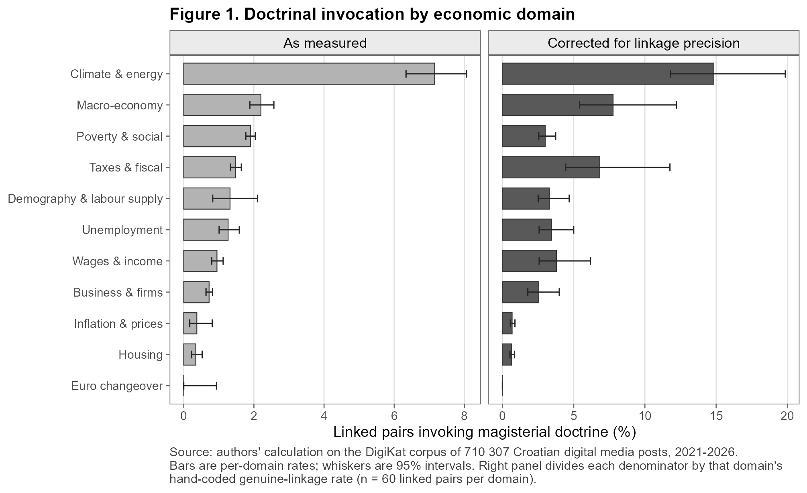
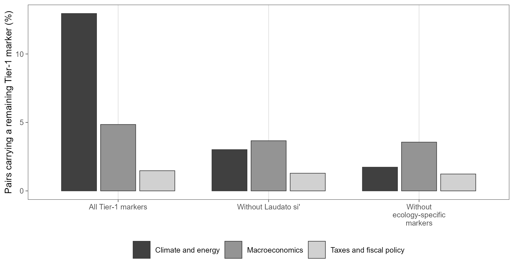
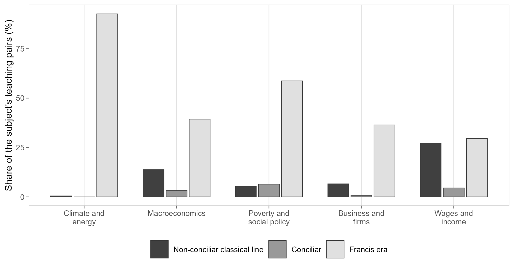
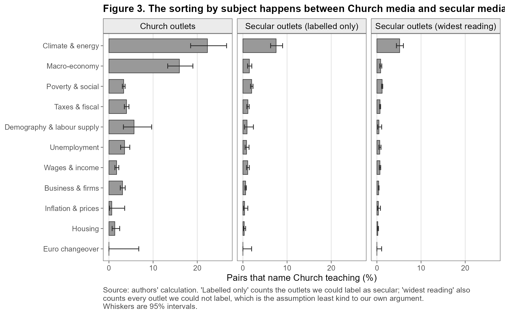

Socijalni nauk Crkve više od stoljeća govori o radu, plaćama, vlasništvu, siromaštvu, javnoj vlasti i
odgovornosti gospodarskih ustanova. Ova studija postavlja uže pitanje. Koliko se u hrvatskim digitalnim
medijima izrijekom pojavljuju naslovi crkvenih dokumenata i specifični pojmovi socijalnoga nauka kada se
govori o gospodarstvu?

Analiza je ponovno izvedena na novoj službenoj bazi DigiKat. Ispravljena je i važna pogreška ranijega
postupka. Oznaka socijalnoga nauka sada mora biti blizu gospodarskoga izraza **iz iste teme**. Rezultat je
znatno uži i oprezniji od ranije verzije rada. Glavni broj nije procjena svih katoličkih ideja u hrvatskoj
javnosti, nego stopa izričito **otkrivenih oznaka** u tematski odabranom katoličkom korpusu.

## Korpus i jedinica analize

Službena baza sadržava **413.985 objava** od 1. siječnja 2021. do 11. lipnja 2026. DigiKat je korpus
odabran prema katoličkim temama, a ne reprezentativan uzorak svih hrvatskih medija ili cijele javne
sfere.

Analiza ima dva koraka.

1. U glavnom okviru opći religijski izraz mora biti udaljen najviše 220 znakova od izraza iz jedne od
   jedanaest gospodarskih tema. Tako dobivamo **66.374 objave** i **79.439 jedinstvenih parova
   objava–tema**.

2. Par ulazi u uži sloj samo ako se naslov dokumenta ili specifična oznaka socijalnoga nauka nalazi
   najviše 220 znakova od gospodarskoga izraza **iz te iste teme**. Ispravljeni sloj sadržava
   **1.093 objave** i **1.290 parova**.

Glavni omjer zato iznosi **1,62%**: 1.290 otkrivenih parova s oznakom među 79.439 parova religije i
gospodarstva. To je popisni omjer unutar opaženoga korpusa, pa uz njega ne prikazujemo Wilsonov interval
kao da je korpus slučajni uzorak.

Opći religijski rječnik namjerno je neovisan o užem rječniku socijalnoga nauka. U provjeri granice
okvira dopušteno je da sama oznaka socijalnoga nauka uvede par u analizu. Tada okvir raste na 66.394
objave i 79.500 parova, a uži sloj na 1.131 objavu i 1.351 par. Dodaje se 61 par, ali se redoslijed tema
ne mijenja.

## Svježe slijepe provjere mjerenja

Glavne provjere nisu preuzele stare kodove. Svježi Codexovi agenti dobili su samo slijepe kartice i
ograničenu kodnu knjigu. Riječ je o modelskom, a ne ljudskom kodiranju. Točna inačica pozadinskoga
modela i postavke dekodiranja nisu bile dostupne sesiji, što ograničava potpunu replikaciju.

Provjera brojnika obuhvatila je 150 pronađenih objava, stratificiranih prema razredu razdoblja
susjednih oznaka, uključujući skupine bez datiranoga dokumenta i mješovite skupine, te prema
koncentraciji izvora. Procijenjeni udio stvarne uporabe socijalnoga nauka iznosi **79,6%**
[72,4; 85,3]. Unaprijed postavljeni prag bio je 80%, pa je nalaz **uvjetan**, a ne prolazan.

Na istih 150 objava gospodarski izraz ima stvaran gospodarski referent u 77,1% slučajeva, a obje
provjere zajedno prolaze u 62,8%. Tematski prag R2 ne prolazi ili se ne može potpuno ocijeniti. Porezi
imaju ponderiranih 22,6%, dok euro, demografija i inflacija nisu zastupljeni u uzorku oblikovanom prema
razdoblju i izvoru. Glavni prolaz za klimu od 95,5% također nije potvrđen u ponavljanju. Među šest
ponovljenih klimatskih kartica glavno je kodiranje prihvatilo pet, a ponovljeno nijednu.

U cijelom ponovljenom uzorku slaganje na osi gospodarskoga referenta iznosi samo **76,7%** uz
**κ = 0,420**, ispod praga od 80%. Ostale tri osi ponavljanja prolaze, ali ukupna provjera stabilnosti
zato ne prolazi.

Druga svježa provjera uzela je 60 parova iz svake gospodarske teme, ukupno 660. Procijenjeni udio
stvarnih poveznica u nazivniku iznosi 52,7% prema glavnoj i 44,0% prema strožoj kodnoj odluci. Ako se
smanji samo nazivnik, uz pretpostavku da je svaki od 1.290 parova u brojniku valjan, ukupni omjeri rastu
na **3,08%** i **3,69%**. To su scenariji osjetljivosti nazivnika, a **nisu ispravljena prevalencija**.
Provjera brojnika provedena je na objavama, dok je nazivnik provjeren na parovima. Njihovo izravno
množenje miješalo bi jedinice i strukture pogreške.

{width="2010" height="1080"}

## Klima vodi samo uz zadani rječnik

Najvišu otkrivenu stopu ima **klima i energetika**, i to **12,96%** (202 od 1.559 parova). Slijedi
**makroekonomija s 4,85%** (94 od 1.938). Siromaštvo i socijalna politika imaju najviše otkrivenih
parova, 586, ali zbog mnogo većega nazivnika stopa iznosi 1,87%.

Klima ostaje prva u svih **25 od 25** provjera koje zadržavaju isti rječnik. To vrijedi nakon uklanjanja
bliskih i naslovnih duplikata, stranih objava, metaforičkih i Caritasovih slučajeva, po odvojenim tokovima
prikupljanja, nakon uklanjanja najvećih izvora i pod različitim prijedlozima skupina medija. To pokazuje
robusnost na ispitane promjene sastava korpusa.

Međutim, provjera samoga konstrukta mijenja zaključak.

- bez oznake *Laudato si'* makroekonomija vodi s **3,66%**, a klima pada na **3,01%**.

- bez triju ekološki specifičnih oznaka, a to su *Laudato si'*, *Laudate Deum* i *integralna ekologija*,
  makroekonomija vodi s **3,56%**, a klima pada na **1,73%**.

Ista se promjena pojavljuje u scenariju osjetljivosti nazivnika. Prema tome, najjači nalaz nije da je
socijalni nauk kao cjelina usmjereniji na klimu nego na starije gospodarske teme. Nalaz je uži.
Ekološki dokumenti, a osobito prepoznatljiv naslov *Laudato si'*, iznimno su vidljiva javna oznaka.

{width="2070" height="1080"}

## Razdoblja dokumenata dodjeljuju se svakom paru

Razdoblje se ne preuzima s razine cijele objave. Dodjeljuje se zasebno svakom paru objava–tema prema
naslovima dokumenata uz tu gospodarsku temu. Tako naslov *Laudato si'* uz klimu ne može odrediti
razdoblje neke druge teme u istoj objavi.

Od 1.290 parova, njih 705 ima Franju kao jedino razdoblje datiranoga dokumenta, uz mogućnost da
sadržavaju i nedatirane pojmovne oznake. U klimi je takvih 187 od 202 para, odnosno 92,6%. Skupina “klasična
ne-koncilska linija” odnosi se na unaprijed određeni skup naslova, a ne na neprekinuto kalendarsko
razdoblje. Pojmovne oznake, uključujući naziv Kompendija prema ovoj konvenciji, nemaju dodijeljeno
papinsko razdoblje.

{width="2010" height="1050"}

Ovaj prikaz podupire tvrdnju o vidljivosti nedavnih ekoloških naslova, ali sam ne razdvaja učinak
novosti dokumenta, javne prepoznatljivosti, izvora teksta ili uredničkoga odabira.

## Skupine izvora samo su prijedlozi

Oznake “konfesionalni” i “sekularni” potječu iz automatiziranoga, još nepotvrđenog prijedloga
klasifikacije izvora. U predloženoj konfesionalnoj skupini stopa klime iznosi 19,47%, a makroekonomije
11,76% (omjer 1,66). U užoj predloženoj sekularnoj skupini omjer je 4,09, a u najširoj 5,68.

{width="2070" height="1140"}

Te se razlike smiju čitati samo kao osjetljivost na prijedlog grupiranja. Budući da oznake nisu
ratificirane i nacrt je opažački, rezultat ne dokazuje granicu crkvenih i sekularnih medija, urednički
odabir ni uzročni proces “prevođenja”.

## Što stari skup može reći o siromaštvu

Raniji stratificirani skup imao je 555 redaka. U službenoj bazi po stabilnom identitetu ostaje 296,
u ispravljenom povezanom sloju 268, a 148 je označeno kao stvarna poveznica. U tablici rukopisa
prikazuju se samo teme s najmanje deset takvih poveznica, ukupno 126 jedinica.

Među 77 poveznica siromaštva i socijalne politike 26,0% je označeno kao pomoć/djelovanje, 19,5% kao
strukturna kritika ili načela socijalnoga nauka, 6,5% kao Crkva u ulozi gospodarskoga aktera, a 48,1%
kao pobožno ili preostalo. Oznake su nastale u tri slijepa prolaza jedne obitelji jezičnih modela.

Taj skup nije izvučen za procjenu zastupljenosti registara. Njegova kodna knjiga ne mjeri prava,
pravne zahtjeve ni jezik ovlaštenja. Zato nova verzija rada odbacuje staru tvrdnju da u raspravi o
siromaštvu prevladava “jezik pomoći” nad “jezikom prava”. Za takav bi zaključak trebao novi
vjerojatnosni uzorak, izravna kodna knjiga i neovisni ljudski koderi.

## Kako čitati zaključak

Studija pouzdano opisuje koliko je unaprijed određeni rječnik otkriven u opaženom službenom korpusu.
Ne procjenjuje sve argumente spojive sa socijalnim naukom, njihov utjecaj na politiku ili razloge zbog
kojih je urednik objavio neki izraz.

Najoprezniji sažetak glasi ovako.

- izričite oznake socijalnoga nauka nalaze se u 1,62% parova religije i gospodarstva u ovom korpusu,

- zbog uvjetne preciznosti brojnika, nepotpunog/neuspjelog R2 praga i neuspjele osi ponavljanja nema
  potpuno ispravljene procjene prevalencije parova,

- klima je prva pod zadanim rječnikom i u 25 provjera sastava, ali vodstvo nestaje bez *Laudato si'* ili
  skupine ekoloških oznaka,

- usporedbe izvora i registri siromaštva ostaju istraživački, a ne uzročni ili populacijski nalazi.

Način prikupljanja promijenjen je 2024., a od veljače do svibnja te godine nema uporabljivog teksta u
izvornom toku. Rad zato ne procjenjuje vremenski trend. Godina 2026. završava 11. lipnja.

## Cijeli rad

Prerađeni rukopis *“Construct-dependent visibility of Catholic social teaching: Detected markers in
Croatia's Catholic-topic digital-media corpus, 1 January 2021–11 June 2026”* dostupan je u cijelosti.

::: {.study-paper-formats aria-label="Dostupni formati rada"}
<a class="study-paper-format study-paper-format--primary" href="../../assets/papers/socijalni-nauk-i-gospodarstvo.html">HTMLČitanje u pregledniku</a>
<a class="study-paper-format" href="../../assets/papers/socijalni-nauk-i-gospodarstvo.pdf">PDFPreuzimanje i ispis</a>
:::

Sve tablice i slike generiraju se iz agregatnih izlaza studije. Sadržaj korpusa, prikupljanje, pravilo
uključivanja i profil izvora opisani su na stranici [Baza podataka](../baza.qmd).

## Status

Prerađeni radni rukopis (2026-08-11), autori [Luka Šikić](https://www.lukasikic.info/) i
[Petra Palić](https://www.unicath.hr/odjeli-i-fakultet/nastavnici/petra-palic), priprema se za časopis.
Dio je drugoga izlaznog toka projekta, koji obuhvaća tematske studije i radove. Popis je na stranici
[Projektni raspored](../schedule.qmd).
