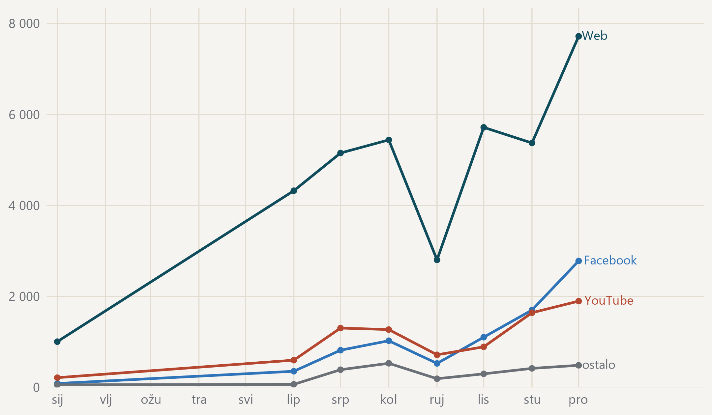

#### Krivulja počinje tek u lipnju, jer ranijih mjeseci u podacima nema

{fig-alt="Krivulje mjesečnog broja objava za web, Facebook, YouTube i zbroj ostalih platformi."}

> Mjesečni broj objava, tri najveće platforme i zbroj svih ostalih. · Izvor: DigiKat, službeni korpus. Kalendarska 2024. Od 9. siječnja do 31. svibnja prikupljanja nema, pa te mjesece krivulja ne prikazuje; rujan je nepotpun jer je prikupljanje stajalo od 16. do 30. Nazivi platformi stoje uz krivulju, pa se čita i bez boje.
