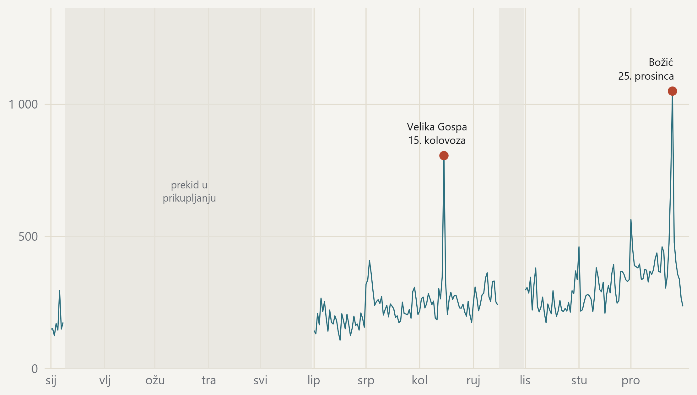

#### Oba vrha godine su blagdani, a Uskrs je ostao izvan prikupljanja

{fig-alt="Dnevni broj objava kroz cijelu godinu s označenim vrhuncima i prekidom u prikupljanju."}

> Broj objava po danu, 207 dana s prikupljanjem; označeni su dani iznad tri standardne devijacije. · Izvor: DigiKat, službeni korpus. Kalendarska 2024. Prag za vrhunac postavljen je prije pregleda podataka, a prosjek i raspršenost računaju se samo nad danima s prikupljanjem. Uskrs 2024. pada 31. ožujka, unutar dugoga prekida, pa ga u podacima nema. Sivo su označena razdoblja bez prikupljanja.
