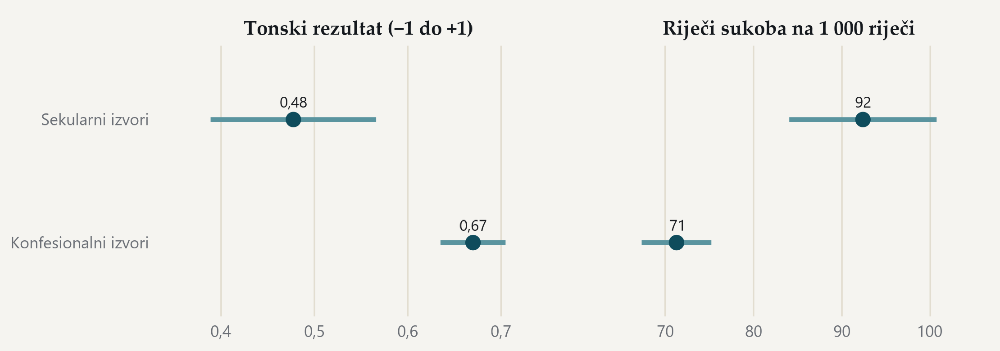

#### Sekularni izvori pišu o istoj temi oštrijim rječnikom

{fig-alt="Usporedba tonskog rezultata i indeksa riječi sukoba za konfesionalne i sekularne izvore."}

> Konfesionalni (314 objava) i sekularni izvori (92 objava) u tonskom uzorku. · Izvor: DigiKat, 1 134 objava iz korpusa za 2024. u tonskom uzorku (2,0 posto korpusne godine). Crte prikazuju 95-postotni interval. Uredničke oznake izvora imaju status prijedloga, pa je usporedba indikativna.
