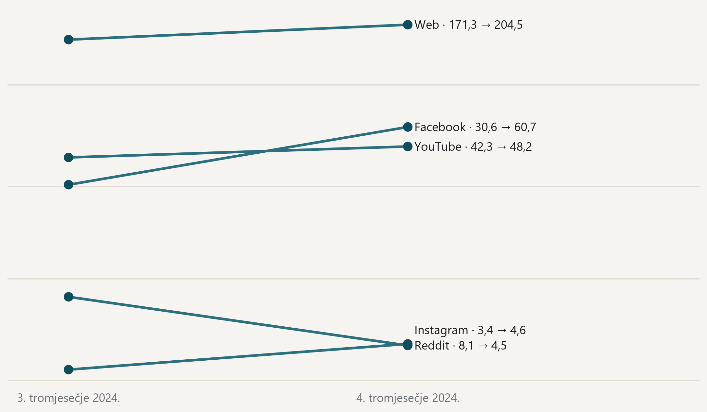

#### Facebook se gotovo udvostručuje, ali s njim raste i popis praćenih stranica

{fig-alt="Nagibni prikaz broja objava po danu s prikupljanjem, po platformama, u trećem i četvrtom tromjesečju 2024."}

> Objave po danu s prikupljanjem, treće prema četvrtom tromjesečju, unutar toka prikupljanja koji teče od srpnja 2024.; logaritamska skala. · Izvor: DigiKat, službeni korpus, tok post2024. Ovo je kretanje unutar godine, a ne usporedba s prethodnom godinom: tok prikupljanja počinje u srpnju 2024., pa 2024. nema usporedivu prethodnu godinu. Četvrto tromjesečje nosi advent i Božić, što dio porasta objašnjava sezonom. Dijeljenjem s brojem dana s prikupljanjem rujanski prekid ne može izgledati kao pad.
