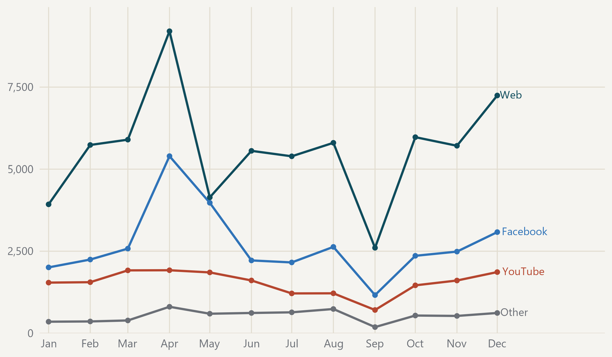

#### April carries the annual peak; the September dip is a collection interruption

{fig-alt="Monthly post-count lines for the web, Facebook, YouTube and all other platforms combined."}

> Monthly post count for the three largest platforms and all others combined. · Source: DigiKat official corpus. Calendar year 2025. September is incomplete because collection stopped for its first fourteen days. Direct labels make the lines readable without colour.
