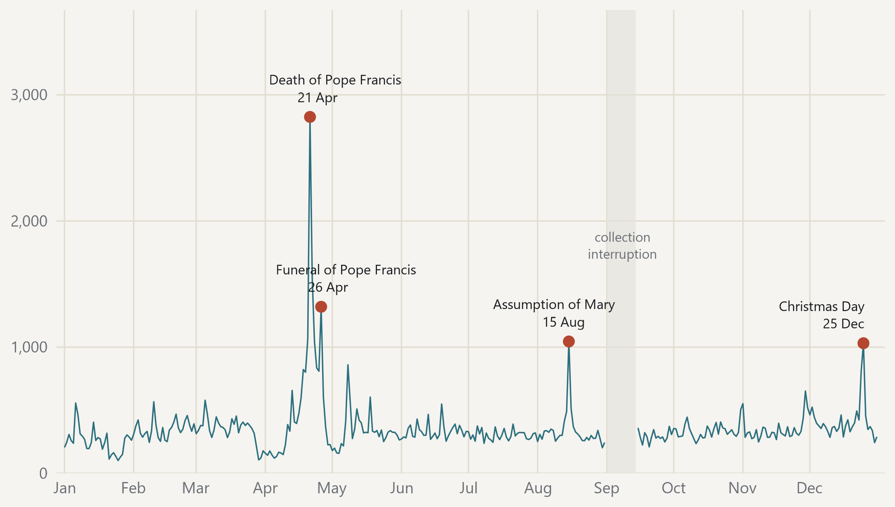

#### The year has one clear peak, and it was not a controversy

{fig-alt="Daily post count for the full year, with peaks and collection interruptions marked."}

> Daily post count across 351 collected days; days above three standard deviations are labelled. · Source: DigiKat official corpus. Calendar year 2025. The peak threshold was fixed before inspecting the data; means and dispersion use collected days only.
