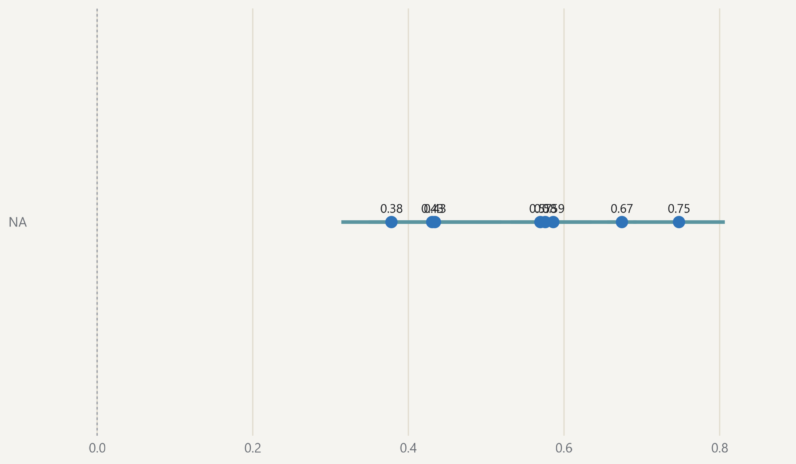

#### No major theme is negative on average

{fig-alt="Mean tone score by leading theme, with confidence intervals."}

> Mean tone score by a post's leading theme, from −1 to +1; categories with at least 30 posts. · Source: DigiKat; 2,479 posts from the 2025 corpus year in the tone sample (2.0% of the corpus year). Lines show 95% confidence intervals.
