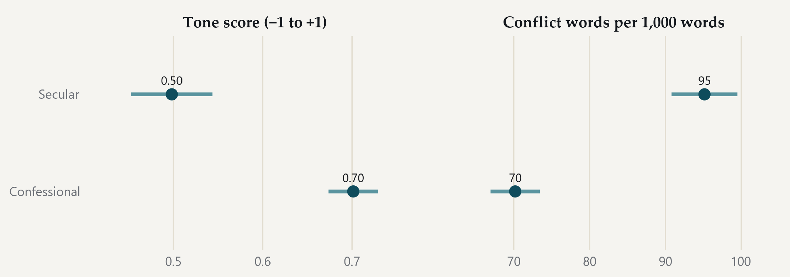

#### Secular sources discuss the same field in sharper language

{fig-alt="Tone and conflict-word measures for confessional and secular sources."}

> Confessional (530 posts) and secular sources (321 posts) in the tone sample. · Source: DigiKat; 2,479 posts from the 2025 corpus year in the tone sample (2.0% of the corpus year). Lines show 95% confidence intervals. Source labels are editorial proposals, so the comparison is indicative.
