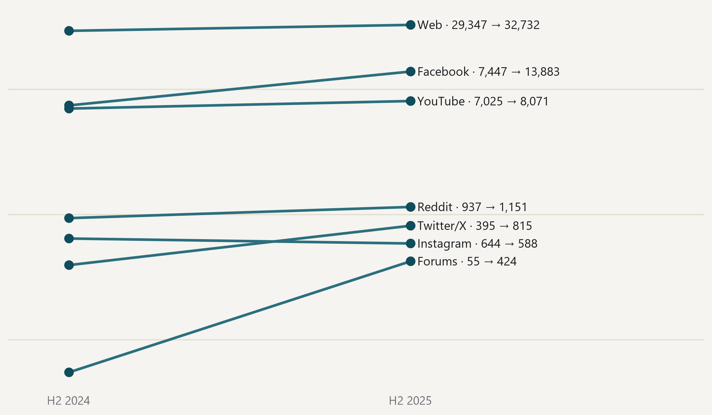

#### The web grows even though fewer sources are tracked than a year earlier

{fig-alt="Slope chart comparing platform volume within the same collection stream."}

> Posts in the second half of each year, within the collection stream operating since July 2024; logarithmic scale. · Source: DigiKat official corpus, post2024 collection stream. The comparison does not cross the 2024 collection seam, and the same interruption dates are removed from both periods.
