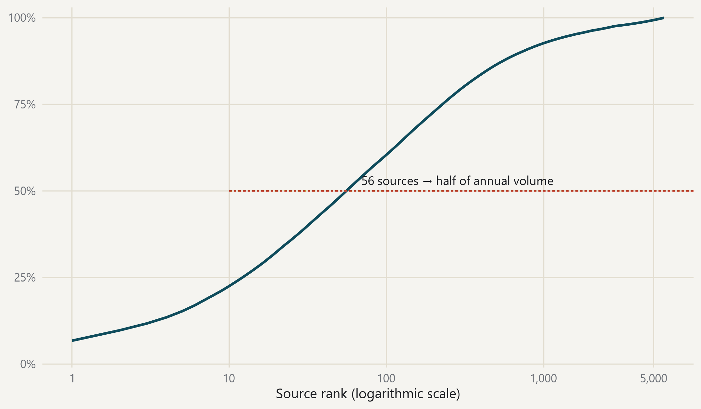

#### A small number of sources carries a great deal, but the tail is long

{fig-alt="Cumulative share of annual post volume by source rank."}

> Cumulative share of annual volume by source rank; 5,814 sources in total. · Source: DigiKat official corpus. Calendar year 2025.
