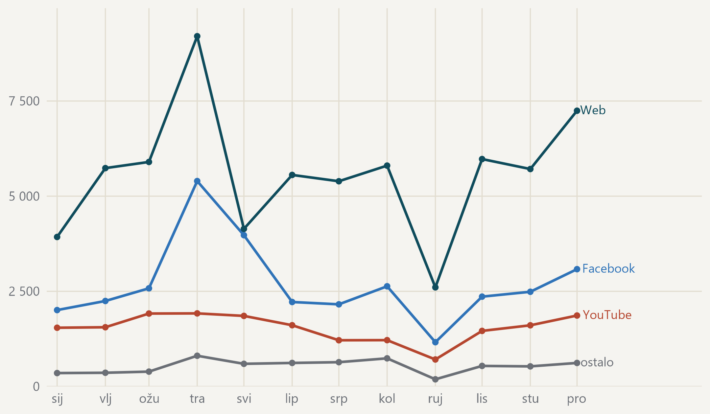

#### Travanj nosi vrh godine, a rujanski pad je prekid u prikupljanju

{fig-alt="Krivulje mjesečnog broja objava za web, Facebook, YouTube i zbroj ostalih platformi."}

> Mjesečni broj objava, tri najveće platforme i zbroj svih ostalih. · Izvor: DigiKat, službeni korpus. Kalendarska 2025. Rujan je nepotpun: prikupljanje je stajalo prvih četrnaest dana. Nazivi platformi stoje uz krivulju, pa se čita i bez boje.
