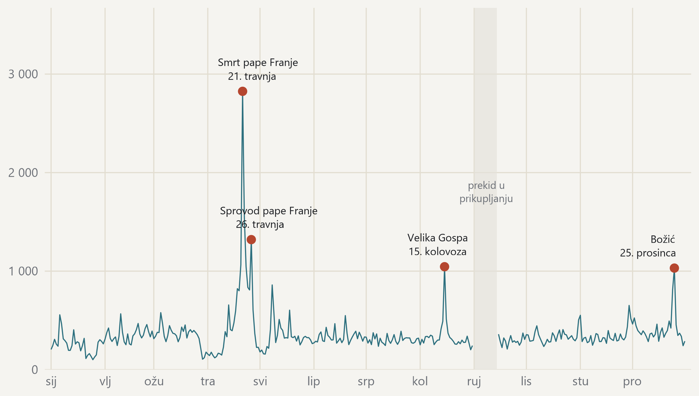

#### Godina ima jedan vrh, i on nije bio sporan

{fig-alt="Dnevni broj objava kroz cijelu godinu s označenim vrhuncima i prekidom u prikupljanju."}

> Broj objava po danu, 351 dan s prikupljanjem; označeni su dani iznad tri standardne devijacije. · Izvor: DigiKat, službeni korpus. Kalendarska 2025. Prag za vrhunac postavljen je prije pregleda podataka, a prosjek i raspršenost računaju se samo nad danima s prikupljanjem.
