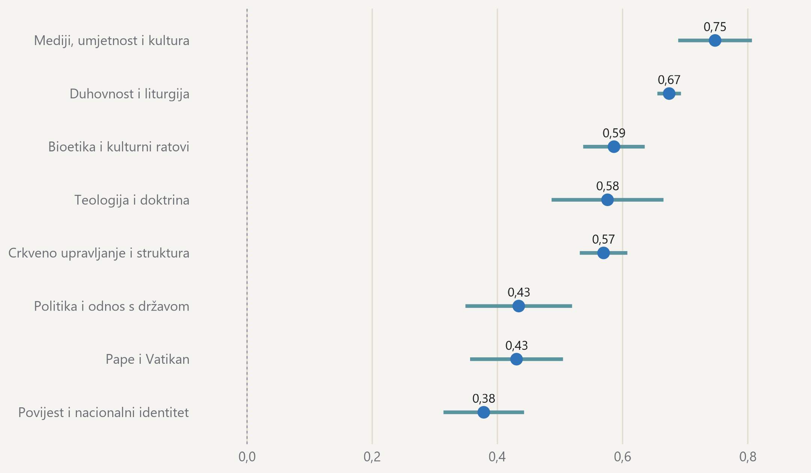

#### Nijedna tema godine nije u prosjeku negativna

{fig-alt="Točkasti prikaz prosječnog tonskog rezultata po vodećim temama, s intervalima pouzdanosti."}

> Prosječan tonski rezultat po vodećoj temi objave, od −1 do +1; kategorije s najmanje 30 objava. · Izvor: DigiKat, 2 479 objava iz korpusa za 2025. u tonskom uzorku (2,0 posto korpusne godine). Crte prikazuju 95-postotni interval.
