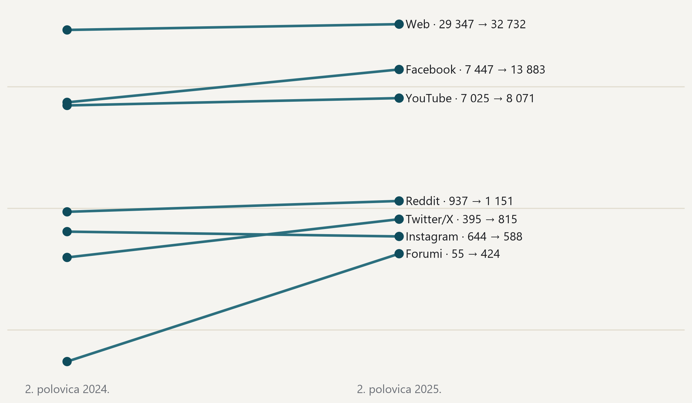

#### Web raste iako pratimo manje izvora nego godinu prije

{fig-alt="Nagibni prikaz broja objava po platformama u drugoj polovici 2024. i 2025."}

> Objave u drugoj polovici godine, unutar toka prikupljanja koji teče od srpnja 2024.; logaritamska skala. · Izvor: DigiKat, službeni korpus, tok post2024. Usporedba ne prelazi prijelom u prikupljanju iz 2024., a iz obiju polovica uklonjeni su isti kalendarski dani prekida.
