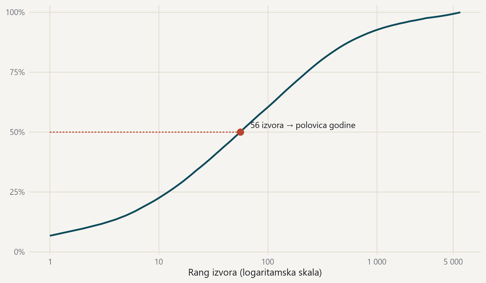

#### Malo izvora nosi mnogo, ali rep je vrlo dug

{fig-alt="Krivulja kumulativnog udjela godišnjeg volumena po rangu izvora."}

> Kumulativni udio godišnjeg volumena po rangu izvora; ukupno 5 814 izvora. · Izvor: DigiKat, službeni korpus. Kalendarska 2025.
