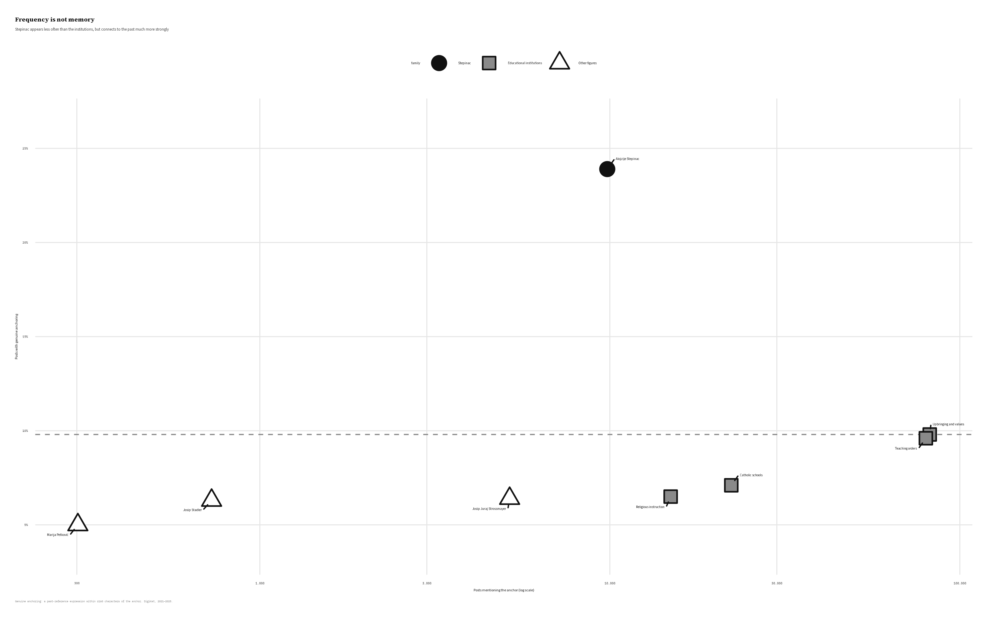
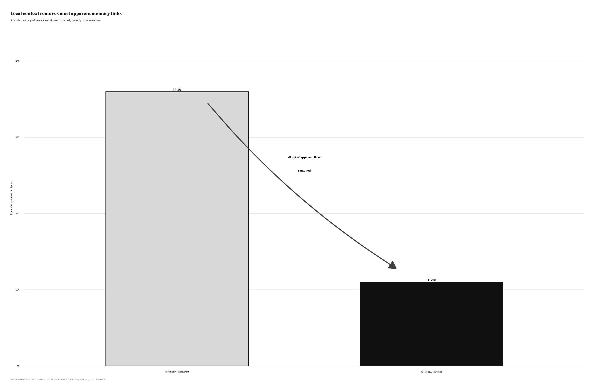
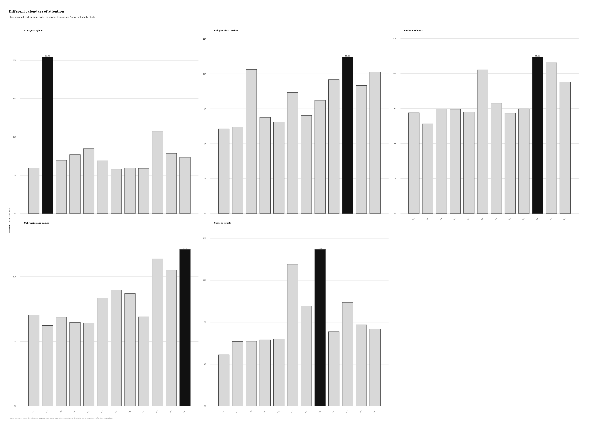
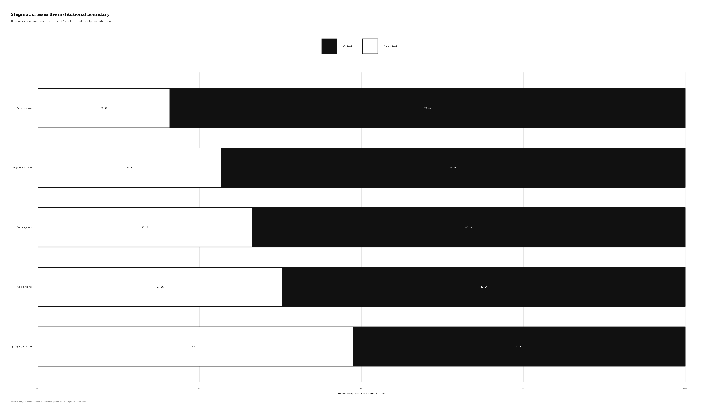

## Abstract

Religious institutions transmit memory, yet digital media may represent them mainly through current controversies. This article asks whether Catholic education in Croatia appears as a vehicle of collective memory or as a debate about present-day values. It compares candidate sites of memory through four signals: recurrence, commemorative peaking, affective charge, and a local textual link to the past. The analysis covers 176,312 education-related posts published between 2021 and 2025. Religious instruction, Catholic schools, teaching orders, and discourse about upbringing and values are highly visible, but only weakly connected to the past. Alojzije Stepinac follows a different pattern: references to him are more historically anchored, peak repeatedly in February around his death anniversary, appear more often in language of conflict and persecution, and circulate across confessional and non-confessional outlets. The result suggests a division of mnemonic labour. Educational institutions organize public debate about the present, while cultural memory concentrates in the figure of the martyr. The analysis also shows that simple co-occurrence overstates memory work: 69.4% of document-level overlaps between an educational anchor and past-related language disappear when the two must occur near each other. This comparative approach distinguishes frequent public topics from anchors that connect the present to a remembered past.

**Keywords:** collective memory; sites of memory; digital religion; Catholic education; Alojzije Stepinac; computational text analysis; Croatia

## 1. Introduction

Religious education connects new generations to inherited stories, practices, and forms of belonging. Yet an institution's purpose does not determine its public meaning. News reports, portal articles, social media, and online discussions may present schools or catechesis less as carriers of tradition than as policy problems or disputes over rights and values.

This tension is pronounced in Croatia, where Catholicism is closely tied to public accounts of national identity and the Church's twentieth-century history remains politically charged. Religious instruction in state schools and the role of Catholic educational institutions are recurring subjects of debate. Alojzije Stepinac, Archbishop of Zagreb during the Second World War and later a cardinal imprisoned by the communist authorities, belongs to a related but more explicitly historical conflict. Croatian Catholic narratives often present him as a martyr and victim of communism, while other traditions interpret his wartime role very differently [@biondich2006; @schwabl2024]. The dispute concerns not only Stepinac, but also which past should guide the present.

The Croatian case therefore poses a clear question: do Catholic educational institutions appear online as places where the past is handed on, or does mediated memory gather around a symbolic figure whose meaning extends beyond the institutions that promote him?

We address this question by comparing eight *anchors*: named figures or coherent groups of education-related expressions. The resulting education strand contains 176,312 posts. The key measure, *genuine anchoring*, requires an anchor and a past-related expression to occur near each other, not merely somewhere in the same document. This makes it possible to separate frequent present-day topics from anchors that connect current discourse to the past.

The design starts from a simple premise: prominence is not the same as memory work. A topic may be frequent because it is controversial now, while a historical name may appear without activating the past. We therefore compare recurrence, temporal rhythm, affective language, and local past linkage. The interpretation rests on their convergence, not on any one measure.

Recent computational studies trace mnemonic actors, temporal rhythms, and language across platforms [@bendavid2024] and examine how a known digital *lieu de mémoire* changes over time [@jumle2026]. This study takes a comparative step: instead of starting with an accepted commemorative event, it asks which Catholic institutions or figures show the clearest pattern of memory work. It also distinguishes local historical linkage from incidental overlap and compares circulation across Catholic and non-confessional sources.

Frequency alone would give the wrong answer. Educational institutions appear more often than Stepinac, but only Stepinac combines strong local links to the past, a recurring commemorative calendar, conflict-oriented language, and circulation across institutional boundaries. This does not mean that schools, parishes, or families lack memory practices. It means that the public digital record presents those institutions mainly through current concerns. In this mediasphere, memory travels through the martyr more readily than through the school.

## 2. Sites of memory in a mediated religious field

### From collective frameworks to measurable anchors

Collective memory is a social activity, not a fixed inventory of facts. Halbwachs locates remembering within the frameworks supplied by groups, relationships, and present concerns [@halbwachs1992]. What a community recalls depends partly on the settings in which the past becomes meaningful. Catholic, mainstream, nationalist, local, and community media therefore do more than distribute memory: they help construct it.

Nora's *lieux de mémoire* draw attention to figures, dates, places, texts, institutions, and symbols in which memory becomes concentrated [@nora1989]. A site of memory need not be a physical place. It may be a person or ritual that is repeatedly revisited from the standpoint of the present.

The concept is not a ready-made measurement scheme, and four indicators cannot exhaust the meaning of a *lieu de mémoire*. They can, however, support a disciplined comparison. Recurrence indicates durability; temporal peaking shows whether attention returns on a commemorative calendar; affective language suggests investment; and genuine anchoring captures a local textual connection to the past. Together, these signals identify degrees of mnemonic activity rather than issue an automatic verdict.

This distinction matters because visibility has many causes: memory, controversy, administration, scandal, or routine reporting. Religious instruction may recur because every school year reopens a policy debate, while a religious order may appear only because an article mentions a monastery. Neither frequency nor whole-document co-occurrence is enough to establish memory work.

### Communicative and cultural memory

Jan Assmann distinguishes fluid, everyday communicative memory from cultural memory carried through texts, figures, rites, institutions, and repeated forms [@assmann1995]. Aleida Assmann further emphasizes that cultural memory depends on selection, mediation, storage, and renewed activation rather than simple preservation [@assmannaleida2011].

Education can turn everyday inheritance into a durable cultural form by stabilizing stories and practices across generations. Yet the same institution may enter public discourse mainly through disputes about curricula, parental rights, secularization, funding, or the role of religion in the state. It can therefore transmit memory in practice while appearing online chiefly as a present-day issue.

A symbolic figure can work differently by condensing biography, historical rupture, moral judgment, and commemoration into one name. Stepinac can evoke the wartime Church, his post-war trial, communist repression, Croatian statehood, Catholic martyrdom, and Croatian-Serbian disputes over history. These meanings are not unified; their conflict may help keep the figure publicly active.

### Digital and connective memory

Digital media store, rank, recirculate, and recontextualize traces of the past [@vandijck2007]. In Hoskins's connective turn, memory is continually remade through networked circulation rather than retrieved unchanged from an archive [@hoskins2011]. Analysis must therefore extend beyond official Church messages to the wider field in which different actors repeat, contest, and repurpose the same anchor.

This wider field can now be studied more systematically. Ben-David and colleagues compare mnemonic actors, temporal dynamics, and vernaculars across platforms, while noting that social media blur commemorative and non-commemorative discourse [@bendavid2024]. Jumle and Makhortykh show how the relevance and discursive composition of a digital site of memory change over time [@jumle2026]. Both approaches treat timing, actors, platforms, and language as parts of memory work rather than as neutral containers.

Our problem is different: several Croatian Catholic institutions, figures, and practices could carry memory, but their public function cannot be assumed. We therefore compare candidates to distinguish memorial anchoring from present-day prominence.

### Religion, media, and the Croatian case

Research on the mediatization of religion shows that media do not simply transmit religious messages. Their genres, routines, and institutional logics shape how religion enters public life [@hjarvard2008; @hoover2006]. Croatian studies likewise describe the internet as a setting in which religious authority, belonging, community, and practice are reorganized [@novak2016]. Pavić, Kurbanović, and Levak found that Croatian Catholic websites and Facebook pages remained closely tied to offline structures and tended to reinforce established authority [@pavic2017]. Our corpus widens that view by including sources with different relationships to the Church.

Peran's distinction between Church media and media that cover religion prevents public Catholicism from being reduced to the Church's own communication [@peran2018]. Here, outlet origin describes the publisher, not the beliefs of authors or audiences. A mixed source profile indicates that an anchor is produced across institutional boundaries; it does not show that those sources or their audiences share an interpretation.

Scholarship on Stepinac shows why this distinction matters. Historical research traces controversy over his conduct, political position, trial, and commemoration [@biondich2006]. Croatian Catholic martyr narratives and Serbian war-criminal narratives remain opposed, with Church and state actors involved in struggles over rehabilitation [@schwabl2024]. Survey research also suggests that many Croatian students view Stepinac positively as part of the national image and encounter him through media [@trbusic2020]. This literature makes him a plausible public memory figure, but comparison with educational institutions remains an empirical question.

## 3. Research questions

The study is descriptive and interpretive. It examines how candidate anchors are patterned in the corpus rather than estimating the causal effects of platforms, outlets, or Church communication.

**RQ1.** Which Catholic educational anchors exhibit the recurrence, commemorative peaking, affective charge, and genuine past linkage expected of a site of memory, and which are mediated primarily as present-day issues?

Before the main analysis, we expected symbolic figures to show stronger memorial anchoring than educational institutions. The comparison could nevertheless have shown that schools or religious instruction were repeatedly tied to communist repression, post-socialist change, or national history.

**RQ2.** Which sources carry each anchor, and through what affective and discursive register?

This question compares confessional and non-confessional origins, named outlets, broad actor types, and the language surrounding each anchor. Source composition indicates who produces an anchor, while affective language helps distinguish conflict and persecution from trust and pastoral formation.

## 4. Data and methods

### Corpus and analytic scope

At the time of analysis, the DigiKat corpus contained 710,307 Croatian- and Bosnian-language posts from web portals, YouTube, Facebook, Twitter/X, Reddit, forums, and comment sections. Web portals dominate. Posts enter the corpus when they match at least two distinct roots from a 95-term Catholic lexicon designed for Croatian inflection. The corpus therefore collects media posts in which Catholic topics are salient, not records produced only by Catholic institutions. This study keeps the existing inclusion rule and analyzes posts dated from 1 January 2021 through 31 December 2025.

### Anchors and the education strand

The study identifies eight primary anchors. Four cover institutions and practices: religious instruction (*vjeronauk* and religion-teacher forms), Catholic schools and higher education, upbringing/values/curriculum, and teaching orders. Four are figures connected to Catholic education and public memory: Alojzije Stepinac, Josip Juraj Strossmayer, Josip Stadler, and Blessed Marija Petković. A secondary ritual bundle covers pilgrimages, processions, the Croatian Catholic Youth Meeting (SHKM), and similar gatherings; it is used only as a temporal comparison.

Matching uses lower-cased text, Croatian locale handling, and patterns for common inflections and spelling variants. A post enters the education strand if it matches at least one primary anchor during the study period. The resulting strand contains 176,312 posts. The patterns favour recall, so broad bundles are also decomposed when interpreted.

### Four signals of a candidate site of memory

**Recurrence** is the number of posts in which an anchor appears. It measures durability, although routine reporting or controversy can also produce high counts.

**Temporal peaking** is measured across the complete 2021–2025 monthly series. The coefficient of variation measures how unevenly attention is distributed, and the modal annual peak month shows whether the same calendar point returns across years. Repeated timing is more consistent with commemoration than a single spike.

**Affective charge** is estimated from a reproducible sample capped at 800 posts per anchor, yielding 5,548 unique posts after overlap. The first 1,500 characters of each post are lemmatized with the project's Croatian UDPipe model. CroSentilex supplies signed polarity and lilaHR an eight-emotion profile. Because lexicons cannot recover irony, context, or felt emotion, these measures describe textual registers and serve only as supporting evidence.

**Genuine anchoring** records whether a twentieth-century past expression occurs within 160 characters of an anchor. The past vocabulary covers communism, Yugoslavia, secularization, 1991, the Homeland War, war, victimhood, and pre-war or post-war periods. Distance is calculated separately for each anchor so that one entity cannot borrow another's nearby past reference. The window is a transparent proximity rule, not a semantic classifier; its purpose is to reduce document-level coincidence.

### Source composition

Source composition is examined through platform shares, named-outlet rankings, and a web-actor typology based on reach and interaction. The typology distinguishes Giants, Megaphones, Community Builders, and Specialists, although these categories differ little across anchors.

An outlet-origin dictionary classifies some named sources as confessional or non-confessional. Coverage ranges from 29.7% to 44.4% for the main anchors and is lower for Strossmayer. Confessional shares are calculated only among categorized posts. These labels describe publishers, not audiences, ideological agreement, or personal religiosity.

### Measurement checks

The design uses Stepinac as a positive control and the broad upbringing-and-values bundle as a foil. Stepinac was expected to show stronger memorial anchoring, while the foil was expected to be frequent but mainly present-oriented. Their observed genuine-anchoring shares are 23.9% and 9.8%, respectively.

A second check corrected the pattern *isusov*, which captured possessive forms meaning “of Jesus” as well as references to Jesuits. Restricting it to explicit forms for Jesuits and the Society of Jesus removed 32,430 false matches. All results use the corrected strand of 176,312 posts.

## 5. Results

### The split: recurrent institutions, mnemonic figure

Table 1 summarizes the comparison. Recurrence alone points toward institutions: upbringing and values appear in 82,025 posts, teaching orders in 79,962, and Stepinac in 9,831.

Genuine anchoring reverses that order. A past expression occurs near Stepinac in 23.9% of his posts, compared with 9.8% for upbringing and values, 9.6% for teaching orders, 7.1% for Catholic schools, and 6.5% for religious instruction. Stepinac's rate is therefore 2.4 to 3.7 times the institutional rates. Figure @fig-anchor-split places the frequent institutional anchors together below 10%, while Stepinac stands apart. Strossmayer, Stadler, and Petković score lower; the vocabulary fits Strossmayer's nineteenth-century context less well, and the two rarest figures do not support the full temporal and affect comparison.

{#fig-anchor-split fig-alt="Scatterplot on a logarithmic frequency axis. Stepinac is well above all other anchors in genuine anchoring, while educational institutions are more frequent but cluster below ten percent." width=100%}

**Table 1. Comparative profile of the eight primary anchors**

| Anchor | Posts | Genuine anchoring | Pooled temporal pattern | Interpretive profile |
|---|---:|---:|---|---|
| Upbringing and values | 82,025 | 9.8% | CV 0.65; December peak in 3 of 5 years | Broad-source, trust-leaning present-day values discourse; present-oriented foil |
| Teaching orders | 79,962 | 9.6% | CV 0.41; December peak in 2 of 5 years | Confessional-leaning and recurrent, but weakly memorial |
| Catholic schools | 22,233 | 7.1% | CV 0.38; November peak in 2 of 5 years | Most confessional among classified posts; highest trust share |
| Religious instruction | 14,918 | 6.5% | CV 0.40; March peak in 2 of 5 years | Confessional-leaning, trust-oriented public controversy |
| Alojzije Stepinac | 9,831 | 23.9% | CV 0.70; February peak in 4 of 5 years | Cross-boundary conflict and persecution register; strongest memory candidate |
| Josip Juraj Strossmayer | 5,172 | 6.4% | CV 0.54; no recurrent peak month | Historically important figure; current past vocabulary is a weak fit |
| Josip Stadler | 728 | 6.3% | Not estimated | Low-frequency figure; descriptive evidence is limited |
| Marija Petković | 302 | 5.0% | Not estimated | Rare candidate retained rather than rejected by frequency |

*Note.* CV values summarize the complete monthly series for 2021–2025. The interpretive profile synthesizes the affect and source-origin results discussed below. Affect is based on the sampled, lemmatized analysis; source proportions refer only to posts assigned an outlet-origin category.

The foil clarifies the difference. Upbringing and values are more than eight times as frequent as Stepinac because they organize current arguments about family, education, morality, and public life. The bundle is driven by the common terms *value* (60,698 posts) and *upbringing* (27,455), while *curriculum* appears in 1,910 posts and “Christian roots” only once. It is therefore a broad field of present-oriented language, not an explicit civilizational-memory frame. Stepinac appears less often, but more reliably opens onto a historical rupture.

Across the strand, 36.0% of posts contain both an education anchor and a past-related expression somewhere in the document, but only 11.0% place them within the local window. The proximity rule therefore removes 69.4% of apparent overlaps. Figure @fig-overlap-filter makes this reduction visible. Without the local requirement, the ordinary coexistence of religious and historical vocabulary would be mistaken for memorial engagement.

{#fig-overlap-filter fig-alt="Two black-and-white bars compare 36.0 percent document-level overlap with 11.0 percent local anchoring. An arrow states that 69.4 percent of apparent links are removed." width=92%}

### The February rhythm

Stepinac also has the clearest commemorative rhythm. His coefficient of variation is 0.70, compared with 0.40 for religious instruction, 0.38 for Catholic schools, and 0.41 for teaching orders. Upbringing and values are similarly uneven at 0.65, but their December peak in three of five years follows a broader institutional and year-end calendar rather than a historical anniversary.

February is Stepinac's highest-volume month in four of the five study years, corresponding to *Stepinčevo* around the anniversary of his death on 10 February 1960. October, the month of his 1998 beatification, forms a smaller secondary rise. The educational anchors instead follow school calendars and news cycles. Figure @fig-seasonality shows the contrast.

{#fig-seasonality fig-alt="Five faceted bar charts showing monthly shares for Stepinac, religious instruction, Catholic schools, upbringing and values, and Catholic rituals. Stepinac has a sharp February maximum; rituals have an August maximum; educational topics have broader seasonal profiles." width=100%}

The ritual bundle provides a second recognizable calendar: August is its peak in all five years, consistent with summer pilgrimages and youth gatherings. Strossmayer's series is moderately uneven but has no recurrent peak month, and his local past score remains low under a vocabulary centred on twentieth-century rupture. His result is therefore less conclusive than Stepinac's.

### Shared authorship across institutional boundaries

Web sources account for about 87% of the education strand. The broad actor typology differs little across anchors, so named outlets and the confessional/non-confessional comparison are more informative.

Among classified posts, 62.2% of Stepinac items come from confessional outlets, compared with 79.6% for Catholic schools and 71.7% for religious instruction. His leading sources include Catholic and diocesan media alongside mainstream and nationally oriented portals. Stepinac is therefore produced across sources with different institutional relationships to the Church.

Outlet origin is available for 32.5% of Stepinac posts, so this pattern indicates source diversity rather than a population share. Nor does a non-confessional origin imply opposition to the Church or agreement on Stepinac's meaning. The evidence shows only that his mediated memory extends beyond formal Catholic communication.

Religious instruction has a different profile. Its leading sources include Reddit's Croatia community and forum.hr, supporting its interpretation as a subject of public argument rather than commemoration. Upbringing and values are the broadest public topic, with 51.3% of classified posts from confessional outlets, while Catholic schools and teaching orders are more concentrated in Church-linked sources. Figure @fig-source-boundary places these profiles side by side. Stepinac falls between broad values discourse and more Church-centred institutional topics, supporting the interpretation of shared authorship. Source diversity alone, however, does not make an anchor mnemonic.

{#fig-source-boundary fig-alt="Black-and-white stacked bars show confessional and non-confessional source shares among classified posts for five anchors. Stepinac is 62.2 percent confessional and 37.8 percent non-confessional, compared with 79.6 and 20.4 percent for Catholic schools." width=95%}

### Affect as supporting evidence

Polarity does not distinguish the anchors. Mean CroSentilex scores cluster near −0.42 because the lexicon contains signed terms and the posts share much news vocabulary. We therefore exclude polarity from the substantive interpretation.

The lilaHR profile offers a modest contrast. Stepinac has the highest average shares of anger, fear, sadness, and disgust and the lowest trust share. Catholic schools have the highest trust and the lowest conflict-oriented emotions; religious instruction also leans toward trust, while rituals have the highest joy share. These are textual patterns, not evidence of what authors or readers felt, but they fit the wider distinction between conflict around the martyr, trust around institutions, and celebration around rituals.

Affect supports but does not carry the argument. The stronger evidence comes from local past linkage, commemorative timing, and source composition.

### Convergence

The signals converge on a simple contrast. Stepinac is less frequent than the institutional bundles but more closely linked to past-related language, more clearly tied to a commemorative calendar, more conflict-oriented in its textual register, and more widely produced across institutional boundaries. Educational anchors are frequent but weakly historical and are associated mainly with routine formation or current controversy. The corpus therefore contains institutions discussed because they matter now and a martyr invoked because the present remains tied to a contested past.

## 6. Discussion

### A division of mnemonic labour

Institutions designed to transmit memory do not necessarily appear as sites of memory in public media. Catholic education may sustain tradition in classrooms, liturgies, families, and curricula, but the corpus observes only its public digital representation. In that setting, educational institutions appear mainly through current concerns such as values, schooling, rights, curriculum, and the role of religion.

Stepinac has a different temporal role. His name brings together martyrdom, communist repression, disputed wartime conduct, national identity, sainthood, and Croatian-Serbian disagreement. The February peak gives this symbolic figure a commemorative calendar, conflict-oriented language gives it a recognizable register, and cross-boundary circulation extends it beyond formal Church communication.

Assmann's distinction helps name this difference [@assmann1995]. The institutions circulate mainly in a fluid, present-oriented field, while Stepinac shows the repetition and symbolic concentration associated with cultural memory. This is not a rigid division: institutions may transmit memory, and Stepinac has no fixed meaning. Rather, it is a division of mnemonic labour in public representation. Institutions organize debate about the present; the martyr supplies a moralized past through which that present can be read.

### Stepinac as contested public property

Nora's sites of memory do not require consensus. They endure because groups revisit them and struggle over their meaning. Stepinac's mixed source profile is therefore part of the phenomenon, not noise around a purely Catholic memory. Catholic, diocesan, mainstream, and nationally oriented outlets may reactivate the same figure for different and even opposing reasons.

This pattern fits scholarship that places Stepinac at the intersection of Church, state, national identity, and competing histories of war and socialism [@biondich2006; @schwabl2024]. It also shows that his public life cannot be reduced to official devotion. The result is best understood as shared authorship, not shared belief: sources in different institutional positions sustain the same memory figure without telling the same story.

### A comparative instrument, not an automatic detector

The four-signal framework extends existing work on mnemonic actors, temporal dynamics, and language [@bendavid2024] and on the changing composition of known digital memory sites [@jumle2026]. Its contribution is to compare different kinds of candidates before deciding which one shows a convincing mnemonic pattern.

Beginning with a memorial day asks how an accepted site of memory changes. This design instead asks which frequent religious anchor warrants that interpretation. The control and foil show whether the measures can separate a memory figure from a present-day topic; rare-anchor retention prevents frequency from deciding the answer in advance; and Strossmayer shows how historically specific vocabulary shapes detection. The framework is thus a structured comparison, not an automatic score. Its force comes from agreement among different forms of evidence.

### Co-occurrence is not memory work

The proximity result has a broader methodological implication. Large documents often contain unrelated themes, and more than two thirds of the apparent education-and-past overlaps disappear when the terms must occur near each other. Whole-document co-occurrence would therefore make Catholic education appear much more historically anchored than it is in the relevant passages.

Proximity does not prove semantic engagement; a 160-character window may still contain negation, quotation, unrelated syntax, or a homonym. It does, however, provide a clearer threshold between incidental presence and plausible linkage. This is especially useful in memory research, where historical vocabulary is common and may be unrelated to the focal anchor.

## 7. Scope and limitations

The study describes public digital representation, not the beliefs or memories of citizens, classrooms, or parishes. Web portals dominate; broad anchors favour recall over fine semantic distinctions; and the past vocabulary fits twentieth-century rupture better than Strossmayer's nineteenth-century setting. Source categories cover only part of the corpus and say nothing about audience agreement, while lexicon scores describe language rather than felt emotion. The claim is therefore limited to the mediasphere: Stepinac has a locally anchored, calendar-driven presence, whereas educational institutions are represented mainly through the present.

## 8. Conclusion

In Croatian digital media between 2021 and 2025, Catholic education is highly visible but rarely presented as a bridge to the past. Religious instruction, Catholic schools, teaching orders, and discussions of upbringing and values appear mainly through schooling, morality, policy, and the public role of religion. Stepinac differs: his name is more often linked locally to the past, attention returns around a February commemoration, the surrounding language stresses conflict and persecution, and circulation extends beyond confessional media. These signals do not imply agreement about him. They show that different actors use the same contested figure to connect present concerns to history.

This division of mnemonic labour is the article's main claim. Institutions charged with transmitting Catholic memory organize public argument in the present, while cultural memory concentrates in the martyr figure. The analysis also shows why document-level overlap is insufficient: most apparent links between education and the past disappear when the terms must meet within the text.

## References

::: {#refs}
:::
