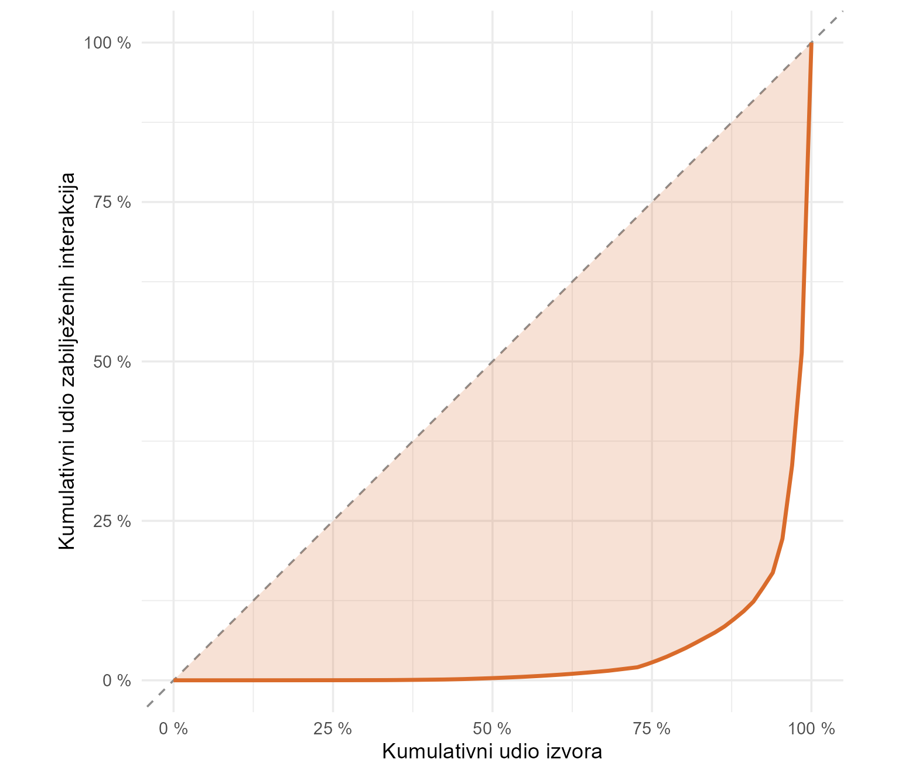
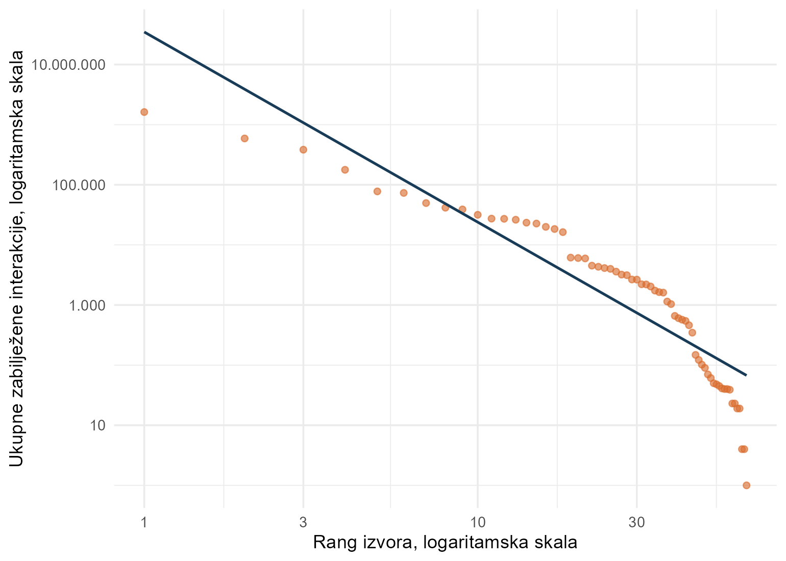
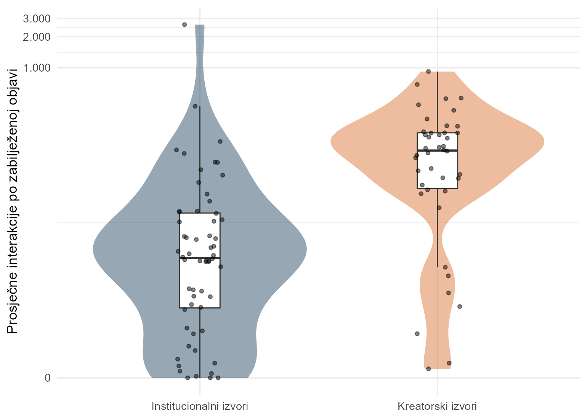
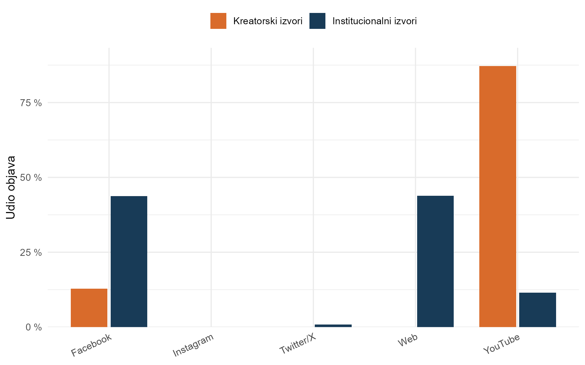
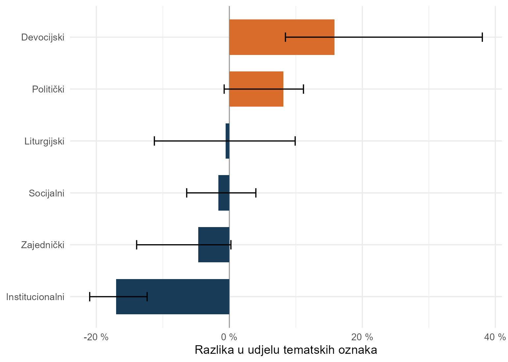
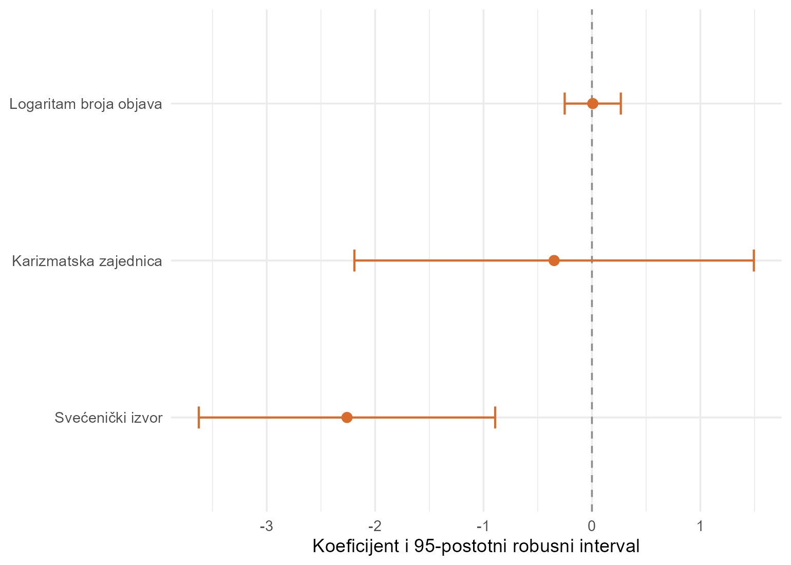

```{r}
#| label: setup
#| include: false

library(data.table)
library(ggplot2)
library(knitr)

results <- jsonlite::read_json("output/analysis_results.json", simplifyVector = TRUE)
hr_int <- function(x) formatC(as.numeric(x), format = "d", big.mark = ".", decimal.mark = ",")
hr_num <- function(x, digits = 3) formatC(as.numeric(x), format = "f", digits = digits,
                                          big.mark = ".", decimal.mark = ",")
hr_pct <- function(x, digits = 1) paste0(hr_num(100 * as.numeric(x), digits), " %")
hr_pp <- function(x, digits = 1) paste0(hr_num(100 * as.numeric(x), digits), " postotnih bodova")
p_text <- function(x) {
  x <- as.numeric(x)
  if (x < .001) "p < 0,001" else paste0("p = ", hr_num(x, 3))
}
ci_text <- function(low, high, digits = 3) {
  paste0("[", hr_num(low, digits), "; ", hr_num(high, digits), "]")
}
```

# Sažetak {.unnumbered}

Institucionalni autoritet ne jamči digitalnu pažnju, ali usporedba crkvenih institucija i religijskih
kreatora lako zamijeni razliku među akterima razlikom među platformama. Ova studija analizira službeni
DigiKat korpus od `r hr_int(results$corpus$rows_official)` objava prikupljenih od 1. siječnja 2021. do
11. lipnja 2026. Primarni analitički skup obuhvaća `r hr_int(results$sample$primary_posts)` objava i
`r hr_int(results$sample$primary_sources)` pouzdano klasificiranih oznaka izvora. Kreatorski izvori
obuhvaćaju laičke religijske kanale, pojedinačne svećenike i karizmatske zajednice. Institucionalni
izvori obuhvaćaju službene komunikatore, biskupijske i župne kanale te akademske ustanove. Pažnja je
izrazito koncentrirana među kreatorskim izvorima. Gini koeficijent iznosi
`r hr_num(results$h1$gini)` uz 95-postotni bootstrap interval
`r ci_text(results$h1$gini_ci_low, results$h1$gini_ci_high)`. Među izvorima s najmanje pet objava
medijan interakcija po objavi iznosi `r hr_num(results$h2$medians$Influencer, 1)` za kreatorske i
`r hr_num(results$h2$medians$Institutional, 1)` za institucionalne izvore. Razlika ostaje pozitivna u
usporedbi ograničenoj na YouTube i prilagođenoj za broj objava i vrijeme prikupljanja. Platformski su
profili snažno različiti, dok se tematski profili razlikuju ponajprije u naglascima. Gotovo svi
prihvatljivi kreatorski izvori primarno su na YouTubeu, pa se ne može odvojeno procijeniti učinak
primarne platforme. Rezultati podupiru precizno ograničen institucionalni deficit zabilježenih
interakcija, ali ne dokazuju opću komunikacijsku nadmoć kreatora niti uzročni učinak njihova stila.

**Ključne riječi.** Ekonomija pažnje, religijski kreatori, digitalni mediji, Katolička crkva,
Hrvatska, platformska komunikacija

# Uvod

Digitalne platforme dovode službene crkvene kanale, zajednice i pojedinačne kreatore u isti prostor
vidljivosti, ali ih ne dovode u jednake uvjete. Institucionalni izvori često objavljuju priopćenja,
arhivske zapise i servisne informacije. Kreatorski izvori češće djeluju kroz osobni glas, video i
izravno obraćanje publici. Zabilježena razlika u interakcijama zato može odražavati privlačnost
sadržaja, platformsku infrastrukturu, različite komunikacijske ciljeve ili način mjerenja. Empirijski
izazov nije samo utvrditi postoji li razlika, nego pokazati na kojoj se razini pojavljuje i gdje
prestaje biti usporediva.

Naziv *katolički influencer* u ovom radu označava analitičku skupinu, a ne zanimanje, samoodređenje ili
prag broja pratitelja. Skupina uključuje pouzdano prepoznate laičke religijske kanale, pojedinačne
svećenike i karizmatske zajednice. Zbog te širine u analitičkom se tekstu koristi precizniji izraz
**kreatorski izvori**. Institucionalna skupina uključuje službene crkvene komunikatore, biskupijske i
župne izvore te katoličke akademske ustanove. Nezavisni katolički mediji, redovničke zajednice,
organizacije mladih, svjetovni mediji i nejasno klasificirani izvori nisu dio primarne usporedbe.

Rad unapređuje raniju verziju analize na tri načina. Prvo, inferencija se oslanja na klasifikaciju
visoke pouzdanosti, dok se širi skup naziva koristi samo za provjeru osjetljivosti. Drugo, usporedba
interakcija provodi se i unutar YouTubea, jedine platforme s dovoljno kreatorskih i institucionalnih
izvora za smislen zajednički oslonac. Treće, tvrdnje o platformi, temama i svećeničkom statusu odvajaju
se od glavnog nalaza i ograničavaju na ono što struktura podataka doista može procijeniti.

Analiza odgovara na pet pitanja.

1. **P1. Koncentracija pažnje.** Koliko su zabilježene interakcije nejednako raspodijeljene među
   kreatorskim izvorima?
2. **P2. Institucionalni deficit pažnje.** Imaju li kreatorski izvori više interakcija po objavi od
   institucionalnih izvora i ostaje li razlika unutar zajedničke platforme?
3. **P3. Platformski profil.** Razlikuje li se raspodjela objava kreatorskih i institucionalnih izvora
   među platformama?
4. **P4. Tematski profil.** Razlikuju li se skupine po relativnoj zastupljenosti šest unaprijed
   određenih tematskih obitelji?
5. **P5. Razlike unutar kreatorskoga sloja.** Jesu li učestalost objavljivanja i vrsta kreatorskoga
   izvora povezane s interakcijama po objavi te može li se procijeniti samostalan učinak primarne
   platforme?

# Podaci i metode

## Dizajn i ulazni korpus

Studija je opservacijska analiza digitalnih objava. Ulaz je `data/digikat_corpus.rds`, službeni
DigiKat korpus izgrađen jedinstvenim pravilom uključivanja za cijelo razdoblje. Analitički kod prije
rada provjerava SHA-256 ulaza prema praćenom manifestu. Korpus obuhvaća razdoblje od 2021. do
11. lipnja 2026. Promjena instrumenta prikupljanja tijekom 2024. ograničava izravne usporedbe volumena
između razdoblja, a 2026. je nepotpuna godina. Analiza ne tumači vremensku promjenu količine objava.

Tok od službenoga korpusa do primarnoga analitičkog skupa prikazan je u @tbl-sample-flow.

```{r}
#| label: tbl-sample-flow
#| tbl-cap: "Tok konstrukcije analitičkoga skupa"

flow <- fread("output/tables/analysis_sample_flow.csv", encoding = "UTF-8")
flow[, `:=`(
  Objave = vapply(posts, hr_int, character(1)),
  `Oznake izvora` = vapply(sources, hr_int, character(1))
)]
flow[, .(`Korak analize` = stage, Objave, `Oznake izvora`)] |>
  kable(align = c("l", "r", "r"))
```

TikTok je isključen iz studijskoga obuhvata jer naslijeđeni klasifikator nije definiran za tu
platformu. Isključenje obuhvaća `r hr_int(results$sample$excluded_tiktok)` objava i ne mijenja službeni
korpus. Od preostalih objava, `r hr_pct(results$sample$primary_interaction_coverage)` ima zabilježenu
vrijednost varijable interakcija u primarnom skupu.

## Klasifikacija i jedinica analize

Klasifikator radi na oznaci `FROM`, koja može predstavljati domenu, kanal, stranicu ili drugi naziv
izvora. Najprije primjenjuje unaprijed sastavljen popis poznatih naziva i kratica. Zatim prepoznaje
jasne biskupijske, župne i svećeničke obrasce. Primarni skup zadržava samo takve oznake visoke
pouzdanosti. Šira provjera osjetljivosti uključuje i nazive prepoznate devocijskim ili zajedničkim
jezičnim obrascem. Taj širi sloj povećava obuhvat, ali ne može pouzdano utvrditi katolički identitet
svakoga izvora.

Jedinica analize nije nužno jedinstvena pravna osoba ili pojedinac. Isti stvarni akter može imati više
oznaka, a jedna oznaka može objediniti više platformskih prisutnosti. Zato se rezultati dosljedno
odnose na **oznake izvora**. Privatna tablica s nazivima služi autorskoj provjeri klasifikacije i ne
ulazi u javne rezultate.

## Mjera pažnje

Pažnja se operacionalizira brojem zabilježenih interakcija u trenutku vendorskoga zahvata. Interakcije
uključuju platformi svojstvene reakcije, komentare, dijeljenja i srodne signale. Varijabla nije broj
jedinstvenih korisnika, doseg, broj pratitelja ni stopa angažmana normalizirana izloženošću. Njezino
značenje i trenutak bilježenja nisu jednaki na svim platformama. Nulte vrijednosti mogu označavati
izostanak interakcija ili izostanak zabilježenoga signala. Glavna međugrupna inferencija zato se
ponavlja unutar YouTubea, gdje se uspoređuje ista platformska vrsta zapisa.

Za usporedbu po izvoru računa se prosječan broj interakcija po objavi s opaženom vrijednošću. Izvori s
manje od pet takvih objava isključuju se iz glavne usporedbe P2 i eksplorativnoga modela P5 kako
pojedinačna objava ne bi određivala prosjek cijeloga izvora. Pragovi od jedne, deset i dvadeset objava
koriste se u provjerama osjetljivosti.

## Analitička strategija

Za P1 interakcije se zbrajaju po pouzdano klasificiranoj kreatorskoj oznaci izvora. Prikazuju se Gini
koeficijent, udio deset vodećih izvora i Lorenzova krivulja. Nesigurnost Gini koeficijenta procjenjuje
se s `r hr_int(results$run$bootstrap_repetitions)` ponovljenih uzoraka izvora. Logaritamska regresija
ukupnih interakcija na rang koristi se samo kao opis oblika raspodjele. Nije formalni test
potencijskoga zakona.

Za P2 raspodjele izvorskih prosjeka uspoređuju se medijanima, bootstrap intervalom razlike medijana,
Wilcoxonovim testom i rang-biserijalnom korelacijom. Glavna prilagođena procjena ograničena je na
YouTube izvore s najmanje pet objava. Linearni model za `log(1 + prosječne interakcije)` uključuje
skupinu izvora, logaritam broja objava i prosječno vrijeme prikupljanja. Intervali i testovi temelje se
na HC3 heteroskedastički robusnim standardnim pogreškama.

P3 se procjenjuje raspodjelom objava po platformi i Cramerovim V. Kako bi se smanjila dominacija
vrlo produktivnih izvora, dodatno se računa prosječni platformski udio tako da svaka oznaka izvora ima
jednaku težinu. Interval razlike društvenih platformi dobiva se bootstrapom izvora.

P4 koristi višestruki rječnik šest obitelji. To su devocijska, liturgijska, institucionalna,
socijalna, politička i zajednička tematika. Jedna objava može dobiti više oznaka. Razlika profila sažima
se Jensen-Shannonovom divergencijom, a nesigurnost divergencije i pojedinačnih razlika procjenjuje se
bootstrapom izvora. Rječnik je opisni instrument, a ne nadzirani klasifikator ili model tema.

Za P5 se unutar kreatorskoga sloja modelira `log(1 + prosječne interakcije)` pomoću logaritma broja
objava te pokazatelja svećeničkih izvora i karizmatskih zajednica. Laički kreatorski izvori čine
referentnu skupinu. Primarna platforma nije uključena ako u prihvatljivom uzorku nema najmanje pet
izvora u svakoj njezinoj kategoriji. P5 je eksplorativan, a koeficijenti se ne tumače uzročno.

# Rezultati

## Analitički obuhvat

Primarni skup sadrži `r hr_int(results$sample$primary_influencer_sources)` kreatorskih i
`r hr_int(results$sample$primary_institutional_sources)` institucionalnih oznaka izvora. One zajedno
proizvode `r hr_int(results$sample$primary_posts)` objava. Nakon praga od pet objava, usporedba P2
obuhvaća `r hr_int(results$h2$influencer_sources)` kreatorska i
`r hr_int(results$h2$institutional_sources)` institucionalnih izvora. Razlika između punoga
klasificiranog skupa i primarnoga skupa nije tehnička sitnica. Ona uklanja najveći dio nazivno
prepoznatih, ali identitetski neprovjerenih devocijskih izvora.

## P1. Pažnja je izrazito koncentrirana

Analiza koncentracije obuhvaća `r hr_int(results$h1$sources)` kreatorskih oznaka izvora s barem jednom
opaženom vrijednošću. Na `r hr_int(results$h1$observed_posts)` objava zabilježeno je ukupno
`r hr_int(results$h1$total_interactions)` interakcija. Gini koeficijent iznosi
`r hr_num(results$h1$gini)`, a njegov 95-postotni bootstrap interval
`r ci_text(results$h1$gini_ci_low, results$h1$gini_ci_high)`. Deset vodećih oznaka izvora prikuplja
`r hr_pct(results$h1$cr10)` svih zabilježenih interakcija. Koncentracija ostaje vrlo visoka i u široj
klasifikaciji, u kojoj Gini iznosi `r hr_num(results$h1$broad_gini)`.

@fig-h1-lorenz prikazuje koliko se kumulativna raspodjela udaljava od potpune jednakosti. Površina
između dijagonale i krivulje nije dokaz posebne distribucijske porodice, ali jasno pokazuje da
„kreatorski sloj” nije homogena skupina uspješnih računa.

{#fig-h1-lorenz}

Opisna regresija ranga ima koeficijent determinacije `r hr_num(results$h1$rank_r2)`. To je snažna
linearna prilagodba na logaritamskim skalama, ali nije dovoljna za tvrdnju da podaci slijede
potencijski zakon. @fig-h1-rank zato služi kao dijagnostički prikaz, ne kao test distribucije.

{#fig-h1-rank}

## P2. Deficit interakcija ostaje u usporedbi unutar YouTubea

Među izvorima s najmanje pet objava, kreatorski medijan iznosi
`r hr_num(results$h2$medians$Influencer, 1)` interakcija po objavi, a institucionalni
`r hr_num(results$h2$medians$Institutional, 1)`. Procijenjena razlika medijana iznosi
`r hr_num(results$h2$median_difference, 1)`, uz 95-postotni bootstrap interval
`r ci_text(results$h2$median_difference_ci_low, results$h2$median_difference_ci_high, 1)`. Wilcoxonov
test daje W = `r hr_num(results$h2$wilcoxon_w, 1)` i `r p_text(results$h2$wilcoxon_p)`. Rang-biserijalna
korelacija od `r hr_num(results$h2$rank_biserial)` pokazuje veliku raspodjelnu razliku u korist
kreatorskih izvora.

@tbl-engagement-descriptives prikazuje broj izvora i interkvartilni raspon na kojima se temelji
usporedba medijana.

```{r}
#| label: tbl-engagement-descriptives
#| tbl-cap: "Interakcije po objavi prema skupini izvora"

eng_desc <- fread("output/tables/h2_group_summary.csv", encoding = "UTF-8")
eng_desc[, Skupina := fifelse(
  actor_group == "Influencer", "Kreatorski izvori", "Institucionalni izvori"
)]
eng_desc[, `:=`(
  `Broj izvora` = vapply(sources, hr_int, character(1)),
  Medijan = vapply(median, hr_num, character(1), digits = 1),
  `Interkvartilni raspon` = paste0(
    vapply(q1, hr_num, character(1), digits = 1), "–",
    vapply(q3, hr_num, character(1), digits = 1)
  )
)]
eng_desc[, .(Skupina, `Broj izvora`, Medijan, `Interkvartilni raspon`)] |>
  kable(align = c("l", "r", "r", "r"))
```

@fig-h2-engagement pokazuje i veliku heterogenost unutar obje skupine. Nalaz nije rezultat samo nekoliko
ekstremnih vrijednosti jer je razlika vidljiva i u medijanima, ali rasponi upozoravaju da naziv skupine
ne određuje uspjeh pojedinačnoga izvora.

{#fig-h2-engagement}

Usporedba unutar YouTubea obuhvaća `r hr_int(results$h2$youtube_influencer_sources)` kreatorski i
`r hr_int(results$h2$youtube_institutional_sources)` institucionalnih izvora. Nakon prilagodbe za broj
objava i prosječno vrijeme prikupljanja, koeficijent kreatorske skupine iznosi
`r hr_num(results$h2$youtube_adjusted_estimate)`, uz 95-postotni HC3 interval
`r ci_text(results$h2$youtube_adjusted_ci_low, results$h2$youtube_adjusted_ci_high)` i
`r p_text(results$h2$youtube_adjusted_p)`. Eksponencirani koeficijent iznosi
`r hr_num(results$h2$youtube_adjusted_ratio, 2)`. Na transformiranoj ljestvici procijenjeni odnos kreće
se od `r hr_num(results$h2$youtube_adjusted_ratio_ci_low, 2)` do
`r hr_num(results$h2$youtube_adjusted_ratio_ci_high, 2)`. Time se glavni nalaz ne oslanja na izravnu
usporedbu weba i društvenih platformi. Koeficijent ostaje pozitivan uz pragove od jedne, deset i
dvadeset objava. Najmanja procjena iznosi `r hr_num(results$h2$youtube_sensitivity_min_estimate)`, a
najveća p-vrijednost `r p_text(results$h2$youtube_sensitivity_max_p)`.

Izraz **institucionalni deficit pažnje** opravdan je samo u ovom ograničenom smislu. Riječ je o manjem
broju zabilježenih interakcija po objavi, uključujući usporedive YouTube izvore. Nalaz ne pokazuje
koliko je ljudi sadržaj vidjelo, koliko mu vjeruje, je li ispunio institucionalnu svrhu ili kakav je
duhovni i društveni učinak imao.

## P3. Platformski profili snažno se razlikuju

Kreatorski izvori objavljuju `r hr_pct(results$h3$social_share_influencer)` sadržaja na Facebooku,
Instagramu, YouTubeu i Twitteru/X, dok je odgovarajući institucionalni udio
`r hr_pct(results$h3$social_share_institutional)`. Web čini
`r hr_pct(results$h3$web_share_institutional)` institucionalnih objava i
`r hr_pct(results$h3$web_share_influencer, 2)` kreatorskih objava. Cramerov V na razini objava iznosi
`r hr_num(results$h3$post_cramers_v)`, a na razini prisutnosti izvora na platformi
`r hr_num(results$h3$source_presence_cramers_v)`.

Razlika nije samo posljedica najproduktivnijih izvora. Kada svaka oznaka izvora dobije jednaku težinu,
prosječan udio društvenih platformi iznosi `r hr_pct(results$h3$source_weighted_social_share_influencer)`
za kreatorske i `r hr_pct(results$h3$source_weighted_social_share_institutional)` za institucionalne
izvore. Razlika iznosi `r hr_pp(results$h3$source_weighted_social_difference)`, uz 95-postotni bootstrap
interval od `r hr_pp(results$h3$source_weighted_social_difference_ci_low)` do
`r hr_pp(results$h3$source_weighted_social_difference_ci_high)`.

@fig-h3-platform prikazuje postotke objava, a ne procijenjenu publiku. Stoga opisuje alokaciju sadržaja
u promatranom korpusu. Ne identificira namjeru aktera niti algoritamsku distribuciju.

{#fig-h3-platform}

## P4. Skupine dijele tematsku jezgru, ali različito naglašavaju njezine dijelove

Rječnik je dodijelio barem jednu oznaku za `r hr_int(results$h4$coded_posts)` od
`r hr_int(results$h4$posts_with_text)` objava s tekstom. To je pokrivenost od
`r hr_pct(results$h4$coverage)`. Jensen-Shannonova divergencija između profila iznosi
`r hr_num(results$h4$js)`. Njezin 95-postotni izvorski bootstrap interval kreće se od
`r hr_num(results$h4$js_ci_low)` do `r hr_num(results$h4$js_ci_high)`. Procjena je viša od rezultata
šire klasifikacije od `r hr_num(results$h4$broad_js)`, što potvrđuje da izbor izvora utječe na veličinu
tematske razlike.

Devocijske oznake imaju `r hr_pp(results$h4$devotional_difference)` veći udio u kreatorskom profilu.
Bootstrap interval kreće se od `r hr_pp(results$h4$devotional_ci_low)` do
`r hr_pp(results$h4$devotional_ci_high)`. Institucionalne oznake imaju
`r hr_pp(abs(results$h4$institutional_difference))` veći udio u institucionalnom profilu, uz interval
razlike kreatora prema institucijama od `r hr_pp(results$h4$institutional_ci_low)` do
`r hr_pp(results$h4$institutional_ci_high)`.

@fig-h4-theme pokazuje da se jasni devocijski i institucionalni naglasci pojavljuju unutar profila
koji i dalje dijele liturgijske, socijalne i zajedničke teme. Zato podaci više podupiru diferencijaciju
naglaska nego tvrdnju o odvojenim tematskim svjetovima.

{#fig-h4-theme}

## P5. Platformski učinak nije procjenjiv, a razlike po vrsti izvora ostaju eksplorativne

Eksplorativni model obuhvaća `r hr_int(results$h5$sources)` kreatorskih izvora s najmanje pet objava.
Među njima je `r hr_int(results$h5$primary_youtube_sources)` primarno na YouTubeu. Takav nedostatak
preklapanja onemogućuje odvojenu procjenu učinka primarne platforme. Izostavljanje platformskoga
koeficijenta nije negativan nalaz, nego identifikacijsko ograničenje.

Model interakcija po objavi uključuje `r hr_int(results$h5$lay_sources)` laičkih izvora,
`r hr_int(results$h5$priest_sources)` svećeničkih izvora i
`r hr_int(results$h5$charismatic_sources)` karizmatskih zajednica. Učestalost objavljivanja nije
povezana s prosjekom interakcija po objavi. Koeficijent iznosi
`r hr_num(results$h5$activity_estimate)` uz `r p_text(results$h5$activity_p)`. To razlikuje učinkovitost
pojedinačne objave od aritmetičke činjenice da više objava stvara više prilika za interakciju.

Svećenički izvori imaju nižu procijenjenu vrijednost od laičkih izvora. Koeficijent iznosi
`r hr_num(results$h5$priest_estimate)`, uz 95-postotni HC3 interval
`r ci_text(results$h5$priest_ci_low, results$h5$priest_ci_high)` i
`r p_text(results$h5$priest_p)`. Procijenjeni omjer na transformiranoj ljestvici iznosi
`r hr_num(results$h5$priest_ratio, 2)`. Koeficijent karizmatskih zajednica nije statistički razlučiv
od laičke skupine (`r p_text(results$h5$charismatic_p)`). @fig-h5-model prikazuje veliku nesigurnost
procjena za manje skupine.

{#fig-h5-model}

Glavne modelske procjene objedinjene su u @tbl-models. Eksponencirani koeficijenti odnose se na
transformirani ishod `log(1 + prosječne interakcije)` i ne treba ih zamijeniti neprilagođenim omjerom
aritmetičkih prosjeka.

```{r}
#| label: tbl-models
#| tbl-cap: "Modelske procjene interakcija po objavi"

h2_model_table <- fread("output/tables/h2_youtube_model.csv", encoding = "UTF-8")
h2_model_table[, `:=`(
  Model = "P2. YouTube izvori",
  Prediktor = "Kreatorski izvor"
)]
h5_model_table <- fread("output/tables/h5_model_coefficients.csv", encoding = "UTF-8")
h5_model_table[, `:=`(
  Model = "P5. Kreatorski sloj",
  Prediktor = fifelse(
    term == "log(posts)", "Logaritam broja objava",
    fifelse(term == "priest", "Svećenički izvor", "Karizmatska zajednica")
  )
)]
model_table <- rbindlist(list(h2_model_table, h5_model_table), fill = TRUE)
model_table[, `:=`(
  `β` = vapply(estimate, hr_num, character(1), digits = 3),
  `95 % CI` = paste0(
    "[", vapply(ci_low, hr_num, character(1), digits = 3), "; ",
    vapply(ci_high, hr_num, character(1), digits = 3), "]"
  ),
  `e^β` = vapply(ratio, hr_num, character(1), digits = 2),
  `p` = vapply(p, p_text, character(1))
)]
model_table[, .(
  Model, Prediktor, `β`, `95 % CI`, `e^β`, `p`
)] |>
  kable(align = c("l", "l", "r", "r", "r", "r"))
```

Niži koeficijent svećeničkih izvora ne može se pripisati svećeničkom statusu kao uzroku. Skupina je
mala, sadržajno heterogena i gotovo potpuno vezana uz jednu platformu. Razlika može odražavati format,
publiku, starost objava, intenzitet kanala ili druge neopažene značajke. Nalaz ostaje sličan uz pragove
od jedne i deset objava, ali pri pragu od dvadeset objava ostaju samo dva svećenička izvora i interval
obuhvaća nulu.

## Sažetak empirijskih odgovora

@tbl-findings razdvaja čvrste opisne nalaze, usporedbu sa zajedničkom platformom i eksplorativne
rezultate. Time se izbjegava objedinjavanje svih pitanja u jednu potvrdnu priču.

```{r}
#| label: tbl-findings
#| tbl-cap: "Sažetak empirijskih odgovora"

findings <- fread("output/tables/findings_summary.csv", encoding = "UTF-8")
status_label <- c(
  robust_descriptive = "Robustan opisni nalaz",
  supported_within_youtube = "Poduprto unutar YouTubea",
  modest_divergence = "Razlika naglasaka; široka nesigurnost",
  exploratory_limited_overlap = "Eksplorativno; ograničeno preklapanje"
)
findings[, `Status dokaza` := unname(status_label[inferential_status])]
findings[, .(Pitanje = question, Nalaz = finding, `Status dokaza`)] |>
  kable(align = c("l", "l", "l"))
```

# Rasprava

## Glavni nalaz

Najčvršći rezultat rada nije opća tvrdnja da su influenceri uspješniji od institucija. Rezultat je
uži. Pouzdano prepoznati kreatorski izvori prikupljaju više zabilježenih interakcija po objavi od
institucionalnih izvora, a razlika ostaje velika i kada se usporedba ograniči na YouTube. Time se
isključuje najjednostavnije objašnjenje prema kojem je cijeli deficit samo posljedica usporedbe
platformi s različitim metrikama.

Ipak, zajednička platforma ne stvara eksperimentalne uvjete. Kreatorski i institucionalni YouTube
izvori mogu se razlikovati po formatu, publici, trajanju videa, temama, starosti kanala i ciljevima.
Procjena zato opisuje uvjetovanu povezanost, ne učinak kreatorskoga identiteta. Izraz deficit pažnje
koristan je samo ako ostane vezan uz zabilježene reakcije na objavu.

## Koncentracija unutar kreatorskoga sloja

Visoka koncentracija mijenja interpretaciju prosječne prednosti kreatorskih izvora. Digitalna pažnja
nije ravnomjerno raspoređena među alternativnim glasovima. Nekoliko oznaka izvora prikuplja gotovo sve
zabilježene interakcije, dok većina ostaje na periferiji. Institucionalni komunikator zato ne konkurira
apstraktnoj skupini „influencera”, nego malom broju iznimno vidljivih kanala i dugom repu slabo vidljivih
izvora.

Takva raspodjela ima i metodološku posljedicu. Prosjek skupine snažno ovisi o vodećim izvorima, dok
medijan bolje opisuje tipičnu oznaku izvora. Ovaj rad zato izvještava obje vrste sažetka i daje prednost
medijanu u glavnoj međugrupnoj usporedbi.

## Platformska podjela rada

Kreatorski je sloj gotovo potpuno usmjeren na društvene platforme, ponajprije YouTube, dok institucije
kombiniraju web, Facebook i YouTube. To nije samo distribucijski detalj. Web stranica može služiti
autoritativnoj objavi, arhivi i pretraživosti, a društvena platforma neposrednoj reakciji i ponovnoj
distribuciji. Manji broj interakcija zato ne znači nužno da institucionalni kanal nije ostvario svrhu.

Nalaz ipak pokazuje da institucionalne organizacije ne mogu procjenjivati digitalni odaziv samo prema
volumenu objavljivanja. Platformski specifični cilj, usporediva skupina izvora i konzistentna metrika
potrebni su prije zaključka o uspjehu. Za YouTube to znači uspoređivati reakcije po objavi s drugim
kanalima slične veličine i razdoblja, a ne s web-produkcijom iste institucije.

## Tematska blizina i razlika naglaska

Tematski rezultat ne podupire sliku dvaju odvojenih religijskih svjetova. Obje skupine sudjeluju u
zajedničkom repertoaru, ali mu daju različite težine. Kreatorski izvori više naglašavaju devocijski
sadržaj, dok institucionalni izvori više bilježe hijerarhiju, dokumente i službena događanja. Razlika
je komunikacijska specijalizacija unutar zajedničkoga polja, a ne potpuna tematska segmentacija.

Rječnički rezultat ne govori jesu li teme obrađene afirmativno, kritički ili informativno. Ne pokazuje
ni proizvodi li devocijski naglasak više interakcija. Za takav bi zaključak bilo potrebno validirano
kodiranje sadržaja i dizajn koji povezuje temu pojedinačne objave s platformski usporedivom pažnjom.

## Razlike unutar kreatorskoga sloja

Eksplorativna negativna povezanost svećeničkih izvora s interakcijama po objavi važna je upravo zato
što ne potvrđuje pretpostavku da osobni klerikalni autoritet automatski donosi digitalnu pažnju. No
uzorak je premalen za čvrstu tipologiju. Svećenički kanal može biti arhiva propovijedi, podcast,
prijenos mise ili osobni komentar, a te se funkcije ne mogu svesti na jednu binarnu oznaku.

Nedostatak varijacije primarne platforme jednako je informativan. U ovom korpusu platforma nije jedan
od nekoliko ravnomjerno dostupnih izbora kreatora. Ona je gotovo sastavni dio promatranoga kreatorskoga
sloja. Pokušaj procjene samostalnoga platformskog učinka stoga bi se temeljio na ekstrapolaciji, a ne na
stvarnoj usporedbi.

## Ograničenja

Prvo, klasifikacija se temelji na oznakama izvora i pravilima, a ne na neovisnom dvostrukom kodiranju
svakoga računa. Primarni skup smanjuje pogrešku, ali ne jamči da je svaka oznaka katolička, aktivna ili
ispravno svrstana. Široka klasifikacija posebno je osjetljiva na općenito kršćanske, regionalne i
devocijske nazive, pa služi samo kao analiza osjetljivosti.

Drugo, oznake izvora nisu razriješene u jedinstvene stvarne aktere. Jedan kanal može imati više
varijanti naziva, a ista institucija može nastupati kroz domenu i društveni račun. Fragmentacija može
povećati broj izvora i promijeniti koncentraciju. Rezultati zato opisuju zabilježene oznake, ne potpuno
razriješenu mrežu osoba i organizacija.

Treće, varijabla interakcija vendorska je snimka. Ne osvježava se jednako dugo nakon objave, ne obuhvaća
iste radnje na svim platformama i može ponavljati iste vrijednosti kroz više zapisa. Nula nije siguran
dokaz nulte reakcije. Usporedba unutar YouTubea i prag minimalnoga broja objava smanjuju, ali ne
uklanjaju taj problem.

Četvrto, korpus obuhvaća javno dostupne i instrumentom dohvaćene objave. Zatvorene skupine, privatne
poruke, dio Instagrama i TikToka, tiskani kanali te offline zajednice ostaju izvan analize. Vidljivi
digitalni sloj nije cijeli katolički komunikacijski prostor.

Peto, promjena instrumenta prikupljanja tijekom 2024. i nepotpuna 2026. ograničavaju vremensku
usporedivost. Modeli kontroliraju prosječno vrijeme prikupljanja gdje je to potrebno, ali ne mogu
rekonstruirati sadržaj koji instrument nije zahvatio.

Šesto, riječ je o opservacijskim podacima. Modeli ne mogu razlikovati učinak identiteta izvora od
učinka kvalitete produkcije, baze pratitelja, plaćene promocije, algoritamske preporuke, teme ili dobi
objave. Statističke veze ne treba čitati kao preporuku da institucije oponašaju kreatore bez obzira na
vlastitu komunikacijsku svrhu.

Sedmo, tematski rječnik koristi široke jezične korijene. Visoka pokrivenost nije isto što i visoka
preciznost, a višestruke oznake nisu međusobno isključive teme. Intervali procjenjuju varijaciju među
izvorima, ali ne uključuju pogrešku samoga rječnika.

# Zaključak

Službeni DigiKat korpus pokazuje institucionalni deficit zabilježenih interakcija po objavi. Nalaz je
vidljiv u izvorima visoke pouzdanosti i ostaje velik unutar YouTubea nakon prilagodbe za aktivnost i
vrijeme prikupljanja. Istodobno je pažnja među kreatorskim izvorima izrazito koncentrirana. Prednost
kreatorskoga sloja zato pripada malom broju vrlo vidljivih kanala, a ne svakom izvoru koji djeluje
izvan institucije.

Kreatorski i institucionalni izvori imaju snažno različite platformske profile, ali dijele velik dio
tematskoga repertoara. Razlikuju se više po naglasku nego po potpunoj tematskoj odvojenosti. Unutar
kreatorskoga sloja podaci nisu dovoljni za samostalan učinak primarne platforme, a razlika svećeničkih
i laičkih izvora ostaje eksplorativna.

Rad stoga sužava, a ne proširuje, tvrdnju o institucionalnom deficitu pažnje. Digitalne interakcije
otkrivaju jednu važnu dimenziju odaziva publike. Ne mjere autoritet, povjerenje, doseg ni ostvarenje
pastoralne i informativne svrhe. Upravo to ograničenje omogućuje da se snažan empirijski rezultat
zadrži bez pretvaranja u opću ocjenu crkvene komunikacije.

# Literatura {.unnumbered}

Abidin, C. (2018). *Internet Celebrity*. Emerald Publishing.

Davenport, T. H. i Beck, J. C. (2001). *The Attention Economy*. Harvard Business School Press.

Goldhaber, M. H. (1997). The attention economy and the net. *First Monday, 2*(4).

Simon, H. A. (1971). Designing organizations for an information-rich world. U M. Greenberger
(ur.), *Computers, Communications, and the Public Interest*. Johns Hopkins Press.

van Dijck, J., Poell, T. i de Waal, M. (2018). *The Platform Society*. Oxford University Press.

# Reproducibilnost i izjave {.unnumbered}

## Podaci i kod {.unnumbered}

Ulazni manifest bilježi SHA-256 službenoga korpusa, programske datoteke, obuhvat, slučajni početni broj
i vrijeme izvođenja. `output/analysis_results.json` jedini je brojčani izvor rukopisa, a javne tablice i
slike ne sadrže nazive računa. Službeni redčani korpus ostaje ograničeni istraživački ulaz prema
pravilima dostupnosti DigiKat projekta. Agregirani rezultati, kod i sintetički primjer dostupni su u
projektnom repozitoriju.

Analiza se reproducira iz korijena repozitorija naredbom `Rscript
studies/catholic-influencers/analysis.R`. Rukopis se zatim izrađuje naredbom `quarto render
studies/catholic-influencers/PAPER.qmd`. Točne naredbe za lokalno okruženje navedene su u datoteci
`studies/catholic-influencers/README.md`.

## Uporaba alata umjetne inteligencije {.unnumbered}

Codex je korišten za reviziju analitičkoga koda, provjere reproducibilnosti, izradu dijagnostike i
jezično-strukturno uređivanje rukopisa. Autori zadržavaju odgovornost za klasifikacijske odluke,
interpretaciju rezultata i konačni tekst.
