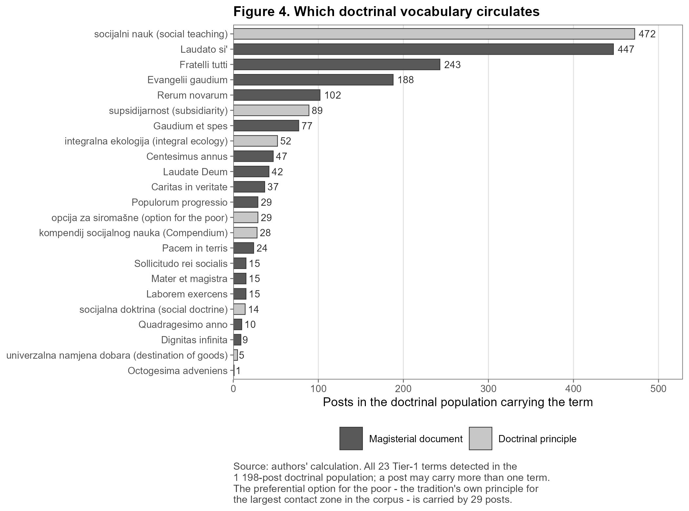

# Which parts of Catholic social teaching reach public argument about the economy?
## Church teaching, secular media and the language of poverty in Croatia, 2021–2026

---

## Abstract (English)

Catholic social teaching has addressed work, wages, property and poverty since 1891, yet how much of
it reaches public argument about the economy, and which parts do, has not been measured. This article
examines 710 307 Croatian digital media posts from 2021 to 2026. Religion and economics co-occur in
108 966 posts, and 1 198 invoke official teaching beside an economic term. Manual coding of 810 items
indicates that 39,5% of detected encounters and 83,3% of detected invocations are genuine. Corrected
for both, teaching is invoked in about one of every twenty-seven genuine encounters. Invocation is
highest on climate and energy (14,80%) and lowest on housing, prices and business. The gradient is
produced at the boundary between Church media and secular media rather than within Church
communication, and it follows the availability of a secular argument able to carry it. On poverty,
the vocabulary in circulation is one of assistance rather than of entitlement.

**Keywords:** socijalni nauk Crkve; siromaštvo; socijalna politika; mediji; javna sfera; Hrvatska

---

## 1. Introduction

The first issue of this journal opened by asking what Catholic social teaching might contribute to
Croatian social policy (Valković, 1994.). The question was normative, and at the time no method
existed for establishing what was in fact reaching public argument. This article supplies the missing
empirical half of it.

The question belongs to social policy rather than to the sociology of religion, because social policy
has to be defended in public and defence is conducted in language. It matters whether poor people are
described as persons who ought to be helped or as persons who are owed something, since the first
description makes assistance discretionary and the second makes it a claim. That difference shapes
how a reduction in social assistance can be contested and who has standing to object.

Croatia is a case in which the question has unusual force. The Catholic Church is among the most
trusted institutions in the country and is the largest provider of welfare outside the state
(Kallunki & Zrinščak, 2021). Croatian social assistance is narrow and means-tested, within a
settlement shaped by war, state-building and late Europeanisation (Stubbs & Zrinščak, 2009), while
the public favours redistribution and lives with comparatively high income inequality (Šućur, 2021.).
Religion here is a public voice about economic life rather than a private matter (Casanova, 1994).
The question is therefore not whether the Church speaks, but which of its subjects the wider media
system carries, and whatever moral language reaches public argument, its shape is evidence about
Croatian social policy rather than about religious belief.

Three findings are reported. The selection is settled at the boundary between Church media and
secular media rather than within Church communication, and depends on whether a secular argument is
already available to carry the teaching. Invocation is concentrated on climate and energy, the most
recent economic subject in the tradition, and is thin on work and wages, the subjects with which it
began. The overall magnitude is small and remains small after correction for measurement error.
Section 2 sets out the tradition, the welfare-state literature and the conditions of entry to secular
debate, Section 3 the corpus and its calibration, Section 4 the results, Section 5 their
interpretation and limits, and Section 6 concludes.

## 2. Theoretical framework and prior research

### 2.1 Catholic social teaching as an economic tradition

Catholic social teaching is the body of official Church documents concerned with economic life,
conventionally dated from *Rerum Novarum* (1891). For its first century it addressed workers and
owners, the just wage, the right of association, private property and the dignity of work
(*Quadragesimo Anno*, 1931; *Laborem Exercens*, 1981; *Centesimus Annus*, 1991). The environment
enters late, since *Laudato si'* (2015) and *Laudate Deum* (2023) constitute the newest economic
subject in the tradition, while *Fratelli tutti* (2020) extends the older argument about fraternity
into questions of property and distribution. The *Compendium of the Social Doctrine of the Church*
(2004) systematises the principles, which are human dignity, the common good, subsidiarity,
solidarity, the universal destination of goods and the preferential option for the poor. The
detection vocabulary used below is built from those names, so the term list is the tradition's own
index rather than an invention of the authors.

Three principles are decisive here, because they point in opposite directions. The universal
destination of goods holds that the goods of the earth are intended for all and that private
ownership exists to serve that purpose, and the preferential option for the poor holds that the
condition of the poor is the test of any social arrangement. Both articulate what the poor are owed.
Subsidiarity holds that a task belongs to the smallest competent body, which for the relief of
poverty means the family, the parish and the local association, and therefore articulates an
obligation to assist. All are authentically Catholic, and which of them circulates is an empirical
question. The documents otherwise serve only as background, establishing just the date at which the
Church began writing on each subject, which is all Section 4 requires of them.

### 2.2 Religion, subsidiarity and the welfare state

Two literatures make the content of the teaching a question about social policy rather than about
religion. Kahl (2005) traces modern poverty policy to religious roots and shows that Catholic
teaching produced a system organised around subsidiarity, in which relief falls first to the family,
the parish and the local association and only residually to the state, while Lutheran and Reformed
settlements arranged the same obligation differently. The comparative literature on religion and
welfare regimes (van Kersbergen & Manow, 2009), already reviewed in this journal, shows that where
Christian democratic parties built the welfare state they built one that transfers income to families
and supplies few public services. Both anticipate a Catholic public language of obligation rather
than of entitlement, and neither has been measured where such language is used.

This journal sustained a line of work on the Church, welfare and social policy between 1994 and
roughly 2006, and then discontinued it. Valković (1994.) began it, Šagi (1995.) applied it to
Croatian conditions, and Zrinščak (1995.) located religion within the emerging third sector of
Central and Eastern Europe. Valković (1996.) identified solidarity and justice as the foundations of
the welfare state, three contributions in 1997 developed solidarity and subsidiarity (Anić, 1997.;
Marasović, 1997.; Šarić, 1997.), and Baloban (2005.) traced Croatian social work to the charitable
work of the Church. This article answers that line of work rather than opening a new one, and
converts a normative question into a measurable one. The proximity is more than bibliographic, since
Baloban is the Croatian scholar named most often inside the analysed posts, with 116 mentions across
67 posts, so the corpus is in part quoting this journal's own contributors.

### 2.3 Conditions of entry to the secular public sphere

Casanova (1994) established that religion re-enters public argument rather than retreating to private
conscience, which makes the terms of that entry the interesting question. Habermas (2006) specifies
those terms. A religious contribution is admitted to secular debate on condition that it is rendered
in generally accessible reasons, a requirement usually described as the translation proviso, which
predicts that doctrine will be admitted in proportion to the ease with which it maps onto an
available secular vocabulary. The closest prior work tests a smaller version of this. Pou-Amérigo
(2018) examined coverage of *Laudato si'* in United States and United Kingdom broadsheets and found
that the newspapers assimilated the encyclical to a political and environmental argument already in
progress and set its theological reasoning aside, across one document, two countries and ten days.

### 2.4 Research gap, questions and expectations

No study has asked whether the same selection operates on a religious tradition as a whole, admitting
some of its parts to public economic argument while systematically excluding others. Answering that
requires the whole tradition on one side and a whole media system on the other, which a national
digital corpus makes possible. This article therefore moves from asking how one encyclical was
received to asking which parts of a 130-year tradition enter public argument about the economy at
all, whether that varies by economic subject, and where in the media system any variation is
produced.

Every post in the corpus is examined rather than a sample of it, and no part of the design isolates a
cause, so what follows are expectations about what should be observed rather than hypotheses to be
tested. Two of them compete. The tradition's own history implies that teaching should be named most
often where the Church has written longest, which is work, wages and property. The translation
proviso implies instead that it should be named most often wherever a secular argument already exists
to carry it, whatever the Church has written. Both agree that naming teaching at all will be rare,
that the rate will differ sharply between subjects, and that any such difference will arise where
Church media meet secular media rather than inside Church communication. On poverty, the largest area
of contact, Kahl (2005) implies that the tradition should appear as a duty to assist rather than as a
claim the poor may make.

## 3. Data and methods

### 3.1 Corpus

The analysis uses the DigiKat corpus, which holds 710 307 Croatian digital media posts from 2021 to
2026 and is assembled and maintained by the DigiKat project, an open science project mapping Catholic
themes in the Croatian digital media space at <https://lusiki.github.io/DigiKat/>. It was built around
a topic rather than a list of sources, so confessional and secular outlets are present side by side,
and the project publishes what the corpus contains, how it was collected and filtered and which
sources it draws on in its open database documentation at
<https://lusiki.github.io/DigiKat/pages/baza.html>. Coverage is overwhelmingly of the web, since
97,6% of the analysed posts are web pages, so the digital public sphere observed here is the Croatian
news portals rather than social media generally.

### 3.2 Measurement and the three nested populations

The analysis works with three nested populations, set out in Table 1. The first is the corpus itself.
The second consists of the posts in which religion and economics occur together. Eleven regular
expression patterns were written, one for each economic subject tracked, among them taxes, wages,
housing, poverty, and climate and energy. A post enters the second population when one of these
patterns matches and a religious term falls within 220 characters of the match, a window of roughly
two sentences on either side, and 108 966 posts satisfy that condition. Because a post may raise more
than one subject, it is counted once for every subject it raises, and each such count is termed a
pair, so the 108 966 posts yield 132 519 pairs. Pairs are the unit of analysis throughout, since the
question concerns how often teaching appears on each subject separately.

The third population consists of the posts that additionally invoke official teaching. Invocation is
detected with a restricted vocabulary of sixteen document titles and seven Croatian expressions that
carry no meaning outside Church teaching, among them *socijalni nauk*, *supsidijarnost* and *opcija
za siromašne*, listed in full in Table A1. A post enters the third population when one of these
expressions appears and also falls within 220 characters of the economic term, an adjacency condition
that places the teaching and the economics in the same passage rather than at opposite ends of a long
article. The rule is demanding, since it excludes 1 677 of the 2 875 posts that would otherwise
qualify and leaves 1 198 posts carrying 1 949 pairs, which are the posts the article analyses. A
second, deliberately excluded vocabulary contains *solidarnost*, *opće dobro*, *dostojanstvo rada*
and *socijalna pravda*, ordinary political expressions that any speaker may use without reference to
the Church. They are never counted as invocation, and appear only in the memo row of Table 1, where
they establish the highest value the count could take if every such expression were admitted, which
is 10,51% of the second population.

**Table 1.** How we get from the whole corpus down to the posts we analyse.

| Group of posts                               |       Posts | % of corpus | % of meeting posts |       Pairs |
|:---------------------------------------------|------------:|------------:|-------------------:|------------:|
| All posts in the corpus                      |     710 307 |      100,00 |                  — |           — |
| Posts using a teaching word anywhere         |       5 407 |        0,76 |                  — |           — |
| **Posts where religion and economics meet**  | **108 966** |   **15,34** |         **100,00** | **132 519** |
| … of these, posts using a teaching word      |       2 875 |        0,40 |               2,64 |           — |
| … **using it nearby, the teaching posts**    |   **1 198** |    **0,17** |           **1,10** |   **1 949** |
| *Memo.* Everyday political words counted too |      11 455 |        1,61 |              10,51 |           — |

*Source: authors' calculation on the DigiKat corpus of 710 307 Croatian digital media posts,
2021–2026. Religion and economics count as meeting when a religious term falls within 220
characters of an economic term. A post becomes a teaching post when one of the Tier-1 teaching
words listed in Table A1 is within 220 characters as well; that last condition removes 1 677 posts.
A pair is one post counted on one economic subject. The memo row adds the Tier-2 words, which are
everyday political words we never count as teaching, and shows how high the count could possibly
go.*

### 3.3 Validation of the detection rules

A lexical search of this kind is exposed to two errors, both assessed by manual coding against rules
recorded in advance (Table 2). It may register an invocation where teaching is not being used, which
inflates the numerator of the headline fraction, and an encounter where the two vocabularies merely
share a post, which inflates the denominator.

The first error was measured on 150 analysed posts, drawn across the document eras and across outlets
of differing size, each coded for whether the teaching is genuinely used in the sense of being
quoted, applied or argued from. A title appearing in a book list, a programme or an advertisement is
not in use and was coded as an error. Teaching is genuinely used in 83,3% of the posts [76,6; 88,4],
so five in six detected invocations are genuine. A threshold of 0,80 was fixed before coding began
and the observed rate clears it, so the count is reported as it stands. Outright misdetections are
rarer still, since a genuine Church expression is present in 149 of the 150 posts. The single failure
is instructive, in that *supsidijarna zaštita* denotes a form of asylum status and is matched by the
pattern for *supsidijarnost*. So is a second test, since the commonest expression in the vocabulary,
*socijalni nauk*, could also match *socijalne nauke*, meaning social sciences, and does so three
times in 5 072 surface matches.

The second error proved consequential. A fresh set of 660 pairs was drawn, 60 at random from each of
the eleven subjects and none coded in any earlier round, and each was coded for whether religion and
economics genuinely address one another or merely co-occur. Only 39,5% do, and the rate ranges from
21,7% to 63,3% across subjects (χ²(10) = 51,1), so two in five apparent encounters are genuine. Some
of the remainder turn on expressions that appear economic and are not, since *zadužen za* denotes
being in charge rather than in debt, and *primanje* may denote the reception of a sacrament rather
than of a salary. Others name a church as a venue or a street, or are devotional articles containing
an economic term. Under the stricter requirement that the economic expression also carry a plainly
economic sense, the rate falls to 26,8%.

**Table 2.** What we found when we read posts by hand to check the search.

| What we checked                                 | What was read        |   n | Rate (%) |      95% CI or range | Set in advance |
|:------------------------------------------------|:---------------------|----:|---------:|---------------------:|---------------:|
| **Check 1.** The teaching is genuinely used     | teaching posts       | 150 | **83,3** |         [76,6; 88,4] |           ≥ 80 |
| Check 1b. The teaching word is really there     | same 150 posts       | 150 |     99,3 |         [96,3; 99,9] |              — |
| Check 2. The economic word is really economic   | same 150 posts       | 150 |     76,0 |         [68,6; 82,1] |              — |
| Checks 1 and 2 both passed                      | same 150 posts       | 150 |     64,7 |         [56,7; 71,9] |              — |
| **Check 3.** Religion and economics really meet | 60 pairs per subject | 660 | **39,5** | 21,7–63,3 by subject |              — |
| Check 3 under the strict reading                | the same 660 pairs   | 660 |     26,8 | 16,7–53,3 by subject |              — |

*Source: authors' calculation on the DigiKat corpus of 710 307 Croatian digital media posts,
2021–2026. Each rate is the share of the posts or pairs read that passed the check, and the last
column shows a threshold fixed before any coding began. Check 3 is weighted by how large each
economic subject is, and subjects differ from one another (χ²(10) = 51,1). The strict reading also
requires the economic word to carry a plainly economic sense. Intervals are Wilson intervals; they
express how well the search rules match a human reading, not sampling uncertainty.*

### 3.4 Correction, inference and reproducibility

The second audit changes what can be reported. Before correction, 1 949 of the 132 519 pairs carry an
invocation, which is 1,47%, or about one in sixty-eight, and in posts rather than pairs the figure is
1 198 of 108 966, about one in ninety-one. Neither is the appropriate quantity, because most of the
denominator is not an encounter at all. The corrected denominator is the 39,5% of pairs that manual
coding confirmed as genuine. Teaching is then invoked in 3,73% of genuine encounters, about one in
twenty-seven, and in 5,48% under the stricter reading. Correction therefore approximately triples the
estimate, and both figures are reported throughout.

No significance tests are reported. Every post in the corpus was examined, so the figures are
population quantities rather than sample estimates, there is no sampling error to test, and a p-value
would carry no interpretation. Intervals are reported, but answer a different question, which is how
closely the detection rules reproduce a human reading. That is the material risk in a design of this
kind, and it is what the audits measure. All are Wilson intervals.

One class of quantity is withheld. Invocations cannot be attributed to individual popes, because the
detector cannot distinguish *Lav* as Leo XIII from *Lav* as Leo XIV or from the Croatian noun for a
lion, so documents are grouped by era instead.

## 4. Results

### 4.1 The gradient across economic subjects

The rate of invocation varies substantially across economic subjects, and in a direction the
tradition's own history would not lead one to expect (Table 3, Figure 1). Before correction it ranges
from 7,15% on climate and energy down to 0,34% on housing and 0,00% on the euro changeover, so the
highest value is twenty-one times the lowest and climate stands well clear of every other subject.
The ordering is not fragile. It survives allowance for outlet dominance, duplicate publication,
foreign news, metaphorical economic expressions, the two collection runs and the labelling of
outlets. Climate ranks first in all 25 of the variants specified in advance, and in 24 its interval
does not touch the runner-up's. None of those variants addresses the second error, however, because
each links religion to economics in the same way.

**Table 3.** How often Church teaching is named, by economic subject, before and after correction.

| Economic subject           |       Pairs | With teaching | Measured rate (%) |       95% CI | Genuine meetings (%) | Corrected rate (%) |         95% CI |
|:---------------------------|------------:|--------------:|------------------:|-------------:|---------------------:|-------------------:|---------------:|
| Climate & energy           |       3 425 |           245 |              7,15 | [6,34; 8,06] |                 48,3 |              14,80 | [11,80; 19,86] |
| Macro-economy              |       7 090 |           156 |              2,20 | [1,88; 2,57] |                 28,3 |               7,77 |  [5,42; 12,21] |
| Taxes & fiscal             |      23 375 |           346 |              1,48 | [1,33; 1,64] |                 21,7 |               6,83 |  [4,44; 11,76] |
| Wages & income             |      13 724 |           130 |              0,95 | [0,80; 1,12] |                 25,0 |               3,79 |   [2,58; 6,17] |
| Unemployment               |       5 849 |            74 |              1,27 | [1,01; 1,58] |                 36,7 |               3,45 |   [2,58; 5,00] |
| Demography & labour supply |       1 288 |            17 |              1,32 | [0,83; 2,10] |                 40,0 |               3,30 |   [2,51; 4,69] |
| Poverty & social           |      38 232 |           727 |              1,90 | [1,77; 2,04] |                 63,3 |               3,00 |   [2,55; 3,73] |
| Business & firms           |      31 416 |           227 |              0,72 | [0,64; 0,82] |                 28,3 |               2,55 |   [1,78; 3,99] |
| Inflation & prices         |       1 607 |             6 |              0,37 | [0,17; 0,81] |                 55,0 |               0,68 |   [0,56; 0,88] |
| Housing                    |       6 106 |            21 |              0,34 | [0,22; 0,52] |                 53,3 |               0,64 |   [0,53; 0,84] |
| Euro changeover            |         407 |             0 |              0,00 | [0,00; 0,94] |                 55,0 |               0,00 |   [0,00; 0,00] |
| **All subjects**           | **132 519** |     **1 949** |          **1,47** |            — |             **39,5** |           **3,73** |              — |

*Source: authors' calculation on the DigiKat corpus of 710 307 Croatian digital media posts,
2021–2026. Ordered by the corrected rate. A pair is one post counted on one economic subject. The
measured rate is the share of a subject's pairs that name teaching. The corrected rate divides
instead by the pairs that hand coding found to be genuine meetings (Table 2, Check 3, 60 pairs per
subject), and carries that coding interval through.*

The decisive test is therefore to give each subject its own denominator, dividing not by all of its
pairs but by the share of them that manual coding confirmed as genuine encounters, a procedure fixed
before the coded results were seen. The ordering holds. Climate and energy remains first, at 14,80%
[11,80; 19,86] against 7,77% for the runner-up. Propagating the coding uncertainty across all eleven
subjects at once, the probability that climate ranks first is 0,987, or 0,937 under the stricter
reading, and the uncorrected and corrected orderings correlate at 0,87.

What correction alters is the size of climate's lead, which falls from 3,25× to 1,91×, or to 1,73×
under the stricter reading, because correction rewards the subjects whose links were largely spurious
and does nothing for those whose links were already sound. Poverty had the soundest links of any
subject, at 63,3%, because a bishop speaking about the poor genuinely is religion meeting economics,
whereas tax and business posts are dense in expressions that merely appear economic. Poverty
consequently falls from third place to seventh, because its denominator was honest to begin with
rather than because invocation became rarer there. The surviving claim is the narrower one that
teaching is invoked distinctly more often on climate than on anything else, and the twenty-one-fold
range of the uncorrected table does not survive.

### 4.2 Document vintage as a rival account

Recency is a plausible rival explanation and it is not sufficient. Francis was pope for most of the
period covered and Francis-era documents lead in every subject. If recency were the whole account,
every subject would show the same mixture of old and new documents. They do not (Table 4, Figure 2).
Documents from 1891 to 1991 account for 0,8% of climate's invocation pairs but for between 11,5% and
14,3% of the pairs in business, wages and housing, fourteen to eighteen times as much, while
Francis-era documents account for 88,2% of climate's. Older documents thus continue to be quoted on
the subjects for which they were written, while the subject they never addressed is carried almost
entirely by documents of the past decade. Recency matters and is evidently not all that matters.

**Table 4.** How old the documents named are, by economic subject (% of that subject's teaching pairs).

| Economic subject           | Pairs with teaching | 1891–1991 | Conciliar (1961–1971) | Benedict XVI | Francis era | Mixed eras | No document named |
|:---------------------------|--------------------:|----------:|----------------------:|-------------:|------------:|-----------:|------------------:|
| Poverty & social           |                 727 |       5,5 |                   5,9 |          0,8 |        57,4 |       10,3 |              20,1 |
| Taxes & fiscal             |                 346 |       5,8 |                   6,1 |          2,3 |        44,2 |        9,5 |              32,1 |
| Climate & energy           |                 245 |       0,8 |                   1,2 |          0,0 |        88,2 |        7,3 |               2,4 |
| Business & firms           |                 227 |      11,5 |                   2,2 |          0,0 |        40,5 |        9,7 |              36,1 |
| Macro-economy              |                 156 |       7,7 |                   2,6 |          0,6 |        48,1 |       15,4 |              25,6 |
| Wages & income             |                 130 |      13,1 |                   2,3 |          0,0 |        44,6 |       15,4 |              24,6 |
| Unemployment               |                  74 |       6,8 |                   2,7 |          0,0 |        45,9 |        5,4 |              39,2 |
| Housing                    |                  21 |      14,3 |                   9,5 |          0,0 |        38,1 |        4,8 |              33,3 |
| Demography & labour supply |                  17 |       5,9 |                   0,0 |          0,0 |        29,4 |       11,8 |              52,9 |
| Inflation & prices         |                   6 |      33,3 |                   0,0 |          0,0 |        50,0 |       16,7 |               0,0 |

*Source: authors' calculation on the DigiKat corpus of 710 307 Croatian digital media posts,
2021–2026. Rows sum to 100. “Mixed eras” marks a post that names documents from more than one era,
and “no document named” a post that names a principle of the teaching but no document title. The
euro changeover names no teaching at all and is left out.*

One expected result did not materialise, and is reported because it is informative. Secular outlets
were expected to carry Francis-era teaching more readily than older teaching, on the reasoning that
recent material travels better. They do not. Francis-era invocations appear in secular outlets 21,2%
of the time and older ones 26,1% of the time, well within each other's intervals. What the secular
press selects on is therefore the subject rather than the vintage of the document, which removes the
most economical rival explanation for the result in Section 4.3, namely that secular editors simply
favour the current pope.

### 4.3 The confessional and secular boundary

Splitting the pairs by the kind of outlet in which they appeared locates the selection (Table 5,
Figure 3). Within Church media, invocation is distributed comparatively evenly across subjects.
Climate leads at 22,31% against 15,96% for the next subject, a ratio of 1,40×, and this is the only
comparison in the study in which the two intervals overlap. Within secular media the pattern is far
sharper, with invocation concentrated almost entirely on climate at 7,52% against 1,98%, a ratio of
3,79×. Even under the assumption least favourable to the present argument, which treats every
unlabelled outlet as secular, the comparison is 5,16% against 1,18%, a ratio of 4,36×. The two kinds
of outlet also carry different volumes. Church outlets hold 21,7% of all pairs in which religion
meets economics but 55,2% of all invocation pairs, and among outlets carrying a label either way the
corresponding shares are 43,0% and 67,0%. However the line is drawn, invocation is concentrated in
the Church's own outlets.

**Table 5.** How often teaching is named inside Church media and inside secular media.

| Group of outlets                |   Pairs | % of all pairs | With teaching | % of teaching pairs | Climate rate (%) | Next highest subject (%) | Ratio |
|:--------------------------------|--------:|---------------:|--------------:|--------------------:|-----------------:|:-------------------------|------:|
| All outlets together            | 132 519 |          100,0 |         1 949 |               100,0 |             7,15 | Macro-economy 2,20       | 3,25× |
| Church outlets                  |  28 798 |           21,7 |         1 075 |                55,2 |            22,31 | Macro-economy 15,96      | 1,40× |
| Secular outlets, labelled only  |  38 194 |           28,8 |           529 |                27,1 |             7,52 | Poverty & social 1,98    | 3,79× |
| Secular outlets, widest reading | 103 721 |           78,3 |           874 |                44,8 |             5,16 | Poverty & social 1,18    | 4,36× |

*Source: authors' calculation on the DigiKat corpus of 710 307 Croatian digital media posts,
2021–2026. Each rate is the share of that group's pairs which name teaching, so the climate column
can be read against the next highest subject beside it. “Widest reading” counts every outlet we
could not label as secular. Among pairs whose outlet carries either label, Church outlets supply
43,0% of the pairs but 67,0% of the pairs that name teaching.*

The topical selection is therefore produced at the media boundary rather than within Church
communication. The Church addresses its economic subjects at broadly comparable rates, and what
varies is which of them the secular press transmits.

### 4.4 Vocabulary and register in the poverty domain

Poverty is the largest contact zone between religion and economics, carrying 38 232 pairs and 727
invocation pairs, which is 37,3% of all invocation pairs. Excluding the largest outlets, poverty
ranks second on invocation behind climate, and second in both secular groupings. Secular media
therefore do transmit what the Church says about poverty, and the question is which part.

The tradition has a principle framed for precisely this subject, *opcija za siromašne*, the
preferential option for the poor. It occurs in 33 posts out of 710 307, of which 29 fall in the
population where religion and economics meet, and accounts for 1,46% of all detected doctrinal
expressions. Eight document titles are named more often, and *Populorum progressio* exactly as often
(Figure 4, with the full inventory in Table A1). What circulates instead are the general labels. The
name of the teaching itself, *socijalni nauk*, appears in 472 analysed posts and its environmental
encyclical *Laudato si'* in 447, while the universal destination of goods appears in five. On the
tradition's largest subject, what reaches circulation is its headline nomenclature rather than its
principles about distribution.

The preceding is a count of expressions together with a reading of posts that any reader may inspect.
No attempt was made to classify every post as charity or as justice, and neither a content analysis
nor a frame analysis was performed. What can be added is a smaller manually coded probe from an
earlier stage of the study (Table 6), covering 192 links in which religion and economics genuinely
meet. On poverty, 28,2% of those links read as charity and 21,2% as justice, with the remaining 43,5%
devotional, while on climate 91,7% read as justice and none as charity. The per-subject counts are
small and the coding was performed by a model rather than by human coders, so the table corroborates
the argument rather than establishing it. Its value lies in the two subjects at the top and the
bottom of the invocation gradient occupying the two ends of this scale as well, in the direction the
counts had already indicated.

**Table 6.** What the meeting between religion and economics is about (% of hand-coded links).

| Economic subject           | Coded links | Church as economic actor | Charity, the language of help | Justice, the language of rights | Devotional or other |
|:---------------------------|------------:|-------------------------:|------------------------------:|--------------------------------:|--------------------:|
| Poverty & social           |          85 |                      7,1 |                          28,2 |                            21,2 |                43,5 |
| Housing                    |          17 |                     58,8 |                          35,3 |                             5,9 |                 0,0 |
| Wages & income             |          17 |                     52,9 |                          29,4 |                            11,8 |                 5,9 |
| Demography & labour supply |          15 |                      6,7 |                          60,0 |                            33,3 |                 0,0 |
| Unemployment               |          13 |                     30,8 |                          15,4 |                            53,8 |                 0,0 |
| Euro changeover            |          12 |                     83,3 |                          16,7 |                             0,0 |                 0,0 |
| Climate & energy           |          12 |                      8,3 |                           0,0 |                            91,7 |                 0,0 |
| Inflation & prices         |          11 |                    100,0 |                           0,0 |                             0,0 |                 0,0 |

*Source: authors' calculation on the DigiKat corpus of 710 307 Croatian digital media posts,
2021–2026. Rows sum to 100. “Church as economic actor” means the Church itself is the economic
party in the story, such as a parish building or a diocesan sale, rather than a voice about the
economy. “Devotional or other” covers economic words used in a spiritual sense and links that fit
no other class. Subjects with fewer than ten coded links are left out. These links come from a
stratified gold set rather than a random draw, and one model did the coding, so the table is
convergent evidence, not a population estimate.*

## 5. Discussion

### 5.1 Interpretation

The pattern is what the translation proviso predicts, and the results indicate that translation
succeeds where a secular argument already exists to be rendered into. Climate has such an argument,
assembled from science, cost, policy and risk, so an encyclical about the environment can be reported
as part of a story the newsroom is already running, with the theological reasoning confined to the
paragraph that is not quoted. The just wage and the universal destination of goods have no equally
available counterpart in Croatian debate, so teaching on those subjects would have to stand on
ecclesial authority alone, and much less of it is transmitted. Pou-Amérigo (2018) documented the same
selection for one encyclical in two countries, and these results extend it to a tradition as a whole.
What is observed is the outcome the argument predicts, not the act of translation itself.

Read this way, the finding concerns newsrooms at least as much as the Church. Secular editors appear
to admit a religious argument when a story they already run can carry it, which is how public debate
ordinarily works and is not specific to Catholicism, so the selection is not attributable to any
communicative failure on the Church's part.

### 5.2 Implications for Croatian social assistance

Kahl (2005) argues that Catholic teaching produced a poverty regime organised around subsidiarity, in
which relief falls first to the family, the parish and the local association and only residually to
the state. If that is correct, a public language in which the poor figure as persons to be assisted
rather than as bearers of claims is the tradition operating as designed. What the present results add
is that this appears in the expressions actually in circulation, across an entire national media
system, in a country where the Church is the largest provider of welfare outside the state.

The charity and justice columns of Table 6 correspond to the language of assistance and the language
of entitlement, and the framing literature explains why the difference has consequences. Iyengar
(1990) shows that coverage presenting an individual case produces individual attributions of
responsibility, while coverage presenting the structural context produces societal ones, a mechanism
that continues to replicate (Boukes, 2022). The language of assistance is the moral analogue of the
first and that of entitlement of the second, and the former poses a question the latter suspends,
which is whether the person deserves it. The public answers such questions by reference to control,
attitude, reciprocity, identity and need (van Oorschot, 2000), so a public that discusses the poor in
the language of assistance keeps asking which of the poor qualify.

Three consequences follow, and none implies that the Church is at fault, since Section 4.3 places the
selection outside its hands. The first is that the language in circulation suits assistance that is
modest and discretionary. Croatian social assistance is already narrow and heavily means-tested
(Stubbs & Zrinščak, 2009), and a moral language of the duty to assist rather than of the right to be
assisted does not create that configuration but supplies fewer resources with which to contest it.
The arguments left in public are arguments about generosity, which have a familiar weakness at budget
time, since they can be answered by enumerating what has already been given, as entitlement arguments
cannot. The second is a mismatch between what the public wants and what the available language
offers, since Šućur (2021.) shows that Croatians favour redistribution when measured against other
European countries, yet a public disposed to support it conducts its conversation largely in the
language of assistance, so that support has no ready route by which to become a demand.

The third is that the idea with the most to say about policy is among the least used, which is a
claim about the circulation of expressions and not about belief or teaching. The preferential option
for the poor is written into the *Compendium*, and is the one principle that converts directly into
the language of entitlement, yet it occurs in 33 posts across five years of national digital media,
while the universal destination of goods, the tradition's sharpest claim about property, occurs in
five. Valković (1996.) named solidarity and justice as the twin foundations of the welfare state, and
three decades later the solidarity term is ubiquitous while the justice term, in the tradition's own
wording, is very nearly absent. The constraint is therefore not the volume of teaching but the
availability of a secular argument for attachment, and Croatian poverty debate has such arguments
already running, over the adequacy of the minimum income, the reach of the guaranteed minimum
benefit, and poverty among the employed. The option for the poor speaks to all three. The connection
is available to be made, and in this corpus it is not made. Whether it ought to be is a normative
question this article does not address.

### 5.3 Limitations

Several limitations bound these results. What is observed is news portals rather than the public
sphere as a whole, since 97,6% of the analysed posts are web pages, so broadcast homilies, parish
bulletins and closed social platforms lie outside the observation window. No claim is made about
change over time either, because the corpus was assembled from two collection runs covering different
years, so a rise or fall between adjacent years reflects how the data were collected rather than how
much attention a subject received. The 220-character window is likewise a decision rather than a
fact, supported by a recall check but not the only defensible value, and since it costs 1 677 posts a
wider window would yield a larger analysis population.

Finally, the design measures the availability of moral language and nothing further. With no
individual-level data and nothing resembling an experiment, no causal claim is made about opinion,
voting or policy. It observes only published media text, so a diocese could teach the option for the
poor weekly without any of it appearing here unless a portal printed the expression.

## 6. Conclusion

Three decades ago this journal asked what Catholic social teaching could offer Croatian social
policy. Searching an entire body of national digital media permits a different form of the question,
by measuring which parts of the teaching reach public argument about the economy and what determines
which parts those are. The answer turns on whether the teaching can be rendered in secular terms. A
subject carries teaching into secular argument when a secular argument is already available to attach
it to, and the selection occurs at the media boundary rather than within Church communication.
Teaching is invoked in about one in twenty-seven genuine encounters, concentrated on climate and
energy and thin on work and wages, and recency is part of that account but not the whole of it.

For social policy what matters is the vocabulary rather than the religion. In a country where the
Church is the largest provider of welfare outside the state, the expressions that reach public
argument about poverty are predominantly expressions of assistance, and the tradition's own
conception of the poor as bearers of claims occurs in thirty-three posts across five years. A welfare
state built on subsidiarity is thus argued about, in public, in the vocabulary that subsidiarity
supplies. Valković (1994.) asked what the tradition could contribute, and part of the answer is that
the ideas with the most to contribute are the ones this route carries least. Two extensions follow.
Human double coding of a slice of both audits would replace the study's weakest component, and
replication in a second Catholic-majority country would show whether the boundary mechanism belongs
to the Croatian media system or to the tradition's encounter with secular argument generally.

---

## References

- Anić, R. (1997.). Solidarnost u učenju Ivana Pavla II. *Revija za socijalnu politiku*, 4(4).
- Baloban, S. (2005.). Karitativni rad Katoličke Crkve kao ishodište socijalnog rada u Hrvatskoj.
  *Revija za socijalnu politiku*, 12(3).
- Boukes, M. (2022). Episodic and thematic framing effects on the attribution of responsibility.
  *The International Journal of Press/Politics*, 27(2), 374–395.
- Casanova, J. (1994). *Public religions in the modern world*. University of Chicago Press.
- Habermas, J. (2006). Religion in the public sphere. *European Journal of Philosophy*, 14(1), 1–25.
- Iyengar, S. (1990). Framing responsibility for political issues: The case of poverty.
  *Political Behavior*, 12(1), 19–40.
- Kahl, S. (2005). The religious roots of modern poverty policy: Catholic, Lutheran and Reformed
  Protestant traditions compared. *European Journal of Sociology*, 46(1), 91–126.
- Kallunki, V., & Zrinščak, S. (2021). Interdependence and competition between the religious and the
  secular: The welfare role of the Church in Croatia and Finland. *Journal of Contemporary Religion*,
  36(1), 123–142.
- Marasović, Š. (1997.). Pokazatelji duha solidarnosti među franjevcima i franjevkama.
  *Revija za socijalnu politiku*, 4(4).
- Pou-Amérigo, M.-J. (2018). Framing 'Green Pope' Francis: Newspaper coverage of Encyclical
  *Laudato Si'* in the United States and the United Kingdom. *Church, Communication and Culture*,
  3(2), 136–151.
- Stubbs, P., & Zrinščak, S. (2009). Croatian social policy: The legacies of war, state-building and
  late Europeanization. *Social Policy & Administration*, 43(2), 121–135.
- Šagi, B. Z. (1995.). Crkva i socijalna politika u našim okolnostima.
  *Revija za socijalnu politiku*, 2(1).
- Šarić, I. (1997.). Solidarnost i supsidijarnost kao temelji socijalnog tržišnog gospodarstva.
  *Revija za socijalnu politiku*, 4(4).
- Šućur, Z. (2021.). Dohodovne nejednakosti i redistributivne preferencije u Hrvatskoj i zemljama
  EU-a: makroanaliza. *Revija za socijalnu politiku*, 28(2).
- Valković, M. (1994.). Socijalni nauk Crkve i socijalna politika.
  *Revija za socijalnu politiku*, 1(1).
- Valković, M. (1996.). Solidarnost i pravda kao temelj socijalne države.
  *Revija za socijalnu politiku*, 3(3).
- van Kersbergen, K., & Manow, P. (Eds.) (2009). *Religion, class coalitions, and welfare states*.
  Cambridge University Press.
- van Oorschot, W. (2000). Who should get what, and why? On deservingness criteria and the
  conditionality of solidarity among the public. *Policy & Politics*, 28(1), 33–48.
- Zrinščak, S. (1995.). Religija, Crkva i treći sektor u Srednjoj i Istočnoj Europi.
  *Revija za socijalnu politiku*, 2(4).
- Church documents cited by title: *Rerum Novarum* (1891); *Quadragesimo Anno* (1931);
  *Laborem Exercens* (1981); *Centesimus Annus* (1991); *Compendium of the Social Doctrine of the
  Church* (2004); *Laudato si'* (2015); *Fratelli tutti* (2020); *Laudate Deum* (2023).

---

## Appendix A. The vocabulary of official teaching

**Table A1.** Every Tier-1 teaching word we detect, counted at the three stages of Table 1.

| Teaching word                                       | Type of word | Era of the document   | In the corpus | In meeting posts | In teaching posts | % of all uses |
|:----------------------------------------------------|:-------------|:----------------------|--------------:|-----------------:|------------------:|--------------:|
| *socijalni nauk* (social teaching)                  | principle    | —                     |         1 825 |              969 |               472 |         23,72 |
| *Laudato si'*                                       | document     | Francis era           |         1 135 |              773 |               447 |         22,46 |
| *Fratelli tutti*                                    | document     | Francis era           |         1 220 |              600 |               243 |         12,21 |
| *Evangelii gaudium*                                 | document     | Francis era           |           667 |              432 |               188 |          9,45 |
| *Rerum novarum*                                     | document     | Classical (1891–1991) |           348 |              225 |               102 |          5,13 |
| *supsidijarnost* (subsidiarity)                     | principle    | —                     |           426 |              246 |                89 |          4,47 |
| *Gaudium et spes*                                   | document     | Conciliar (1961–1971) |           493 |              207 |                77 |          3,87 |
| *integralna ekologija* (integral ecology)           | principle    | —                     |           108 |               81 |                52 |          2,61 |
| *Centesimus annus*                                  | document     | Classical (1891–1991) |            93 |               67 |                47 |          2,36 |
| *Laudate Deum*                                      | document     | Francis era           |            96 |               62 |                42 |          2,11 |
| *Caritas in veritate*                               | document     | Benedict XVI          |           116 |               81 |                37 |          1,86 |
| *opcija za siromašne* (option for the poor)         | principle    | —                     |            33 |               29 |                29 |          1,46 |
| *Populorum progressio*                              | document     | Conciliar (1961–1971) |            68 |               43 |                29 |          1,46 |
| *kompendij socijalnog nauka* (Compendium)           | principle    | —                     |            68 |               50 |                28 |          1,41 |
| *Pacem in terris*                                   | document     | Conciliar (1961–1971) |           145 |               71 |                24 |          1,21 |
| *Laborem exercens*                                  | document     | Classical (1891–1991) |            34 |               24 |                15 |          0,75 |
| *Mater et magistra*                                 | document     | Conciliar (1961–1971) |            40 |               29 |                15 |          0,75 |
| *Sollicitudo rei socialis*                          | document     | Classical (1891–1991) |            25 |               19 |                15 |          0,75 |
| *socijalna doktrina* (social doctrine)              | principle    | —                     |            35 |               25 |                14 |          0,70 |
| *Quadragesimo anno*                                 | document     | Classical (1891–1991) |            28 |               22 |                10 |          0,50 |
| *Dignitas infinita*                                 | document     | Francis era           |           142 |               79 |                 9 |          0,45 |
| *univerzalna namjena dobara* (destination of goods) | principle    | —                     |             8 |                7 |                 5 |          0,25 |
| *Octogesima adveniens*                              | document     | Conciliar (1961–1971) |             3 |                1 |                 1 |          0,05 |

*Source: authors' calculation on the DigiKat corpus of 710 307 Croatian digital media posts,
2021–2026. Counts are posts carrying the word. “Type of word” separates the titles of Church
documents from the names of principles, and a principle belongs to no single era. The teaching
posts hold 1 990 uses of these words across 1 198 posts, since one post can carry several. The last
column is the share of those uses, which is what Figure 4 plots.*
